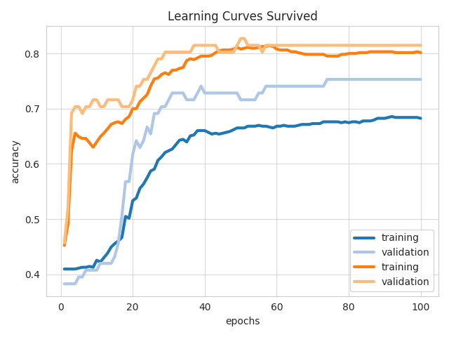
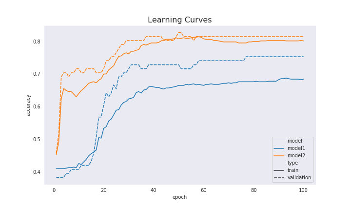

# Credit Card Fraud Detection Example

This API example is based on Kaggle's [Credit Card Fraud](https://www.kaggle.com/mlg-ulb/creditcardfraud) dataset for detecting instances of credit card fraud.

### Preparatory Steps

Create and download your [Kaggle API Credentials](https://github.com/Kaggle/kaggle-api#api-credentials).

The Credit Card Fraud dataset is hosted by Kaggle, and as such Ludwig will need to authenticate you through the Kaggle API to download the dataset.


Enter `python model_training.py` will train a standard model with no class balancing and a balanced model with class balancing applied.  Results of model training will be stored in these locations.

```
./results/
    simple_experiment_simple_model/
    
./visualizations/
    learning_curves_class_imbalance_accuracy.png
    learning_curves_class_imbalance_loss.png
```

This is the standard Ludwig learning curve plot from training the two models



This is the custom visualization created by the Jupyter notebook `model_training_results.ipynb`.


