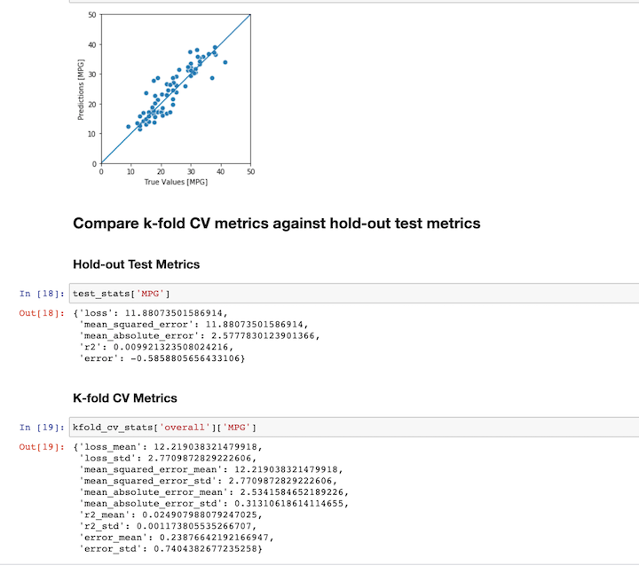

# K-Ffold Cross Validation Example

This directory contains two examples of performing a k-fold cross validation analysis with Ludwig.


## Classification Example

This example illustrates running the k-fold cv with the `ludwig experiment` cli.

To run this example execute this bash script:
``` 
./k-fold_cv_classification.sh
```
This bash script performs these steps:

- Download and prepare data for training and create a Ludwig config file
- Execute `ludwig experiment` to run the 5-fold cross validation
- Display results from the 5-fold cross validation analysis

Sample output:
``` 
Cleaning out old results
Downloading data set
Preparing data for training
Saving training and test data sets
Preparing Ludwig config
Completed data preparation
Training: 100%|████████████████████████████████████████████████████████████████████████████████| 12/12 [00:00<00:00, 23.14it/s]
Evaluation train: 100%|████████████████████████████████████████████████████████████████████████| 12/12 [00:00<00:00, 98.62it/s]
Evaluation test : 100%|█████████████████████████████████████████████████████████████████████████| 3/3 [00:00<00:00, 321.03it/s]
Training: 100%|███████████████████████████████████████████████████████████████████████████████| 12/12 [00:00<00:00, 190.18it/s]
Evaluation train: 100%|███████████████████████████████████████████████████████████████████████| 12/12 [00:00<00:00, 331.68it/s]
Evaluation test : 100%|█████████████████████████████████████████████████████████████████████████| 3/3 [00:00<00:00, 298.08it/s]
<<<< DELETED LINES >>>>>
Training: 100%|███████████████████████████████████████████████████████████████████████████████| 12/12 [00:00<00:00, 248.00it/s]
Evaluation train: 100%|███████████████████████████████████████████████████████████████████████| 12/12 [00:00<00:00, 400.31it/s]
Evaluation test : 100%|█████████████████████████████████████████████████████████████████████████| 3/3 [00:00<00:00, 340.35it/s]
Evaluation: 100%|████████████████████████████████████████████████████████████████████████████████| 3/3 [00:00<00:00, 27.87it/s]
retrieving results from  results
#
# K-fold Cross Validation Results
#
{'combined': {'accuracy_mean': 0.9736263736263737,
              'accuracy_std': 0.011206636293610508,
              'loss_mean': 0.06359774886251807,
              'loss_std': 0.011785678840394689},
 'diagnosis': {'accuracy_mean': 0.9736263736263737,
               'accuracy_std': 0.011206636293610508,
               'average_precision_macro_mean': 0.995842104045726,
               'average_precision_macro_std': 0.002339014329647542,
               'average_precision_micro_mean': 0.995842104045726,
               'average_precision_micro_std': 0.002339014329647542,
               'average_precision_samples_mean': 0.995842104045726,
               'average_precision_samples_std': 0.002339014329647542,
               'loss_mean': 0.06359774886251807,
               'loss_std': 0.011785678840394689,
               'roc_auc_macro_mean': 0.9973999160508542,
               'roc_auc_macro_std': 0.0011259319854886507,
               'roc_auc_micro_mean': 0.9973999160508542,
               'roc_auc_micro_std': 0.0011259319854886507}}
```


## Regression Example

This illustrates using the Ludwig API to run the K-fold cross validation analysis.  To run the example, open the jupyter notebook `regression_example.ipynb`.  Following steps are performed:

- Download and prepare data for training and create a Ludwig config data structure from a pandas dataframe structure
- Use `experiment.kfold_cross_validate()` function  to run the 5-fold cross validation
- Display results from the 5-fold cross validation analysis

Expected output from running the example:
