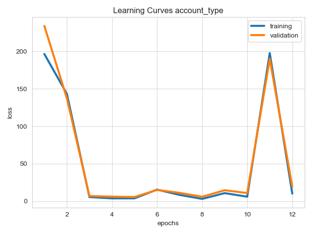
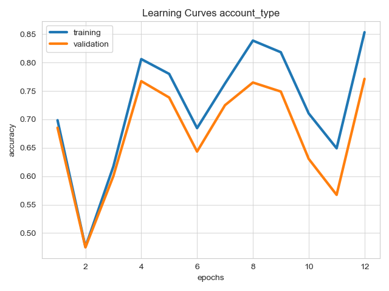
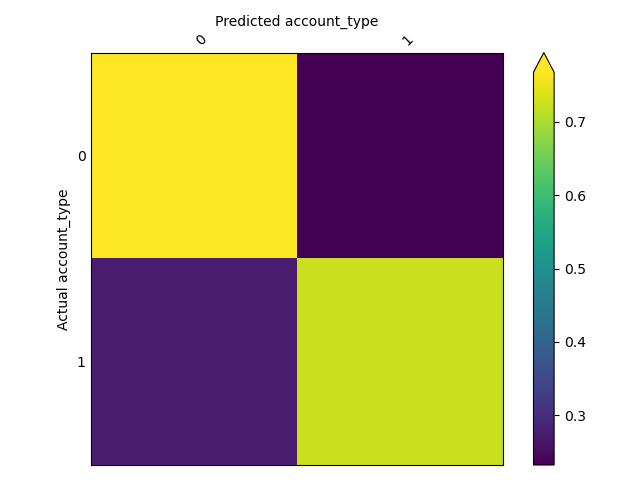

# Twitter Bots Example

We'll be using the twitter human-bots dataset which is composed of 37438 rows each corresponding to a Twitter user
account. Each row contains 20 feature columns collected via the Twitter API. These features contain multiple data
modalities, including the account description and the profile image.

The target column account_type has two unique values: bot or human. 25013 user accounts were annotated as human
accounts, the remaining 12425 are bots.

### Preparatory Steps

Create and download your [Kaggle API Credentials](https://github.com/Kaggle/kaggle-api#api-credentials).

The Twitter Bots dataset is hosted by Kaggle, Ludwig will need to authenticate you through the Kaggle API to download
the dataset.

### Examples

Run `python train_twitter_bots.py` to train a single model. This will download the Twitter Bots dataset into the current
directory, train a model, and write results into the following directories:

```
./results/
    api_experiment_run/
./visualizations/
    learning_curves_account_type_accuracy.png
    learning_curves_account_type_loss.png
```

After training, the script will generate the following plots:




