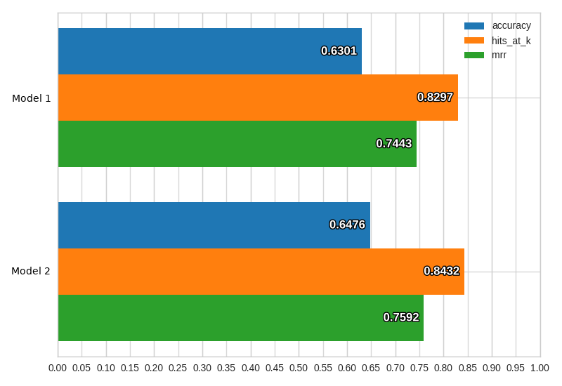

Getting Started
===============

Installation
------------

Ludwig's requirements are the following:

- numpy
- pandas
- scipy
- scikit-learn
- imageio
- spacy
- tensorflow
- matplotlib
- seaborn
- Cython
- h5py
- tqdm
- tabulate
- PyYAML

Ludwig has been developed and tested with python 3 in mind.
If you don’t have python 3 installed, install it by running:

```
sudo apt install python3  # on ubuntu
brew install python3  # on mac
```

At the time of writing this document, TensorFlow is not compatible with python 3.7, so the recommended version of python for Ludwig is 3.6. You may want to use a virtual environment to maintain an isolated [Python environment](https://docs.python-guide.org/dev/virtualenvs/).

In order to install Ludwig just run:

```
pip install ludwig
python -m spacy download en
```

or install it by building the source code from the repository:

```
git clone git@github.com:uber/ludwig.git
cd ludwig
virtualenv -p python3 venv
source venv/bin/activate
pip install -r requirements.txt
python -m spacy download en
python setup.py install
```

Beware that in the `requirements.txt` file the `tensorflow` package is the regular one, not the GPU enabled one.
To install the GPU enabled one replace it with `tensorflow-gpu`.

If you want to train Ludwig models in a distributed way, you need to also install the `horovod` package.
Please follow the instructions on [Horovod's repository](https://github.com/uber/horovod) to install it.


Basic Principles
----------------

Ludwig provides two main functionalities: training models and using them to predict.
It is based on datatype abstraction, so that the same data preprocessing and postprocessing will be performed on different datasets that share data types and the same encoding and decoding models developed for one task can be reused for different tasks.

Training a model in Ludwig is pretty straightforward: you provide a CSV dataset and a model definition YAML file.

The model definition contains a list of input features and output features, all you have to do is specify names of the columns in the CSV that are inputs to your model alongside with their datatypes, and names of columns in the CSV that will be outputs, the target variables which the model will learn to predict.
Ludwig will compose a deep learning model accordingly and train it for you.

Currently the available datatypes in Ludwig are:

- binary
- numeric
- category
- set
- bag
- sequence
- text
- timeseries
- image

The model definition can contain additional information, in particular how to preprocess each column in the CSV, which encoder and decoder to use for each one, feature hyperparameters and training parameters.
This allows ease of use for novices and flexibility of experts.


### Training

For example, given a text classification dataset like the following:

| doc_text                              | class    |
|---------------------------------------|----------|
| Former president Barack Obama ...     | politics |
| Juventus hired Cristiano Ronaldo ... | sport    |
| LeBron James joins the Lakers ...     | sport    |
| ...                                   | ...      |

you want to learn a model that uses the content of the `doc_text` column as input to predict the values in the `class` column.
You can use the following model definition:

```yaml
{input_features: [{name: doc_text, type: text}], output_features: [{name: class, type: category}]}
```

and start the training typing the following command in your console:

```
ludwig train --data_csv path/to/file.csv --model_definition "{input_features: [{name: doc_text, type: text}], output_features: [{name: class, type: category}]}"
```

and Ludwig will perform a random split of the data, preprocess it, build a WordCNN model (the default for text features) that decodes output classes through a softmax classifier, train the model on the training set until the accuracy on the validation set stops improving.
Training progress will be displayed in the console, but TensorBoard can also be used.

If you prefer to use an RNN encoder and increase the number of epochs you want the model to train for, all you have to do is to change the model definition to:

```yaml
{input_features: [{name: doc_text, type: text, encoder: rnn}], output_features: [{name: class, type: category}], training: {epochs: 50}}
```

Refer to the [User Guide](user_guide.md) to find out all the options available to you in the model definition and take a look at the [Examples](examples.md) to see how you can use Ludwig for several different tasks.

After training, Ludwig will create a directory under `/results` containing the trained model with its hyperparameters and summary statistics of the training process.
You can visualize them using one of the several visualization options available in the `visualize` tool, for instance:

```
ludwig visualize --visualization learning_curves --training_stats results/training_stats.json
```

The commands will display a graph that looks like the following, where you can see loss and accuracy as functions of train iteration number:


Several visualizations are available, please refer to [Visualizations](user_guide.md#visualizations) for more details.


### Distributed Training

You can distribute the training of your models using [Horovod](https://github.com/uber/horovod), which allows to train on a single machine with multiple GPUs as well as on multiple machines with multiple GPUs.
Refer to the [User Guide](user_guide.md) for more details.


### Predict

If you have new data and you want your previously trained model to predict target output values, you can type the following command in your console:

```
ludwig predict --data_csv path/to/data.csv --model_path /path/to/model --train_set_metadata_json path/to/metadata.json
```

where the `train_set_metadata_json.json` file contains the description on how to transform raw data to tensors and is created during the training process.

Running this command will return model predictions and some test performance statistics if the dataset contains ground truth information to compare to.
Those can be visualized by the `visualize` tool, which can also be used to compare performances and predictions of different models, for instance:

```
ludwig visualize --visualization compare_performance --test_stats path/to/test_stats_model_1.json path/to/test_stats_model_2.json
```

will return a bar plot comparing the models on different measures:



A handy `ludwig experiment` command that performs training and prediction one after the other is also available.


### Programmatic API

Ludwig also provides a simple programmatic API that allows you to train or load a model and use it to obtain predictions on new data:

```python
from ludwig import LudwigModel

# train a model
model_definition = {...}
model = LudwigModel(model_definition)
train_stats = model.train(training_dataframe)
# or load a model
model = LudwigModel.load(model_path)

# obtain predictions
predictions = model.predict(test_dataframe)

model.close()
```

More details are provided in the [User Guide](user_guide.md) and in the [API documentation](api.md).

Extensibility
-------------

Ludwig is built from the ground up with extensibility in mind.
It is easy to add an additional datatype that is not currently supported by just implementing a  the abstract classes that contain a functions to preprocess the data, encode it and decode it.

Furthermore, new models, with their own specific hyperparameters, can be easily added by implementing a class that accepts tensors (of a specific rank, depending of the datatype) as inputs and provides tensors as output.
This encourages reuse and sharing new models with the community.
Refer to the [Developer Guide](developer_guide.md) for further details.


Roadmap
-------

We will prioritize new features depending on the feedback of the community, but we are already planning to add:

- batcher that uses TensorFlow data pipelines.
- add additional text and sequence encoders (attention, co-attention, hierarchical attention, bert).
- add additional image encoders (ResNet, DenseNet, Inception).
- add image decoding (both image generation by deconvolution and pixel-wise classification for image segmentation).
- add additional features types (audio, geolocation vectors, dates, point clouds, lists of lists, multi-sentence documents).
- add additional measures and losses.
- add additional data formatters and dataset-specific preprocessing scripts.

We also want to address some of the current limitations:

- currently all the dataset needs to be loaded in memory in order to train a model. Image features already have a way to dynamically read batches of datapoints from disk, and we want to extend this capability to other datatypes.
- there is currently no way to serve automatically trained ludwig models, we want to add a small server and a simple user interface in order to provide a live demo capability.
- document lower level functions.


Credits
-------

Ludwig is designed and developed by [Piero Molino](jttp://w4nderlu.st) at [Uber AI](http://uber.ai).

Main contributors:

- Yaroslav Dudin

Contributors:

- Sai Sumanth Miryala
- Yi Shi
- Ankit Jain
- Pranav Subramani
