Command Line Interface
======================

Ludwig provides six command line interface entry points

- train
- predict
- test
- experiment
- visualize
- collect_weights
- collect_activations
- serve

They are described in detail below.

train
-----

This command lets you train a model from your data.
You can call it with:

```
ludwig train [options]
```

or with

```
python -m ludwig.train [options]
```

from within Ludwig's main directory.

These are the available arguments:

```
usage: ludwig train [options]

This script trains a model.

optional arguments:
  -h, --help            show this help message and exit
  --output_directory OUTPUT_DIRECTORY
                        directory that contains the results
  --experiment_name EXPERIMENT_NAME
                        experiment name
  --model_name MODEL_NAME
                        name for the model
  --data_csv DATA_CSV   input data CSV file. If it has a split column, it will
                        be used for splitting (0: train, 1: validation, 2:
                        test), otherwise the dataset will be randomly split
  --data_train_csv DATA_TRAIN_CSV
                        input train data CSV file
  --data_validation_csv DATA_VALIDATION_CSV
                        input validation data CSV file
  --data_test_csv DATA_TEST_CSV
                        input test data CSV file
  --data_hdf5 DATA_HDF5
                        input data HDF5 file. It is an intermediate preprocess
                        version of the input CSV created the first time a CSV
                        file is used in the same directory with the same name
                        and a hdf5 extension
  --data_train_hdf5 DATA_TRAIN_HDF5
                        input train data HDF5 file. It is an intermediate
                        preprocess version of the input CSV created the first
                        time a CSV file is used in the same directory with the
                        same name and a hdf5 extension
  --data_validation_hdf5 DATA_VALIDATION_HDF5
                        input validation data HDF5 file. It is an intermediate
                        preprocess version of the input CSV created the first
                        time a CSV file is used in the same directory with the
                        same name and a hdf5 extension
  --data_test_hdf5 DATA_TEST_HDF5
                        input test data HDF5 file. It is an intermediate
                        preprocess version of the input CSV created the first
                        time a CSV file is used in the same directory with the
                        same name and a hdf5 extension
  --train_set_metadata_json TRAIN_SET_METADATA_JSON
                        input metadata JSON file. It is an intermediate
                        preprocess file containing the mappings of the input
                        CSV created the first time a CSV file is used in the
                        same directory with the same name and a json extension
  -sspi, --skip_save_processed_input
                        skips saving intermediate HDF5 and JSON files
  -md MODEL_DEFINITION, --model_definition MODEL_DEFINITION
                        model definition
  -mdf MODEL_DEFINITION_FILE, --model_definition_file MODEL_DEFINITION_FILE
                        YAML file describing the model. Ignores
                        --model_hyperparameters
  -mlp MODEL_LOAD_PATH, --model_load_path MODEL_LOAD_PATH
                        path of a pretrained model to load as initialization
  -mrp MODEL_RESUME_PATH, --model_resume_path MODEL_RESUME_PATH
                        path of a the model directory to resume training of
  -ssm, --skip_save_model
                        disables saving weights each time the model imrpoves. By
                        default Ludwig saves weights after each epoch the
                        validation measure improves, but if the model is
                        really big that can be time consuming if you do not
                        want to keep the weights and just find out what
                        performance can a model get with a set of
                        hyperparameters, use this parameter to skip it.
  -ssp, --skip_save_progress
                        disables saving weights after each epoch. By default
                        ludwig saves weights after each epoch for enabling
                        resuming of training, but if the model is really big
                        that can be time consuming and will save twice as much
                        space, use this parameter to skip it.
  -ssl, --skip_save_log
                        disables saving TensorBoard logs. By default Ludwig
                        saves logs for the TensorBoard, but if it is not
                        needed turning it off can slightly increase the
                        overall speed.
  -skfsi, --skip_save_k_fold_split_indices
                        disables saving indices generated to split training 
                        data set for the k-fold cross validation run, but if it 
                        is not needed turning it off can slightly increase the 
                        overall speed
  -rs RANDOM_SEED, --random_seed RANDOM_SEED
                        a random seed that is going to be used anywhere there
                        is a call to a random number generator: data
                        splitting, parameter initialization and training set
                        shuffling
  -kf K_FOLD, --k_fold K_FOLD
                        number of folds for a k-fold cross validation run
  -g GPUS [GPUS ...], --gpus GPUS [GPUS ...]
                        list of gpus to use
  -gf GPU_FRACTION, --gpu_fraction GPU_FRACTION
                        fraction of gpu memory to initialize the process with
  -uh, --use_horovod    uses horovod for distributed training
  -dbg, --debug         enables debugging mode
  -l {critical,error,warning,info,debug,notset}, --logging_level {critical,error,warning,info,debug,notset}
                        the level of logging to use
```

When Ludwig trains a model it creates two intermediate files, one HDF5 and one JSON.
The HDF5 file contains the data mapped to numpy ndarrays, while the JSON file contains the mappings from the values in the tensors to their original labels.

For instance, for a categorical feature with 3 possible values, the HDF5 file will contain integers from 0 to 3 (with 0 being a `<UNK>` category), while the JSON file will contain a `idx2str` list containing all tokens (`[<UNK>, label_1, label_2, label_3]`), a `str2idx` dictionary (`{"<UNK>": 0, "label_1": 1, "label_2": 2, "label_3": 3}`) and a `str2freq` dictionary (`{"<UNK>": 0, "label_1": 93, "label_2": 55, "label_3": 24}`).

The reason to have those  intermediate files is two-fold: on one hand, if you are going to train your model again Ludwig will try to load them instead of recomputing all tensors, which saves a consistent amount of time, and on the other hand when you want to use your model to predict, data has to be mapped to tensors in exactly the same way it was mapped during training, so you'll be required to load the JSON metadata file in the `predict` command.
The way this works is: the first time you provide a UTF-8 encoded CSV (`--data_csv`), the HDF5 and JSON files are created, from the second time on Ludwig will load them instead of the CSV even if you specify the CSV (it looks in the same directory for files names in the same way but with a different extension), finally you can directly specify the HDF5 and JSON files (`--data_hdf5` and `--metadata_json`).

As the mapping from raw data to tensors depends on the type of feature that you specify in your model definition, if you change type (for instance from `sequential` to `text`) you also have to redo the preprocessing, which is achieved by deleting the HDF5 and JSON files.
Alternatively you can skip saving the HDF5 and JSON files specifying `--skip_save_processed_input`.

Splitting between train, validation and test set can be done in several ways.
This allows for a few possible input data scenarios:

- one single UTF-8 encoded CSV file is provided (`-data_csv`). In this case if the CSV contains a `split` column with values `0` for training, `1` for validation and `2` for test, this split will be used. If you want to ignore the split column and perform a random split, use a `force_split` argument in the model definition. In the case when there is no split column, a random `70-20-10` split will be performed. You can set the percentages and specify if you want stratified sampling in the model definition preprocessing section.

- you can provide separate UTF-8 encoded train, validation and test CSVs (`--data_train_csv`, `--data_validation_csv`, `--data_test_csv`).

- the HDF5 and JSON file indications specified in the case of a single CSV file apply also in the multiple files case (`--data_train_hdf5`, `--data_validation_hdf5`, `--data_test_hdf5`), with the only difference that you need to specify only one JSON file (`--metadata_json`) instead of three.
The validation set is optional, but if absent the training wil continue until the end of the training epochs, while when there's a validation set the default behavior is to perform early stopping after the validation measure does not improve for a certain amount of epochs.
The test set is optional too.

Other optional arguments are `--output_directory`, `--experiment_name` and `--model name`.
By default the output directory is `./results`.
That directory will contain a directory named `[experiment_name]_[model_name]_0` if model name and experiment name are specified.
If the same combination of experiment and model name is used again, the integer at the end of the name wil be increased.
If neither of them is specified the directory will be named `run_0`.
The directory will contain

- `description.json` - a file containing a description of the training process with all the information to reproduce it.
- `training_statistics.json` which contains records of all measures and losses for each epoch.
- `model` - a directory containing model hyperparameters, weights, checkpoints and logs (for TensorBoard).
- `kfold_training_statistics.json` - an optional file that is created when the `--k_fold` parameter is specified.  This file contains metrics from k-fold cross validation run.  In addition to the metrics for each fold, there is an `overall` key that shows mean and standard deviation for metrics across all folds.
- `kfold_split_indicies.json` - this file is present if `--k_fold` parameter is specified and `--skip_save_k_fold_split_indices` is not specified.  This file contains for each fold the row index values for the training data that creates the training and hold-out test folds.  These indices can be used to reproduce the fold splits.

The model definition can be provided either as a string (`--model_definition`) or as YAML file (`--model_definition_file`).
Details on how to write your model definition are provided in the [Model Definition](#model-definition) section.

During training Ludwig saves two sets of weights for the model, one that is the weights at the end of the epoch where the best performance on the validation measure was achieved and one that is the weights at the end of the latest epoch.
The reason for keeping the second set is to be able to resume training in case the training process gets interrupted somehow.

To resume training using the latest weights and the whole history of progress so far you have to specify the `--model_resume_path` argument.
You can avoid saving the latest weights and the overall progress so far by using the argument `--skip_save_progress`, but you will not be able to resume it afterwards.
Another available option is to load a previously trained model as an initialization for a new training process.
In this case Ludwig will start a new training process, without knowing any progress of the previous model, no training statistics, nor the number of epochs the model has been trained on so far.
It's not resuming training, just initializing training with a previously trained model with the same model definition, and it is accomplished through the `--model_load_path` argument.

You can request a k-fold cross validation run by specifing the `--k_fold` parameter.

You can specify a random seed to be used by the python environment, python random package, numpy and TensorFlow with the `--random_seed` argument.
This is useful for reproducibility.
Be aware that due to asynchronicity in the TensorFlow GPU execution, when training on GPU results may not be reproducible.

You can manage which GPUs on your machine are used with the `--gpus` argument, which accepts a string identical to the format of `CUDA_VISIBLE_DEVICES` environment variable, namely a list of integers separated by comma.
You can also specify the fraction of the GPU memory that will be initially assigned to TensorFlow with `--gpu_fraction`.
By default it is 1.0, but you can set it, for instance, to 0.2 to use only 1/5 of the available memory.
If TensorFlow will need more GPU memory it will try to increase this amount.

Finally the `--logging_level` argument lets you set the amount of logging that you want to see during training and the `--debug` argument turns on TensorFlow's `tfdbg`. Be careful when doing so, as it will help in catching errors, in particular infs and NaNs but it will consume much more memory.

Example:
```
ludwig train --data_csv reuters-allcats.csv --model_definition "{input_features: [{name: text, type: text, encoder: parallel_cnn, level: word}], output_features: [{name: class, type: category}]}"
```

predict
-------

This command lets you use a previously trained model to predict on new data.
You can call it with:

```
ludwig predict [options]
```

or with

```
python -m ludwig.predict [options]
```

from within Ludwig's main directory.

These are the available arguments:

```
usage: ludwig predict [options]

This script loads a pretrained model and uses it to predict.

optional arguments:
  -h, --help            show this help message and exit
  --data_csv DATA_CSV   input data CSV file. If it has a split column, it will
                        be used for splitting (0: train, 1: validation, 2:
                        test), otherwise the dataset will be randomly split
  --data_hdf5 DATA_HDF5
                        input data HDF5 file. It is an intermediate preprocess
                        version of the input CSV created the first time a CSV
                        file is used in the same directory with the same name
                        and a hdf5 extension
  --train_set_metadata_json TRAIN_SET_METADATA_JSON
                        input metadata JSON file. It is an intermediate
                        preprocess file containing the mappings of the input
                        CSV created the first time a CSV file is used in the
                        same directory with the same name and a json extension
  -s {training,validation,test,full}, --split {training,validation,test,full}
                        the split to test the model on
  -m MODEL_PATH, --model_path MODEL_PATH
                        model to load
  -od OUTPUT_DIRECTORY, --output_directory OUTPUT_DIRECTORY
                        directory that contains the results
  -ssuo, --skip_save_unprocessed_output
                        skips saving intermediate NPY output files
  -bs BATCH_SIZE, --batch_size BATCH_SIZE
                        size of batches
  -g GPUS, --gpus GPUS  list of gpu to use
  -gf GPU_FRACTION, --gpu_fraction GPU_FRACTION
                        fraction of gpu memory to initialize the process with
  -uh, --use_horovod    uses horovod for distributed training
  -dbg, --debug         enables debugging mode
  -l {critical,error,warning,info,debug,notset}, --logging_level {critical,error,warning,info,debug,notset}
                        the level of logging to use
```

The same distinction between UTF-8 encoded CSV files and HDF5 / JSON files explained in the [train](#train) section also applies here.
In either case, the JSON metadata file obtained during training is needed in order to map the new data into tensors.
If the new data contains a split column, you can specify which split to use to calculate the predictions with the `--split` argument. By default it's `full` which means all the splits will be used.

A model to load is needed, and you can specify its path with the `--model_path` argument.
If you trained a model previously and got the results in, for instance, `./results/experiment_run_0`, you have to specify `./results/experiment_run_0/model` for using it to predict.

You can specify an output directory with the argument `--output-directory`, by default it will be `./result_0`, with increasing numbers if a directory with the same name is present.

The directory will contain a prediction CSV file and a probability CSV file for each output feature, together with raw NPY files containing raw tensors.
You can specify not to save the raw NPY output files with the argument `skip_save_unprocessed_output`.

A specific batch size for speeding up the prediction can be specified using the argument `--batch_size`.

Finally the `--logging_level`, `--debug` and `--gpus` related arguments behave exactly like described in the train command section.

Example:
```
ludwig predict --data_csv reuters-allcats.csv --model_path results/experiment_run_0/model/
```

test
----

This command lets you use a previously trained model to predict on new data and evaluate the performance of the prediction compared to ground truth.
You can call it with:

```
ludwig test [options]
```

or with

```
python -m ludwig.test_performance [options]
```

from within Ludwig's main directory.

These are the available arguments:

```
usage: ludwig predict [options]

This script loads a pretrained model and uses it to predict.

optional arguments:
  -h, --help            show this help message and exit
  --data_csv DATA_CSV   input data CSV file. If it has a split column, it will
                        be used for splitting (0: train, 1: validation, 2:
                        test), otherwise the dataset will be randomly split
  --data_hdf5 DATA_HDF5
                        input data HDF5 file. It is an intermediate preprocess
                        version of the input CSV created the first time a CSV
                        file is used in the same directory with the same name
                        and a hdf5 extension
  --train_set_metadata_json TRAIN_SET_METADATA_JSON
                        input metadata JSON file. It is an intermediate
                        preprocess file containing the mappings of the input
                        CSV created the first time a CSV file is used in the
                        same directory with the same name and a json extension
  -s {training,validation,test,full}, --split {training,validation,test,full}
                        the split to test the model on
  -m MODEL_PATH, --model_path MODEL_PATH
                        model to load
  -od OUTPUT_DIRECTORY, --output_directory OUTPUT_DIRECTORY
                        directory that contains the results
  -ssuo, --skip_save_unprocessed_output
                        skips saving intermediate NPY output files
  -bs BATCH_SIZE, --batch_size BATCH_SIZE
                        size of batches
  -g GPUS, --gpus GPUS  list of gpu to use
  -gf GPU_FRACTION, --gpu_fraction GPU_FRACTION
                        fraction of gpu memory to initialize the process with
  -uh, --use_horovod    uses horovod for distributed training
  -dbg, --debug         enables debugging mode
  -l {critical,error,warning,info,debug,notset}, --logging_level {critical,error,warning,info,debug,notset}
                        the level of logging to use
```

All parameters are the same of [predict](#predict) and the behavior is the same.
The only difference isthat `test` requires the dataset to contain also columns with the same name of output features.
This is needed because `test` compares the predictions produced by the model with the ground truth and will save all those statistics in a `test_statistics.json` file in the result directory.

Note that the data must contain columns for each output feature with ground truth output values in order to compute the performance statistics.
If you receive an error regarding a missing output feature column in your data, it means that the data does not contain the columns for each output feature to use as ground truth.

Example:
```
ludwig test --data_csv reuters-allcats.csv --model_path results/experiment_run_0/model/
```

experiment
----------

This command combines training and test into a single handy command.
You can call it with:

```
ludwig experiment [options]
```

or with

```
python -m ludwig.experiment [options]
```

from within Ludwig's main directory.

These are the available arguments:

```
usage: ludwig experiment [options]

This script trains and tests a model.

optional arguments:
  -h, --help            show this help message and exit
  --output_directory OUTPUT_DIRECTORY
                        directory that contains the results
  --experiment_name EXPERIMENT_NAME
                        experiment name
  --model_name MODEL_NAME
                        name for the model
  --data_csv DATA_CSV   input data CSV file. If it has a split column, it will
                        be used for splitting (0: train, 1: validation, 2:
                        test), otherwise the dataset will be randomly split
  --data_train_csv DATA_TRAIN_CSV
                        input train data CSV file
  --data_validation_csv DATA_VALIDATION_CSV
                        input validation data CSV file
  --data_test_csv DATA_TEST_CSV
                        input test data CSV file
  --data_hdf5 DATA_HDF5
                        input data HDF5 file. It is an intermediate preprocess
                        version of the input CSV created the first time a CSV
                        file is used in the same directory with the same name
                        and a hdf5 extension
  --data_train_hdf5 DATA_TRAIN_HDF5
                        input train data HDF5 file. It is an intermediate
                        preprocess version of the input CSV created the first
                        time a CSV file is used in the same directory with the
                        same name and a hdf5 extension
  --data_validation_hdf5 DATA_VALIDATION_HDF5
                        input validation data HDF5 file. It is an intermediate
                        preprocess version of the input CSV created the first
                        time a CSV file is used in the same directory with the
                        same name and a hdf5 extension
  --data_test_hdf5 DATA_TEST_HDF5
                        input test data HDF5 file. It is an intermediate
                        preprocess version of the input CSV created the first
                        time a CSV file is used in the same directory with the
                        same name and a hdf5 extension
  --train_set_metadata_json TRAIN_SET_METADATA_JSON
                        input train set metadata JSON file. It is an intermediate
                        preprocess file containing the mappings of the input
                        CSV created the first time a CSV file is used in the
                        same directory with the same name and a json extension
  -sspi, --skip_save_processed_input
                        skips saving intermediate HDF5 and JSON files
  -ssuo, --skip_save_unprocessed_output
                        skips saving intermediate NPY output files
  -md MODEL_DEFINITION, --model_definition MODEL_DEFINITION
                        model definition
  -mdf MODEL_DEFINITION_FILE, --model_definition_file MODEL_DEFINITION_FILE
                        YAML file describing the model. Ignores
                        --model_hyperparameters
  -mlp MODEL_LOAD_PATH, --model_load_path MODEL_LOAD_PATH
                        path of a pretrained model to load as initialization
  -mrp MODEL_RESUME_PATH, --model_resume_path MODEL_RESUME_PATH
                        path of a the model directory to resume training of
  -ssp SKIP_SAVE_PROGRESS_WEIGHTS, --skip_save_progress SKIP_SAVE_PROGRESS_WEIGHTS
                        disables saving weights after each epoch. By default
                        Ludwig saves weights after each epoch for enabling
                        resuming of training, but if the model is really big
                        that can be time consuming and will use twice as much
                        storage space, use this parameter to skip it.
  -rs RANDOM_SEED, --random_seed RANDOM_SEED
                        a random seed that is going to be used anywhere there
                        is a call to a random number generator: data
                        splitting, parameter initialization and training set
                        shuffling
  -g GPUS [GPUS ...], --gpus GPUS [GPUS ...]
                        list of gpus to use
  -gf GPU_FRACTION, --gpu_fraction GPU_FRACTION
                        fraction of gpu memory to initialize the process with
  -dbg, --debug         enables debugging mode
  -l {critical,error,warning,info,debug,notset}, --logging_level {critical,error,warning,info,debug,notset}
                        the level of logging to use
```

The parameters combine parameters from both [train](#train) and [test](#test) so refer to those sections for an in depth explanation.
The output directory will contain the outputs both commands produce.

Example:
```
ludwig experiment --data_csv reuters-allcats.csv --model_definition "{input_features: [{name: text, type: text, encoder: parallel_cnn, level: word}], output_features: [{name: class, type: category}]}"
```

visualize
---------

This command lets you visualize training and prediction statistics, alongside with comparing different models performances and predictions.
You can call it with:

```
ludwig visualize [options]
```

or with

```
python -m ludwig.visualize [options]
```

from within Ludwig's main directory.

These are the available arguments:
```
usage: ludwig visualize [options]

This script analyzes results and shows some nice plots.

optional arguments:
  -h, --help            show this help message and exit
  -d DATA_CSV, --data_csv DATA_CSV
                        raw data file
  -g GROUND_TRUTH, --ground_truth GROUND_TRUTH
                        ground truth file
  -gts GROUND_TRUTH_SPLIT, --ground_truth_split GROUND_TRUTH_SPLIT
                       ground truth split - 0:train, 1:validation, 2:test split
  -gm GROUND_TRUTH_METADATA, --ground_truth_metadata GROUND_TRUTH_METADATA
                        input metadata JSON file
  -v {compare_performance,compare_classifiers_performance_from_prob,compare_classifiers_performance_from_pred,compare_classifiers_performance_changing_k,compare_classifiers_performance_subset,compare_classifiers_predictions,compare_classifiers_predictions_distribution,confidence_thresholding,confidence_thresholding_2thresholds_3d,confidence_thresholding_data_vs_acc,confidence_thresholding_2thresholds_2d,confidence_thresholding_data_vs_acc_subset,confidence_thresholding_data_vs_acc_subset_per_class,binary_threshold_vs_metric,roc_curves,roc_curves_from_test_statistics,data_vs_acc_subset,data_vs_acc_subset_per_class,calibration_1_vs_all,calibration_multiclass,confusion_matrix,compare_classifiers_multiclass_multimetric,frequency_vs_f1,learning_curves}, --visualization {compare_performance,compare_classifiers_performance_from_prob,compare_classifiers_performance_from_pred,compare_classifiers_performance_changing_k,compare_classifiers_performance_subset,compare_classifiers_predictions,compare_classifiers_predictions_distribution,confidence_thresholding,confidence_thresholding_2thresholds_3d,confidence_thresholding_data_vs_acc,confidence_thresholding_2thresholds_2d,confidence_thresholding_data_vs_acc_subset,confidence_thresholding_data_vs_acc_subset_per_class,binary_threshold_vs_metric,roc_curves,roc_curves_from_test_statistics,data_vs_acc_subset,data_vs_acc_subset_per_class,calibration_1_vs_all,calibration_multiclass,confusion_matrix,compare_classifiers_multiclass_multimetric,frequency_vs_f1,learning_curves}
                        type of visualization
  -f FIELD, --field FIELD
                        field containing ground truth
  -tf THRESHOLD_FIELDS [THRESHOLD_FIELDS ...], --threshold_fields THRESHOLD_FIELDS [THRESHOLD_FIELDS ...]
                        fields for 2d threshold
  -pred PREDICTIONS [PREDICTIONS ...], --predictions PREDICTIONS [PREDICTIONS ...]
                        predictions files
  -prob PROBABILITIES [PROBABILITIES ...], --probabilities PROBABILITIES [PROBABILITIES ...]
                        probabilities files
  -trs TRAINING_STATS [TRAINING_STATS ...], --training_statistics TRAINING_STATS [TRAINING_STATS ...]
                        training stats files
  -tes TEST_STATS [TEST_STATS ...], --test_statistics TEST_STATS [TEST_STATS ...]
                        test stats files
  -alg ALGORITHMS [ALGORITHMS ...], --algorithms ALGORITHMS [ALGORITHMS ...]
                        names of the algorithms (for better graphs)
  -tn TOP_N_CLASSES [TOP_N_CLASSES ...], --top_n_classes TOP_N_CLASSES [TOP_N_CLASSES ...]
                        number of classes to plot
  -k TOP_K, --top_k TOP_K
                        number of elements in the ranklist to consider
  -ll LABELS_LIMIT, --labels_limit LABELS_LIMIT
                        maximum numbers of labels. If labels in dataset are
                        higher than this number, "rare" label
  -ss {ground_truth,predictions}, --subset {ground_truth,predictions}
                        type of subset filtering
  -n, --normalize       normalize rows in confusion matrix
  -m METRICS [METRICS ...], --metrics METRICS [METRICS ...]
                        metrics to dispay in threshold_vs_metric
  -pl POSITIVE_LABEL, --positive_label POSITIVE_LABEL
                        label of the positive class for the roc curve
  -l {critical,error,warning,info,debug,notset}, --logging_level {critical,error,warning,info,debug,notset}
                        the level of logging to use
```

As the `--visualization` parameters suggests, there is a vast number of visualizations readily available.
Each of them requires a different subset of this command's arguments, so they will be described one by one in the [Visualizations](#visualizations) section.

collect_weights
---------------

This command lets you load a pre-trained model and collect the tensors with a specific name in order to save them in a NPY format.
This may be useful in order to visualize the learned weights (for instance collecting embedding matrices) and for some post-hoc analyses.
You can call it with:

```
ludwig collect_weights [options]
```

or with

```
python -m ludwig.collect weights [options]
```

from within Ludwig's main directory.

These are the available arguments:
```
usage: ludwig collect_weights [options]

This script loads a pretrained model and uses it collect weights.

optional arguments:
  -h, --help            show this help message and exit
  -m MODEL_PATH, --model_path MODEL_PATH
                        model to load
  -t TENSORS [TENSORS ...], --tensors TENSORS [TENSORS ...]
                        tensors to collect
  -od OUTPUT_DIRECTORY, --output_directory OUTPUT_DIRECTORY
                        directory that contains the results
  -dbg, --debug         enables debugging mode
  -l {critical,error,warning,info,debug,notset}, --logging_level {critical,error,warning,info,debug,notset}
                        the level of logging to use
```

The three most important arguments are `--model_path` where you have to specify the path of the model to load, `--tensors` that lets you specify a list of tensor names in the TensorFlow graph that contain the weights you want to collect, and finally `--output_directory` that lets you specify where the NPY files (one for each tensor name specified) will be saved.

In order to figure out the names of the tensors containing the weights you want to collect, the best way is to inspect the graph of the model with TensorBoard.

```
tensorboard --logdir /path/to/model/log
```

collect_activations
-------------------

This command lets you load a pre-trained model and input data and collects the values of activations contained in tensors with a specific name in order to save them in a NPY format.
This may be useful in order to visualize the activations (for instance collecting last layer's activations as embeddings representations of the input datapoint) and for some post-hoc analyses.
You can call it with:

```
ludwig collect_activations [options]
```

or with

```
python -m ludwig.collect activations [options]
```

from within Ludwig's main directory.

These are the available arguments:

```
usage: ludwig collect_activations [options]

This script loads a pretrained model and uses it collect tensors for each
datapoint in the dataset.

optional arguments:
  -h, --help            show this help message and exit
  --data_csv DATA_CSV   input data CSV file
  --data_hdf5 DATA_HDF5
                        input data HDF5 file
  -s {training,validation,test,full}, --split {training,validation,test,full}
                        the split to test the model on
  -m MODEL_PATH, --model_path MODEL_PATH
                        model to load
  -t TENSORS [TENSORS ..], --tensors TENSORS [TENSORS ..]
                        tensors to collect
  -od OUTPUT_DIRECTORY, --output_directory OUTPUT_DIRECTORY
                        directory that contains the results
  -bs BATCH_SIZE, --batch_size BATCH_SIZE
                        size of batches
  -g GPUS, --gpus GPUS  list of gpu to use
  -gf GPU_FRACTION, --gpu_fraction GPU_FRACTION
                        fraction of gpu memory to initialize the process with
  -dbg, --debug         enables debugging mode
  -l {critical,error,warning,info,debug,notset}, --logging_level {critical,error,warning,info,debug,notset}
                        the level of logging to use
```

The data related and runtime related arguments (GPUs, batch size, etc.) are the same used in [predict](#predict), you can refer to that section for an explanation.
The collect specific arguments `--model_path`, `--tensors` and `--output_directory` are the same used in [collect_weights](#collect_weights), you can refer to that section for an explanation.

In order to figure out the names of the tensors containing the activations you want to collect, the best way is to inspect the graph of the model with TensorBoard.

```
tensorboard --logdir /path/to/model/log
```

serve
-----

This command lets you load a pre-trained model and serve it on an http server.

You can call it with:

```
ludwig serve [options]
```

or with

```
python -m ludwig.serve [options]
```

from within Ludwig's main directory.

These are the available arguments:
```
usage: ludwig serve [options]

This script serves a pretrained model

optional arguments:
  -h, --help            show this help message and exit
  -m MODEL_PATH, --model_path MODEL_PATH
                        model to load
  -l {critical,error,warning,info,debug,notset}, --logging_level {critical,error,warning,info,debug,notset}
                        the level of logging to use
  -p PORT, --port PORT  port for server (default: 8000)
  -H HOST, --host HOST  host for server (default: 0.0.0.0)
```

The most important argument is `--model_path` where you have to specify the path of the model to load. 

Once running, you can make a POST request on the `/predict` endpoint to run inference on the form data submitted. 

#### Example curl

##### File
`curl http://0.0.0.0:8000/predict -X POST -F 'image_path=@path_to_image/example.png'`

##### Text
`curl http://0.0.0.0:8000/predict -X POST -F 'english_text=words to be translated'`

##### Both Text and File
`curl http://0.0.0.0:8000/predict -X POST -F 'text=mixed together with' -F 'image=@path_to_image/example.png'`


Additional executables
----------------------

Ludwig provides a number of additional entry points for specific tasks.
Those are more experimental functionalities, once solidified they will be added as additional commands in the Ludwig CLI.


### Dataset Synthesys

WIP


### Preprocessing

WIP


### Neuropod export

A Ludwig model can be exported as a [Neuropod](https://github.com/uber/neuropod), a mechanism that allows it to be executed in a framework agnostic way.

In order to export a Ludwig model as a Neuropod, first make sure the `neuropod` package is installed in your environment, then run the following command:

```
python -m ludwig.neuropod --ludwig_model_path <LUDWIG_MODEL_PATH> --neuropod_path <NEUROPOD_PATH>
```

where `ludwig_model_path` is the path to a trained Ludwig model and `neuropod_path` is the path where to save the Neuropod contaning the model.
Be aware that, if a file already exists at `neuropod_path` it will be overridden.

These are the available arguments:
```
usage: neuropod.py [-h] -m LUDWIG_MODEL_PATH
                   [-l {critical,error,warning,info,debug,notset}] -n
                   NEUROPOD_PATH [-nm NEUROPOD_MODEL_NAME]

This script exports a Ludwig model in the Neuropod format

optional arguments:
  -h, --help            show this help message and exit
  -m LUDWIG_MODEL_PATH, --ludwig_model_path LUDWIG_MODEL_PATH
                        path to the Ludwig model to export
  -l {critical,error,warning,info,debug,notset}, --logging_level {critical,error,warning,info,debug,notset}
                        the level of logging to use
  -n NEUROPOD_PATH, --neuropod_path NEUROPOD_PATH
                        path of the output Neuropod package file
  -nm NEUROPOD_MODEL_NAME, --neuropod_model_name NEUROPOD_MODEL_NAME
                        path of the output Neuropod package file
```

This functionality has been tested with `neuropod==0.1.1`.


Data Preprocessing
==================

Ludwig data preprocessing maps raw data coming in UTF-8 encoded CSV format into an HDF5 file containing tensors and a JSON file containing mappings from strings to tensors when needed.
This mapping is performed when a UTF-8 encoded CSV is provided as input and both HDF5 and JSON files are saved in the same directory as the input CSV, unless the argument `--skip_save_processed_input` is used (both in `train` and `experiment` commands).
The reason to save those files is both to provide a cache and avoid performing the preprocessing again (as, depending on the type of features involved, it could be time consuming) and to provide the needed mappings to be able to map unseen data into tensors.

The preprocessing process is personalizable to fit the specifics of your data format, but the basic assumption is always that your UTF-8 encoded CSV files contains one row for each datapoint and one column for each feature (either input or output), and that you are able to determine the type of that column among the ones supported by Ludwig.
The reason for that is that each data type is mapped into tensors in a different way and expects the content to be formatted in a specific way.
Different datatypes may have different formatters that format the values of a cell.

For instance the value of a cell of a sequence feature column by default is managed by a `space` formatter, that splits the content of the value into a list of strings using space.

| before formatter       | after formatter          |
|------------------------|--------------------------|
| "token3 token4 token2" | [token3, token4, token2] |
| "token3 token1"        | [token3, token1]         |

Then a list `idx2str` and two dictionaries `str2idx` and `str2freq` are created containing all the tokens in all the lists obtained by splitting all the rows of the column and an integer id is assigned to each of them (in order of frequency).

```json
{
    "column_name": {
        "idx2str": [
            "<PAD>",
            "<UNK>",
            "token3",
            "token2",
            "token4",
            "token1"
        ],
        "str2idx": {
            "<PAD>": 0,
            "<UNK>": 1,
            "token3": 2,
            "token2": 3,
            "token4": 4,
            "token1": 5
        },
        "str2freq": {
            "<PAD>":  0,
            "<UNK>":  0,
            "token3": 2,
            "token2": 1,
            "token4": 1,
            "token1": 1
        }
    }
}
```

Finally a numpy matrix is created with sizes `n x l` where `n` is the number of rows in the column and `l` is the minimum of the longest tokenized list and a `max_length` parameter that can be set.
All sequences shorter than `l` are padded on the right (but this behavior may also be modified through a parameter).

| after formatter          | numpy matrix |
|--------------------------|--------------|
| [token3, token4, token2] | 2 4 3        |
| [token3, token1]         | 2 5 0        |

The final result matrix is saved in the HDF5 the name of the original column in the CSV as key, while the mapping from token to integer ID (and its inverse mapping) is saved in the JSON file.

Each datatype is preprocessed in a different way, using different parameters and different formatters.
Details on how to set those parameters for each feature type and for each specific feature will be described in the [Model Definition - Preprocessing](#preprocessing) section.

`Binary` features are directly transformed into a binary valued vector of length `n` (where `n` is the size of the dataset) and added to HDF5 with a key that reflects the name of column in the CSV.
No additional information about them is available in the JSON metadata file.

`Numerical` features are directly transformed into a float valued vector of length `n` (where `n` is the size of the dataset) and added to HDF5 with a key that reflects the name of column in the CSV.
No additional information about them is available in the JSON metadata file.

`Category` features are transformed into an integer valued vector of size `n` (where `n` is the size of the dataset) and added to HDF5 with a key that reflects the name of column in the CSV.
The way categories are mapped into integers consists in first collecting a dictionary of all the different category strings present in the column of the CSV, then rank them by frequency and then assign them an increasing integer ID from the most frequent to the most rare (with 0 being assigned to a `<UNK>` token).
The column name is added to the JSON file, with an associated dictionary containing
1. the mapping from integer to string (`idx2str`)
2. the mapping from string to id (`str2idx`)
3. the mapping from string to frequency (`str2freq`)
4. the size of the set of all tokens (`vocab_size`)
4. additional preprocessing information (by default how to fill missing values and what token to use to fill missing values)

`Set` features are transformed into a binary (int8 actually) valued matrix of size `n x l` (where `n` is the size of the dataset and `l` is the minimum of the size of the biggest set and a `max_size` parameter) and added to HDF5 with a key that reflects the name of column in the CSV.
The way sets are mapped into integers consists in first using a formatter to map from strings to sequences of set items (by default this is done by splitting on spaces).
Then a dictionary of all the different set item strings present in the column of the CSV is collected, then they are ranked by frequency and an increasing integer ID is assigned to them from the most frequent to the most rare (with 0 being assigned to `<PAD>` used for padding and 1 assigned to `<UNK>` item).
The column name is added to the JSON file, with an associated dictionary containing
1. the mapping from integer to string (`idx2str`)
2. the mapping from string to id (`str2idx`)
3. the mapping from string to frequency (`str2freq`)
4. the maximum size of all sets (`max_set_size`)
5. additional preprocessing information (by default how to fill missing values and what token to use to fill missing values)

`Bag` features are treated in the same way of set features, with the only difference being that the matrix had float values (frequencies).

`Sequence` features are transformed into an integer valued matrix of size `n x l` (where `n` is the size of the dataset and `l` is the minimum of the length of the longest sequence and a `sequence_length_limit` parameter) and added to HDF5 with a key that reflects the name of column in the CSV.
The way sets are mapped into integers consists in first using a formatter to map from strings to sequences of tokens (by default this is done by splitting on spaces).
Then a dictionary of all the different token strings present in the column of the CSV is collected, then they are ranked by frequency and an increasing integer ID is assigned to them from the most frequent to the most rare (with 0 being assigned to `<PAD>` used for padding and 1 assigned to `<UNK>` item).
The column name is added to the JSON file, with an associated dictionary containing
1. the mapping from integer to string (`idx2str`)
2. the mapping from string to id (`str2idx`)
3. the mapping from string to frequency (`str2freq`)
4. the maximum length of all sequences (`sequence_length_limit`)
5. additional preprocessing information (by default how to fill missing values and what token to use to fill missing values)

`Text` features are treated in the same way of sequence features, with a couple differences.
Two different formatting/splitting happen, one that splits at every character and one that uses a spaCy based tokenizer (and removes stopwords) are used, and two different key are added to the HDF5 file, one containing the matrix of characters and one containing the matrix of words.
The same thing happens in the JSON file, where there are dictionaries for mapping characters to integers (and the inverse) and words to integers (and their inverse).
In the model definition you are able to specify which level of representation to use, if the character level or the word level.

`Timeseries` features are treated in the same way of sequence features, with the only difference being that the matrix in the HDF5 file does not have integer values, but float values.
Moreover, there is no need for any mapping in the JSON file.

`Image` features are transformed into a int8 valued tensor of size `n x h x w x c` (where `n` is the size of the dataset and `h x w` is a specific resizing of the image that can be set, and `c` is the number of color channels) and added to HDF5 with a key that reflects the name of column in the CSV.
The column name is added to the JSON file, with an associated dictionary containing preprocessing information about the sizes of the resizing.

CSV Format
----------

Ludwig uses Pandas under the hood to read the UTF-8 encoded CSV files.
Pandas tries to automatically identify the separator (generally `','`) from the data.
The default escape character is `'\'`.
For example, if `','` is the column separator and one of your data columns has a `','` in it, Pandas would fail to load the data properly.
To handle such cases, we expect the values in the columns to be escaped with backslashes (replace `','` in the data with `'\\,'`).


Data Postprocessing
===================

The JSON file obtained from preprocessing is used also for postprocessing: Ludwig models return output predictions and, depending on their datatype they are mapped back into the original space.
Numerical and timeseries are returned as they are, while category, set, sequence, and text features output integers, those integers are mapped back into the original tokens / names using the `idx2str` in the JSON file.
When you run `experiment` or `predict` you will find both a CSV file for each output containing the mapped predictions, a probability CSV file containing the probability of that prediction, a probabilities CSV file containing the probabilities for all alternatives (for instance, the probabilities of all the categories in case of a categorical feature).
You will also find the unmapped NPY files.
If you don't need them you can use the `--skip_save_unprocessed_output` argument.

Model Definition
================

The model definition is the core of Ludwig.
It is a dictionary that contains all the information needed to build and train a Ludwig model.
It mixes ease of use, by means of reasonable defaults, with flexibility, by means of detailed control over the parameters of your model.
It is provided to both `experiment` and `train` commands either as a string (`--model_definition`) or as a file (`--model_definition_file`).
The string or the content of the file will be parsed by PyYAML into a dictionary in memory, so any style of YAML accepted by the parser is considered to be valid, so both multiline and oneline formats are accepted.
For instance a list of dictionaries can be written both as
```yaml
mylist: [{name: item1, score: 2}, {name: item2, score: 1}, {name: item3, score: 4}]
```

or as:

```yaml
mylist:
    -
        name: item1
        score: 2
    -
        name: item2
        score: 1
    -
        name: item3
        score: 4
```

The structure of the model definition file is a dictionary with five keys:

```yaml
input_features: []
combiner: {}
output_features: []
training: {}
preprocessing: {}
```

Only `input_features` and `output_features` are required, the other three fields have default values, but you are free to modify them.

Input features
--------------

The `input_features` list contains a list of dictionaries, each of them containing two required fields `name` and `type`.
`name` is the name of the feature and is the same name of the column of the CSV input file, `type` is one of the supported datatypes.
Input features may have different ways to be encoded and the parameter to decide it is `encoder`.

All the other parameters you specify in an input feature will be passed as parameters to the function that build the encoder, and each encoder can have different parameters.

For instance a `sequence` feature can be encoded by a `stacked_cnn` or by and `rnn`, but only the `stacked_cnn` will accept the parameter `num_filters` while only the `rnn` will accept the parameter `bidirectional`.

A list of all the encoders available for all the datatypes alongside with the description of all parameters will be provided in the datatype-specific sections.
Some datatypes have only one type of encoder, so you are not required to specify it.

The role of the encoders is to map inputs into tensors, usually vectors in the case of datatype without a temporal / sequential aspect, matrices in case there is a temporal / sequential aspect or higher rank tensors in case there is a spatial or a spatio-temporal aspect to the input data.

Different configurations of the same encoder may return a tensor with different rank, for instance a sequential encoder may return a vector of size `h` that is either the final vector of a sequence or the result of pooling over the sequence length, or it can return a matrix of size `l x h` where `l` is the length of the sequence and `h` is the hidden dimension if you specify the pooling reduce operation (`reduce_output`) to be `null`.
For the sake of simplicity you can imagine the output to be a vector in most of the cases, but there is a `reduce_output` parameter one can specify to change the default behavior.

An additional feature that ludwig provides is the option to have tied weights between different encoders.
For instance if my model takes two sentences as input and return the probability of their entailment, I may want to encode both sentences with the same encoder.
The way to do it is by specifying the `tied-weights` parameter of the second feature you define to be the name of the first feature you defined.

```yaml
input_features:
    -
        name: sentence1
        type: text
    -
        name: sentence2
        type: text
        tied_weights: sentence1
```

If you specify a name of an input feature that has not been defined yet, it will result in an error.
Also, in order to be able to have tied weights, all encoder parameters have to be identical between the two input features.

Combiner
--------

Combiners are part of the model that take all the outputs of the different input features and combine them in a single representation that is passed to the outputs.
You can specify which one to use in the `combiner` section of the model definition.
Different combiners implement different combination logic, but the default one `concat` just concatenates all outputs of input feature encoders and optionally passes the concatenation through fully connected layers, with the output of the last layer being forwarded to the outputs decoders.

```
+-----------+
|Input      |
|Feature 1  +-+
+-----------+ |            +---------+
+-----------+ | +------+   |Fully    |
|...        +--->Concat+--->Connected+->
+-----------+ | +------+   |Layers   |
+-----------+ |            +---------+
|Input      +-+
|Feature N  |
+-----------+
```

For the sake of simplicity you can imagine the both inputs and outputs are vectors in most of the cases, but there are `reduce_input` and `reduce_output` parameters to specify to change the default behavior.

Output Features
---------------

The `output_features` list has the same structure of the `input_features` list: it is a list of dictionaries containing a `name` and a `type`.
They represent outputs / targets that you want your model to predict.
In most machine learning tasks you want to predict only one target variable, but in Ludwig you are allowed to specify as many outputs as you want and they are going to be optimized in a multi-task fashion, using a weighted sum of their losses as a combined loss to optimize.

Instead of having `encoders`, output features have `decoders`, but most of them have only one decoder so you don't have to specify it.

Decoders take the output of the combiner as input, process it further, for instance passing it through fully connected layers, and finally predict values and compute a loss and some measures (depending on the datatype different losses and measures apply).

Decoders have additional parameters, in particular `loss` that allows you to specify a different loss to optimize for this specific decoder, for instance numerical features support both `mean_squared_error` and `mean_absolute_error` as losses.
Details about the available decoders and losses alongside with the description of all parameters will be provided in the datatype-specific sections.

For the sake of simplicity you can imagine the input coming from the combiner to be a vector in most of the cases, but there is a `reduce_input` parameter one can specify to change the default behavior.

### Multi-task Learning

As Ludwig allows for multiple output features to be specified and each output feature can be seen as a task the model is learning to perform, by consequence Ludwig supports Multi-task learning natively.
When multiple output features are specified, the loss that is optimized is a weighted sum of the losses of each individual output feature.
By default each loss weight is `1`, but it can be changed by specifying a value for the `weight` parameter in the `loss` section of each output feature definition.

For example, given a `category` feature `A` and `numerical` feature `B`, in order to optimize the loss `loss_total = 1.5 * loss_A + 0.8 + loss_B` the `output_feature` section of the model definition should look like:

```yaml
output_features:
    -
        name: A
        type: category
        loss:
          weight: 1.5
    -
        name: A
        type: numerical
        loss:
          weight: 0.8
```

### Output Features Dependencies

An additional feature that Ludwig provides is the concept of dependency between `output_features`.
You can specify a list of output features as dependencies when you write the dictionary of a specific feature.
At model building time Ludwig checks that no cyclic dependency exists.
If you do so Ludwig will concatenate all the final representations before the prediction of those output features to the original input of the decoder.
The reason is that if different output features have a causal dependency, knowing which prediction has been made for one can help making the prediction of the other.

For instance if two output features are one coarse grained category and one fine-grained category that are in a hierarchical structure with each other, knowing the prediction made for coarse grained restricts the possible categories to predict for the fine-grained.
In this case the following model definition structure can be used:

```yaml
output_features:
    -
        name: coarse_class
        type: category
        num_fc_layers: 2
        fc_size: 64
    -
        name: fine_class
        type: category
        dependencies:
            - coarse_class
        num_fc_layers: 1
        fc_size: 64
```

Assuming the input coming from the combiner has hidden dimension `h` 128, there are two fully connected layers that return a vector with hidden size 64 at the end of the `coarse_class` decoder (that vector will be used for the final layer before projecting in the output `coarse_class` space)
In the decoder of `fine_class`, the 64 dimensional vector of `coarse_class` will be concatenated to the combiner output vector, making a vector of hidden size 192 that will be passed through a fully connected layer and the 64 dimensional output will be used for the final layer before projecting in the output class space of the `fine_class`.

Training
--------

The `training` section of the model definition lets you specify some parameters of the training process, like for instance the number of epochs or the learning rate.

These are the available training parameters:

- `batch_size` (default `128`): size of the batch used for training the model.
- `eval_batch_size` (default `0`): size of the batch used for evaluating the model. If it is `0`, the same value of `batch_size` is used. This is usefult to speedup evaluation with a much bigger batch size than training, if enough memory is available, or to decrease the batch size when `sampled_softmax_cross_entropy` is used as loss for sequential and categorical features with big vocabulary sizes (evaluation needs to be performed on the full vocabulary, so a much smaller batch size may be needed to fit the activation tensors in memory).
- `epochs` (default `100`): number of epochs the training process will run for.
- `early_stop` (default `5`): if there's a validation set, number of epochs of patience without an improvement on the validation measure before the training is stopped.
- `optimizer` (default `{type: adam, beta1: 0.9, beta2: 0.999, epsilon: 1e-08}`): which optimizer to use with the relative parameters. The available optimizers are: `sgd` (or `stochastic_gradient_descent`, `gd`, `gradient_descent`, they are all the same), `adam`, `adadelta`, `adagrad`, `adagradda`, `momentum`, `ftrl`, `proximalgd`, `proximaladagrad`, `rmsprop`. To know their parameters check [TensorFlow's optimizer documentation](https://www.tensorflow.org/api_docs/python/tf/train).
- `learning_rate` (default `0.001`): the learning rate to use.
- `decay` (default `false`): if to use exponential decay of the learning rate or not.
- `decay_rate` (default `0.96`): the rate of the exponential learning rate decay.
- `decay_steps` (default `10000`): the number of steps of the exponential learning rate decay.
- `staircase` (default `false`): decays the learning rate at discrete intervals.
- `regularization_lambda` (default `0`): the lambda parameter used for adding a l2 regularization loss to the overall loss.
- `dropout_rate` (default `0.0`): the probability to drop neurons in dropout. The `dropout_rate` is used throughout the whole model, but to decide which parts of the model will use it, use the `dropout` boolean parameter available in each encoder, combiner and decoder.
- `reduce_learning_rate_on_plateau` (default `0`): if there's a validation set, how many times to reduce the learning rate when a plateau of validation measure is reached.
- `reduce_learning_rate_on_plateau_patience` (default `5`): if there's a validation set, number of epochs of patience without an improvement on the validation measure before reducing the learning rate.
- `reduce_learning_rate_on_plateau_rate` (default `0.5`): if there's a validation set, the reduction rate of the learning rate.
- `increase_batch_size_on_plateau` (default `0`): if there's a validation set, how many times to increase the batch size when a plateau of validation measure is reached.
- `increase_batch_size_on_plateau_patience` (default `5`): if there's a validation set, number of epochs of patience without an improvement on the validation measure before increasing the learning rate.
- `increase_batch_size_on_plateau_rate` (default `2`): if there's a validation set, the increase rate of the batch size.
- `increase_batch_size_on_plateau_max` (default `512`): if there's a validation set, the maximum value of batch size.
- `validation_field` (default `combined`): when there is more than one output feature, which one to use for computing if there was an improvement on validation. The measure to use to determine if there was an improvement can be set with the `validation_measure` parameter. Different datatypes have different available measures, refer to the datatype-specific section for more details. `combined` indicates the use the combination of all features. For instance the combination of `combined` and `loss` as measure uses a decrease in the combined loss of all output features to check for improvement on validation, while `combined` and `accuracy` considers on how many datapoints the predictions for all output features were correct (but consider that for some features, for instance `numeric` there is no accuracy measure, so you should use `accuracy` only if all your output features have an accuracy measure).
- `validation_measure:` (default `loss`): the measure to use to determine if there was an improvement. The measure is considered for the output feature specified in `validation_field`. Different datatypes have different available measures, refer to the datatype-specific section for more details.
- `bucketing_field` (default `null`): when not `null`, when creating batches, instead of shuffling randomly, the length along the last dimension of the matrix of the specified input feature is used for bucketing datapoints and then randomly shuffled datapoints from the same bin are sampled. Padding is trimmed to the longest datapoint in the batch. The specified feature should be either a `sequence` or `text` feature and the encoder encoding it has to be `rnn`. When used, bucketing improves speed of `rnn` encoding up to 1.5x, depending on the length distribution of the inputs.
- `learning_rate_warmup_epochs` (default `1`): It's the number or training epochs where learning rate warmup will be used. It is calculated as ``described in [Accurate, Large Minibatch SGD: Training ImageNet in 1 Hour](https://arxiv.org/abs/1706.02677). In the paper the authors suggest `6` epochs of warmup, that parameter is suggested for large datasets and big batches.

### Optimizers details


Preprocessing
-------------

The `preprocessing` section of the model definition makes it possible to specify datatype specific parameters to perform data preprocessing.
The preprocessing dictionary contains one key of each datatype, but you have to specify only the ones that apply to your case, the other ones will be kept as defaults.
Moreover, the preprocessing dictionary contains parameters related to how to split the data that are not feature specific.

- `force_split` (default `false`): if `true` the `split` column in the CSV data file is ignored and the dataset is randomly split. If `false` the `split` column is used if available.
- `split_probabilities` (default `[0.7, 0.1, 0.2]`): the proportion of the CSV data to end up in training, validation and test. The three values have to sum up to one.
- `stratify` (default `null`): if `null` the split is random, otherwise you can specify the name of a `category` feature and the split will be stratified on that feature.

Example preprocessing dictionary (showing default values):

```yaml
preprocessing:
    force_split: false
    split_probabilities: [0.7, 0.1, 0.2]
    stratify: null
    category: {...}
    sequence: {...}
    text: {...}
    ...
```

The details about the preprocessing parameters that each datatype accepts will be provided in the datatype-specific sections.

It is important to point out that different features within the same datatype may require different preprocessing.
For instance a document classification model may have two text input features, one for the title of the document and one for the body.

As the length of the title is much shorter than the length of the body, the parameter `word_length_limit` should be set to 10 for the title and 2000 for the body, but both of them share the same parameter `most_common_words` with value 10000.

The way to do this is adding a `preprocessing` key inside the title `input_feature` dictionary and one in the `body` input feature dictionary containing the desired parameter and value.
The model definition will look like:

```yaml
preprocessing:
    text:
        most_common_word: 10000
input_features:
    -
        name: title
        type: text
        preprocessing:
            word_length_limit: 20
    -
        name: body
        type: text
        preprocessing:
            word_length_limit: 2000

```

Binary Features
---------------

### Binary Features Preprocessing

Binary features are directly transformed into a binary valued vector of length `n` (where `n` is the size of the dataset) and added to HDF5 with a key that reflects the name of column in the CSV.
No additional information about them is available in the JSON metadata file.

The parameters available for preprocessing are

- `missing_value_strategy` (default `fill_with_const`): what strategy to follow when there's a missing value in a binary column. The value should be one of `fill_with_const` (replaces the missing value with a specific value specified with the `fill_value` parameter), `fill_with_mode` (replaces the missing values with the most frequent value in the column), `fill_with_mean` (replaces the missing values with the mean of the values in the column), `backfill` (replaces the missing values with the next valid value).
- `fill_value` (default `0`): the value to replace the missing values with in case the `missing_value_strategy` is `fill_with_const`.

### Binary Input Features and Encoders

Binary features have no encoder, the raw binary values coming from the input placeholders are just returned as outputs.
By consequence there are no encoding parameters.
Inputs are of size `b` while outputs are of size `b x 1` where `b` is the batch size.

Example binary feature entry in the output features list:

```yaml
name: binary_csv_column_name
type: binary
```

### Binary Output Features and Decoders

Binary features can be used when a binary classification needs to be performed or when the output is a single probability.
There is only one decoder available for binary features and it is a (potentially empty) stack of fully connected layers, followed by a projection into a single number followed by a sigmoid function.

These are the available parameters of a binary output feature

- `reduce_inputs` (default `sum`): defines how to reduce an input that is not a vector, but a matrix or a higher order tensor, on the first dimension 9second if you count the batch dimension). Available values are: `sum`, `mean` or `avg`, `max`, `concat` (concatenates along the first dimension), `last` (returns the last vector of the first dimension).
- `dependencies` (default `[]`): the output features this one is dependent on. For a detailed explanation refer to [Output Features Dependencies](#output-features-dependencies).
- `reduce_dependencies` (default `sum`): defines how to reduce the output of a dependent feature that is not a vector, but a matrix or a higher order tensor, on the first dimension 9second if you count the batch dimension). Available values are: `sum`, `mean` or `avg`, `max`, `concat` (concatenates along the first dimension), `last` (returns the last vector of the first dimension).
- `loss` (default `{type: cross_entropy, confidence_penalty: 0, robust_lambda: 0, positive_class_weight: 1}`): is a dictionary containing a loss `type` and its hyperparameters. The only available loss `type` is `cross_entropy` (cross entropy), and the optional parameters are `confidence_penalty` (an additional term that penalizes too confident predictions by adding a `a * (max_entropy - entropy) / max_entropy` term to the loss, where a is the value of this parameter), `robust_lambda` (replaces the loss with `(1 - robust_lambda) * loss + robust_lambda / 2` which is useful in case of noisy labels) and `positive_class_weight` (multiplies the loss for the positive class, increasing its importance).

These are the available parameters of a binary output feature decoder

- `fc_layers` (default `null`): it is a list of dictionaries containing the parameters of all the fully connected layers. The length of the list determines the number of stacked fully connected layers and the content of each dictionary determines the parameters for a specific layer. The available parameters for each layer are: `fc_size`, `norm`, `activation`, `dropout`, `initializer` and `regularize`. If any of those values is missing from the dictionary, the default one specified as a parameter of the decoder will be used instead.
- `num_fc_layers` (default 0): this is the number of stacked fully connected layers that the input to the feature passes through. Their output is projected in the feature's output space.
- `fc_size` (default `256`): if a `fc_size` is not already specified in `fc_layers` this is the default `fc_size` that will be used for each layer. It indicates the size of the output of a fully connected layer.
- `activation` (default `relu`): if an `activation` is not already specified in `fc_layers` this is the default `activation` that will be used for each layer. It indicates the activation function applied to the output.
- `norm` (default `null`): if a `norm` is not already specified in `fc_layers` this is the default `norm` that will be used for each layer. It indicates the norm of the output and it can be `null`, `batch` or `layer`.
- `dropout` (default `false`): determines if there should be a dropout layer after each layer.
- `initializer` (default `null`): the initializer to use. If `null`, the default initialized of each variable is used (`glorot_uniform` in most cases). Options are: `constant`, `identity`, `zeros`, `ones`, `orthogonal`, `normal`, `uniform`, `truncated_normal`, `variance_scaling`, `glorot_normal`, `glorot_uniform`, `xavier_normal`, `xavier_uniform`, `he_normal`, `he_uniform`, `lecun_normal`, `lecun_uniform`. Alternatively it is possible to specify a dictionary with a key `type` that identifies the type of initializer and other keys for its parameters, e.g. `{type: normal, mean: 0, stddev: 0}`. To know the parameters of each initializer, please refer to [TensorFlow's documentation](https://www.tensorflow.org/api_docs/python/tf/keras/initializers).
- `regularize` (default `true`): if `true` the wights of the layers are added to the set of weights that get regularized by a regularization loss (if the `regularization_lambda` in `training` is greater than 0).
- `threshold` (default `0.5`): The threshold above (greater or equal) which the predicted output of the sigmoid will be mapped to 1.

Example binary feature entry (with default parameters) in the output features list:

```yaml
name: binary_csv_column_name
type: binary
reduce_inputs: sum
dependencies: []
reduce_dependencies: sum
loss:
    type: cross_entropy
    confidence_penalty: 0
    robust_lambda: 0
    positive_class_weight: 1
fc_layers: null
num_fc_layers: 0
fc_size: 256
activation: relu
norm: null
dropout: false
initializer: null
regularize: true
threshold: 0.5
```

### Binary Features Measures

The only measures that are calculated every epoch and are available for binary features are the `accuracy` and the `loss` itself.
You can set either of them as `validation_measure` in the `training` section of the model definition if you set the `validation_field` to be the name of a binary feature.

Numerical Features
------------------

### Numerical Features Preprocessing

Numerical features are directly transformed into a float valued vector of length `n` (where `n` is the size of the dataset) and added to HDF5 with a key that reflects the name of column in the CSV.
No additional information about them is available in the JSON metadata file.

Parameters available for preprocessing are

- `missing_value_strategy` (default `fill_with_const`): what strategy to follow when there's a missing value in a binary column. The value should be one of `fill_with_const` (replaces the missing value with a specific value specified with the `fill_value` parameter), `fill_with_mode` (replaces the missing values with the most frequent value in the column), `fill_with_mean` (replaces the missing values with the mean of the values in the column), `backfill` (replaces the missing values with the next valid value).
- `fill_value` (default `0`): the value to replace the missing values with in case the `missing_value_strategy` is `fill-value`.
- `normalization` (default `None`): technique to be used when normalizing the numerical feature types. The available options are `None`, `zscore` and `minmax`. If the value is `None` no normalization is performed. If the value is `zscore`, the mean and standard deviation are computed so that values are shifted to have zero mean and 1 standard deviation. If the value is `minmax`, minimun and maximum values are computed and the minimum is subtracted from values and the result is divided by difference between maximum and minimum.

### Numerical Input Features and Encoders

Numerical features have one encoder, the raw float values coming from the input placeholders are passed through a single neuron for scaling purposes, (optionally) passed through a normalization layer (either `null`, `batch_norm`, or `layer_norm`) and returned as outputs.
Inputs are of size `b` while outputs are of size `b x 1` where b is the batch size.

The available encoder parameters are:

- `norm'` (default `null`): norm to apply after the single neuron. It can be `null`, `batch` or `layer`.
- `tied_weights` (default `null`): name of the input feature to tie the weights the encoder with. It needs to be the name of a feature of the same type and with the same encoder parameters.

Example numerical feature entry in the output features list:

```yaml
name: numerical_csv_column_name
type: numerical
norm: null
tied_weights: null
```

### Numerical Output Features and Decoders

Numerical features can be used when a regression needs to be performed.
There is only one decoder available for numerical features and it is a (potentially empty) stack of fully connected layers, followed by a projection into a single number.

These are the available parameters of a numerical output feature

- `reduce_inputs` (default `sum`): defines how to reduce an input that is not a vector, but a matrix or a higher order tensor, on the first dimension 9second if you count the batch dimension). Available values are: `sum`, `mean` or `avg`, `max`, `concat` (concatenates along the first dimension), `last` (returns the last vector of the first dimension).
- `dependencies` (default `[]`): the output features this one is dependent on. For a detailed explanation refer to [Output Features Dependencies](#output-features-dependencies).
- `reduce_dependencies` (default `sum`): defines how to reduce the output of a dependent feature that is not a vector, but a matrix or a higher order tensor, on the first dimension 9second if you count the batch dimension). Available values are: `sum`, `mean` or `avg`, `max`, `concat` (concatenates along the first dimension), `last` (returns the last vector of the first dimension).
- `loss` (default `{type: mean_squared_error}`): is a dictionary containing a loss `type`. The available losses `type` are `mean_squared_error` and `mean_absolute_error`.

These are the available parameters of a numerical output feature decoder

- `fc_layers` (default `null`): it is a list of dictionaries containing the parameters of all the fully connected layers. The length of the list determines the number of stacked fully connected layers and the content of each dictionary determines the parameters for a specific layer. The available parameters for each layer are: `fc_size`, `norm`, `activation`, `dropout`, `initializer` and `regularize`. If any of those values is missing from the dictionary, the default one specified as a parameter of the decoder will be used instead.
- `num_fc_layers` (default 0): this is the number of stacked fully connected layers that the input to the feature passes through. Their output is projected in the feature's output space.
- `fc_size` (default `256`): if a `fc_size` is not already specified in `fc_layers` this is the default `fc_size` that will be used for each layer. It indicates the size of the output of a fully connected layer.
- `activation` (default `relu`): if an `activation` is not already specified in `fc_layers` this is the default `activation` that will be used for each layer. It indicates the activation function applied to the output.
- `norm` (default `null`): if a `norm` is not already specified in `fc_layers` this is the default `norm` that will be used for each layer. It indicates the norm of the output and it can be `null`, `batch` or `layer`.
- `dropout` (default `false`): determines if there should be a dropout layer after each layer.
- `initializer` (default `null`): the initializer to use. If `null`, the default initialized of each variable is used (`glorot_uniform` in most cases). Options are: `constant`, `identity`, `zeros`, `ones`, `orthogonal`, `normal`, `uniform`, `truncated_normal`, `variance_scaling`, `glorot_normal`, `glorot_uniform`, `xavier_normal`, `xavier_uniform`, `he_normal`, `he_uniform`, `lecun_normal`, `lecun_uniform`. Alternatively it is possible to specify a dictionary with a key `type` that identifies the type of initializer and other keys for its parameters, e.g. `{type: normal, mean: 0, stddev: 0}`. To know the parameters of each initializer, please refer to [TensorFlow's documentation](https://www.tensorflow.org/api_docs/python/tf/keras/initializers).
- `regularize` (default `true`): if `true` the weights of the layers are added to the set of weights that get regularized by a regularization loss (if the `regularization_lambda` in `training` is greater than 0).
- `clip` (default `null`): If not `null` it specifies a minimum and maximum value the predictions will be clipped to. The value can be either a list or a tuple of length 2, with the first value representing the minimum and the second the maximum. For instance `(-5,5)` will make it so that all predictions will be clipped in the `[-5,5]` interval.

Example numerical feature entry (with default parameters) in the output features list:

```yaml
name: numerical_csv_column_name
type: numerical
reduce_inputs: sum
dependencies: []
reduce_dependencies: sum
loss:
    type: mean_squared_error
fc_layers: null
num_fc_layers: 0
fc_size: 256
activation: relu
norm: null
dropout: false
initializer: null
regularize: true
```

### Numerical Features Measures

The measures that are calculated every epoch and are available for numerical features are `mean_squared_error`, `mean_absolute_error`, `r2` and the `loss` itself.
You can set either of them as `validation_measure` in the `training` section of the model definition if you set the `validation_field` to be the name of a numerical feature.

Category Features
-----------------

### Category Features Preprocessing

Category features are transformed into an integer valued vector of size `n` (where `n` is the size of the dataset) and added to HDF5 with a key that reflects the name of column in the CSV.
The way categories are mapped into integers consists in first collecting a dictionary of all the different category strings present in the column of the CSV, then rank them by frequency and then assign them an increasing integer ID from the most frequent to the most rare (with 0 being assigned to a `<UNK>` token).
The column name is added to the JSON file, with an associated dictionary containing
1. the mapping from integer to string (`idx2str`)
2. the mapping from string to id (`str2idx`)
3. the mapping from string to frequency (`str2freq`)
4. the size of the set of all tokens (`vocab_size`)
4. additional preprocessing information (by default how to fill missing values and what token to use to fill missing values)

The parameters available for preprocessing are

- `missing_value_strategy` (default `fill_with_const`): what strategy to follow when there's a missing value in a binary column. The value should be one of `fill_with_const` (replaces the missing value with a specific value specified with the `fill_value` parameter), `fill_with_mode` (replaces the missing values with the most frequent value in the column), `fill_with_mean` (replaces the missing values with the mean of the values in the column), `backfill` (replaces the missing values with the next valid value).
- `fill_value` (default `"<UNK>"`): the value to replace the missing values with in case the `missing_value_strategy` is `fill-value`.
- `lowercase` (default `false`): if the string has to be lowercased before being handled by the formatter.
- `most_common` (default `10000`): the maximum number of most common tokens to be considered. if the data contains more than this amount, the most infrequent tokens will be treated as unknown.

### Category Input Features and Encoders

Category features have one encoder, the raw integer values coming from the input placeholders are mapped to either dense or sparse embeddings (one-hot encodings) and returned as outputs.
Inputs are of size `b` while outputs are of size `b x h` where `b` is the batch size and `h` is the dimensionality of the embeddings.

The available encoder parameters are

- `representation'` (default `dense`): the possible values are `dense` and `sparse`. `dense` means the embeddings are initialized randomly, `sparse` means they are initialized to be one-hot encodings.
- `embedding_size` (default `256`): it is the maximum embedding size, the actual size will be `min(vocabulary_size, embedding_size)` for `dense` representations and exactly `vocabulary_size` for the `sparse` encoding, where `vocabulary_size` is the number of different strings appearing in the training set in the column the feature is named after (plus 1 for `<UNK>`).
- `embeddings_on_cpu` (default `false`): by default embeddings matrices are stored on GPU memory if a GPU is used, as it allows for faster access, but in some cases the embedding matrix may be really big and this parameter forces the placement of the embedding matrix in regular memory and the CPU is used to resolve them, slightly slowing down the process as a result of data transfer between CPU and GPU memory.
- `pretrained_embeddings` (default `null`): by default `dense` embeddings are initialized randomly, but this parameter allow to specify a path to a file containing embeddings in the [GloVe format](https://nlp.stanford.edu/projects/glove/). When the file containing the embeddings is loaded, only the embeddings with labels present in the vocabulary are kept, the others are discarded. If the vocabulary contains strings that have no match in the embeddings file, their embeddings are initialized with the average of all other embedding plus some random noise to make them different from each other. This parameter has effect only if `representation` is `dense`.
- `embeddings_trainable` (default `true`): If `true` embeddings are trained during the training process, if `false` embeddings are fixed. It may be useful when loading pretrained embeddings for avoiding finetuning them. This parameter has effect only for `representation` is `dense` as `sparse` one-hot encodings are not trainable.
- `dropout` (default `false`): determines if there should be a dropout layer after embedding.
- `initializer` (default `null`): the initializer to use. If `null`, the default initialized of each variable is used (`glorot_uniform` in most cases). Options are: `constant`, `identity`, `zeros`, `ones`, `orthogonal`, `normal`, `uniform`, `truncated_normal`, `variance_scaling`, `glorot_normal`, `glorot_uniform`, `xavier_normal`, `xavier_uniform`, `he_normal`, `he_uniform`, `lecun_normal`, `lecun_uniform`. Alternatively it is possible to specify a dictionary with a key `type` that identifies the type of initializer and other keys for its parameters, e.g. `{type: normal, mean: 0, stddev: 0}`. To know the parameters of each initializer, please refer to [TensorFlow's documentation](https://www.tensorflow.org/api_docs/python/tf/keras/initializers).
- `regularize` (default `true`): if `true` the embedding weights are added to the set of weights that get regularized by a regularization loss (if the `regularization_lambda` in `training` is greater than 0).
- `tied_weights` (default `null`): name of the input feature to tie the weights the encoder with. It needs to be the name of a feature of the same type and with the same encoder parameters.

Example category feature entry in the input features list:

```yaml
name: category_csv_column_name
type: category
representation: dense
embedding_size: 256
embeddings_on_cpu: false
pretrained_embeddings: null
embeddings_trainable: true
dropout: false
initializer: null
regularize: true
tied_weights: null
```

### Category Output Features and Decoders

Category features can be used when a multi-class classification needs to be performed.
There is only one decoder available for category features and it is a (potentially empty) stack of fully connected layers, followed by a projection into a vector of size of the number of available classes, followed by a softmax.

```
+--------------+   +---------+   +-----------+
|Combiner      |   |Fully    |   |Projection |   +-------+
|Output        +--->Connected+--->into Output+--->Softmax|
|Representation|   |Layers   |   |Space      |   +-------+
+--------------+   +---------+   +-----------+
```

These are the available parameters of a category output feature

- `reduce_inputs` (default `sum`): defines how to reduce an input that is not a vector, but a matrix or a higher order tensor, on the first dimension 9second if you count the batch dimension). Available values are: `sum`, `mean` or `avg`, `max`, `concat` (concatenates along the first dimension), `last` (returns the last vector of the first dimension).
- `dependencies` (default `[]`): the output features this one is dependent on. For a detailed explanation refer to [Output Features Dependencies](#output-features-dependencies).
- `reduce_dependencies` (default `sum`): defines how to reduce the output of a dependent feature that is not a vector, but a matrix or a higher order tensor, on the first dimension 9second if you count the batch dimension). Available values are: `sum`, `mean` or `avg`, `max`, `concat` (concatenates along the first dimension), `last` (returns the last vector of the first dimension).
- `loss` (default `{type: softmax_cross_entropy, class_similarities_temperature: 0, class_weights: 1, confidence_penalty: 0, distortion: 1, labels_smoothing: 0, negative_samples: 0, robust_lambda: 0, sampler: null, unique: false}`): is a dictionary containing a loss `type`. The available losses `type` are `softmax_cross_entropy` and `sampled_softmax_cross_entropy`.

These are the `loss` parameters

- `confidence_penalty` (default `0`): penalizes overconfident predictions (low entropy) by adding an additional term that penalizes too confident predictions by adding a `a * (max_entropy - entropy) / max_entropy` term to the loss, where a is the value of this parameter. Useful in case of noisy labels.
- `robust_lambda` (default `0`): replaces the loss with `(1 - robust_lambda) * loss + robust_lambda / c` where `c` is the number of classes, which is useful in case of noisy labels.
- `class_weights` (default `1`): the value can be a vector of weights, one for each class, that is multiplied to the loss of the datapoints that have that class as ground truth. It is an alternative to oversampling in case of unbalanced class distribution. The ordering of the vector follows the category to integer ID mapping in the JSON metadata file (the `<UNK>` class needs to be included too). Alternatively, the value can be a dictionary with class strings as keys and weights as values, like `{class_a: 0.5, class_b: 0.7, ...}`.
- `class_similarities` (default `null`): if not `null` it is a `c x c` matrix in the form of a list of lists that contains the mutual similarity of classes. It is used if `class_similarities_temperature` is greater than 0. The ordering of the vector follows the category to integer ID mapping in the JSON metadata file (the `<UNK>` class needs to be included too).
- `class_similarities_temperature` (default `0`): is the temperature parameter of the softmax that is performed on each row of `class_similarities`. The output of that softmax is used to determine the supervision vector to provide instead of the one hot vector that would be provided otherwise for each datapoint. The intuition behind it is that errors between similar classes are more tollerable than errors between really different classes.
- `labels_smoothing` (default `0`): If label_smoothing is nonzero, smooth the labels towards `1/num_classes`: `new_onehot_labels = onehot_labels * (1 - label_smoothing) + label_smoothing / num_classes`.
- `negative_samples` (default `0`): if `type` is `sampled_softmax_cross_entropy`, this parameter indicates how many negative samples to use.
- `sampler` (default `null`): options are `fixed_unigram`, `uniform`, `log_uniform`, `learned_unigram`. For a detailed description of the samplers refer to [TensorFlow's documentation](https://www.tensorflow.org/api_guides/python/nn#Candidate_Sampling).
- `distortion` (default `1`): when `loss` is `sampled_softmax_cross_entropy` and the sampler is either `unigram` or `learned_unigram` this is used to skew the unigram probability distribution. Each weight is first raised to the distortion's power before adding to the internal unigram distribution. As a result, distortion = 1.0 gives regular unigram sampling (as defined by the vocab file), and distortion = 0.0 gives a uniform distribution.
- `unique` (default `false`): Determines whether all sampled classes in a batch are unique.

These are the available parameters of a category output feature decoder

- `fc_layers` (default `null`): it is a list of dictionaries containing the parameters of all the fully connected layers. The length of the list determines the number of stacked fully connected layers and the content of each dictionary determines the parameters for a specific layer. The available parameters for each layer are: `fc_size`, `norm`, `activation`, `dropout`, `initializer` and `regularize`. If any of those values is missing from the dictionary, the default one specified as a parameter of the decoder will be used instead.
- `num_fc_layers` (default 0): this is the number of stacked fully connected layers that the input to the feature passes through. Their output is projected in the feature's output space.
- `fc_size` (default `256`): if a `fc_size` is not already specified in `fc_layers` this is the default `fc_size` that will be used for each layer. It indicates the size of the output of a fully connected layer.
- `activation` (default `relu`): if an `activation` is not already specified in `fc_layers` this is the default `activation` that will be used for each layer. It indicates the activation function applied to the output.
- `norm` (default `null`): if a `norm` is not already specified in `fc_layers` this is the default `norm` that will be used for each layer. It indicates the norm of the output and it can be `null`, `batch` or `layer`.
- `dropout` (default `false`): determines if there should be a dropout layer after each layer.
- `initializer` (default `null`): the initializer to use. If `null`, the default initialized of each variable is used (`glorot_uniform` in most cases). Options are: `constant`, `identity`, `zeros`, `ones`, `orthogonal`, `normal`, `uniform`, `truncated_normal`, `variance_scaling`, `glorot_normal`, `glorot_uniform`, `xavier_normal`, `xavier_uniform`, `he_normal`, `he_uniform`, `lecun_normal`, `lecun_uniform`. Alternatively it is possible to specify a dictionary with a key `type` that identifies the type of initializer and other keys for its parameters, e.g. `{type: normal, mean: 0, stddev: 0}`. To know the parameters of each initializer, please refer to [TensorFlow's documentation](https://www.tensorflow.org/api_docs/python/tf/keras/initializers).
- `regularize` (default `true`): if `true` the weights of the layers are added to the set of weights that get regularized by a regularization loss (if the `regularization_lambda` in `training` is greater than 0).
- `top_k` (default `3`): determines the parameter `k`, the number of categories to consider when computing the `top_k` measure. It computes accuracy but considering as a match if the true category appears in the first `k` predicted categories ranked by decoder's confidence.

Example category feature entry (with default parameters) in the output features list:

```yaml
name: category_csv_column_name
type: category
reduce_inputs: sum
dependencies: []
reduce_dependencies: sum
loss:
    type: softmax_cross_entropy
    confidence_penalty: 0
    robust_lambda: 0
    class_weights: 1
    class_similarities: null
    class_similarities_temperature: 0
    labels_smoothing: 0
    negative_samples: 0
    sampler: null
    distortion: 1
    unique: false
fc_layers: null
num_fc_layers: 0
fc_size: 256
activation: relu
norm: null
dropout: false
initializer: null
regularize: true
top_k: 3
```

### Category Features Measures

The measures that are calculated every epoch and are available for category features are `accuracy`, `top_k` (computes accuracy considering as a match if the true category appears in the first `k` predicted categories ranked by decoder's confidence) and the `loss` itself.
You can set either of them as `validation_measure` in the `training` section of the model definition if you set the `validation_field` to be the name of a category feature.

Set Features
------------

### Set Features Preprocessing

Set features are transformed into a binary (int8 actually) valued matrix of size `n x l` (where `n` is the size of the dataset and `l` is the minimum of the size of the biggest set and a `max_size` parameter) and added to HDF5 with a key that reflects the name of column in the CSV.
The way sets are mapped into integers consists in first using a formatter to map from strings to sequences of set items (by default this is done by splitting on spaces).
Then a dictionary of all the different set item strings present in the column of the CSV is collected, then they are ranked by frequency and an increasing integer ID is assigned to them from the most frequent to the most rare (with 0 being assigned to `<PAD>` used for padding and 1 assigned to `<UNK>` item).
The column name is added to the JSON file, with an associated dictionary containing
1. the mapping from integer to string (`idx2str`)
2. the mapping from string to id (`str2idx`)
3. the mapping from string to frequency (`str2freq`)
4. the maximum size of all sets (`max_set_size`)
5. additional preprocessing information (by default how to fill missing values and what token to use to fill missing values)

The parameters available for preprocessing arehe parameters available for preprocessing are

- `missing_value_strategy` (default `fill_with_const`): what strategy to follow when there's a missing value in a binary column. The value should be one of `fill_with_const` (replaces the missing value with a specific value specified with the `fill_value` parameter), `fill_with_mode` (replaces the missing values with the most frequent value in the column), `fill_with_mean` (replaces the missing values with the mean of the values in the column), `backfill` (replaces the missing values with the next valid value).
- `fill_value` (default `0`): the value to replace the missing values with in case the `missing_value_strategy` is `fill-value`.
- `format` (default `space`): defines how to map from the raw string content of the CSV column to a set of elements. The default value `space` splits the string on spaces. Other options are: `underscore` (splits on underscore), `comma`(splits on comma), `json` (decodes the string into a set or a list through a JSON parser).
- `lowercase` (default `false`): if the string has to be lowercased before being handled by the formatter.
- `most_common` (default `10000`): the maximum number of most common tokens to be considered. if the data contains more than this amount, the most infrequent tokens will be treated as unknown.

### Set Input Features and Encoders

Set features have one encoder, the raw binary values coming from the input placeholders are first transformed in sparse integer lists, then they are mapped to either dense or sparse embeddings (one-hot encodings), finally they are aggregated and returned as outputs.
Inputs are of size `b` while outputs are of size `b x h` where `b` is the batch size and `h` is the dimensionally of the embeddings.

```
+-+
|0|          +-----+
|0|   +-+    |emb 2|   +-----------+
|1|   |2|    +-----+   |Aggregation|
|0+--->4+---->emb 4+--->Reduce     +->
|1|   |5|    +-----+   |Operation  |
|1|   +-+    |emb 5|   +-----------+
|0|          +-----+
+-+
```

The available encoder parameters are

- `representation'` (default `dense`): the possible values are `dense` and `sparse`. `dense` means the embeddings are initialized randomly, `sparse` means they are initialized to be one-hot encodings.
- `embedding_size` (default `50`): it is the maximum embedding size, the actual size will be `min(vocabulary_size, embedding_size)` for `dense` representations and exactly `vocabulary_size` for the `sparse` encoding, where `vocabulary_size` is the number of different strings appearing in the training set in the column the feature is named after (plus 1 for `<UNK>`).
- `embeddings_on_cpu` (default `false`): by default embeddings matrices are stored on GPU memory if a GPU is used, as it allows for faster access, but in some cases the embedding matrix may be really big and this parameter forces the placement of the embedding matrix in regular memory and the CPU is used to resolve them, slightly slowing down the process as a result of data transfer between CPU and GPU memory.
- `pretrained_embeddings` (default `null`): by default `dense` embeddings are initialized randomly, but this parameter allow to specify a path to a file containing embeddings in the [GloVe format](https://nlp.stanford.edu/projects/glove/). When the file containing the embeddings is loaded, only the embeddings with labels present in the vocabulary are kept, the others are discarded. If the vocabulary contains strings that have no match in the embeddings file, their embeddings are initialized with the average of all other embedding plus some random noise to make them different from each other. This parameter has effect only if `representation` is `dense`.
- `embeddings_trainable` (default `true`): If `true` embeddings are trained during the training process, if `false` embeddings are fixed. It may be useful when loading pretrained embeddings for avoiding finetuning them. This parameter has effect only for `representation` is `dense` as `sparse` one-hot encodings are not trainable.
- `dropout` (default `false`): determines if there should be a dropout layer before returning the encoder output.
- `initializer` (default `null`): the initializer to use. If `null`, the default initialized of each variable is used (`glorot_uniform` in most cases). Options are: `constant`, `identity`, `zeros`, `ones`, `orthogonal`, `normal`, `uniform`, `truncated_normal`, `variance_scaling`, `glorot_normal`, `glorot_uniform`, `xavier_normal`, `xavier_uniform`, `he_normal`, `he_uniform`, `lecun_normal`, `lecun_uniform`. Alternatively it is possible to specify a dictionary with a key `type` that identifies the type of initializer and other keys for its parameters, e.g. `{type: normal, mean: 0, stddev: 0}`. To know the parameters of each initializer, please refer to [TensorFlow's documentation](https://www.tensorflow.org/api_docs/python/tf/keras/initializers).
- `regularize` (default `true`): if `true` the embedding weights are added to the set of weights that get regularized by a regularization loss (if the `regularization_lambda` in `training` is greater than 0).
- `reduce_output` (default `sum`): describes the strategy to use to aggregate the embeddings of the items of the set. Possible values are `sum`, `mean` and `sqrt` (the weighted sum divided by the square root of the sum of the squares of the weights).
- `tied_weights` (default `null`): name of the input feature to tie the weights the encoder with. It needs to be the name of a feature of the same type and with the same encoder parameters.

Example set feature entry in the output features list:

```yaml
name: set_csv_column_name
type: set
representation: dense
embedding_size: 50
embeddings_on_cpu: false
pretrained_embeddings: null
embeddings_trainable: true
dropout: false
initializer: null
regularize: true
reduce_output: sum
tied_weights: null
```

### Set Output Features and Decoders

Set features can be used when multi-label classification needs to be performed.
There is only one decoder available for set features and it is a (potentially empty) stack of fully connected layers, followed by a projection into a vector of size of the number of available classes, followed by a sigmoid.

```
+--------------+   +---------+   +-----------+
|Combiner      |   |Fully    |   |Projection |   +-------+
|Output        +--->Connected+--->into Output+--->Sigmoid|
|Representation|   |Layers   |   |Space      |   +-------+
+--------------+   +---------+   +-----------+
```

These are the available parameters of the set output feature

- `reduce_inputs` (default `sum`): defines how to reduce an input that is not a vector, but a matrix or a higher order tensor, on the first dimension 9second if you count the batch dimension). Available values are: `sum`, `mean` or `avg`, `max`, `concat` (concatenates along the first dimension), `last` (returns the last vector of the first dimension).
- `dependencies` (default `[]`): the output features this one is dependent on. For a detailed explanation refer to [Output Features Dependencies](#output-features-dependencies).
- `reduce_dependencies` (default `sum`): defines how to reduce the output of a dependent feature that is not a vector, but a matrix or a higher order tensor, on the first dimension 9second if you count the batch dimension). Available values are: `sum`, `mean` or `avg`, `max`, `concat` (concatenates along the first dimension), `last` (returns the last vector of the first dimension).
- `loss` (default `{type: sigmoid_cross_entropy}`): is a dictionary containing a loss `type`. The available loss `type` is `sigmoid_cross_entropy`.

These are the available parameters of a set output feature decoder

- `fc_layers` (default `null`): it is a list of dictionaries containing the parameters of all the fully connected layers. The length of the list determines the number of stacked fully connected layers and the content of each dictionary determines the parameters for a specific layer. The available parameters for each layer are: `fc_size`, `norm`, `activation`, `dropout`, `initializer` and `regularize`. If any of those values is missing from the dictionary, the default one specified as a parameter of the decoder will be used instead.
- `num_fc_layers` (default 0): this is the number of stacked fully connected layers that the input to the feature passes through. Their output is projected in the feature's output space.
- `fc_size` (default `256`): if a `fc_size` is not already specified in `fc_layers` this is the default `fc_size` that will be used for each layer. It indicates the size of the output of a fully connected layer.
- `activation` (default `relu`): if an `activation` is not already specified in `fc_layers` this is the default `activation` that will be used for each layer. It indicates the activation function applied to the output.
- `norm` (default `null`): if a `norm` is not already specified in `fc_layers` this is the default `norm` that will be used for each layer. It indicates the norm of the output and it can be `null`, `batch` or `layer`.
- `dropout` (default `false`): determines if there should be a dropout layer after each layer.
- `initializer` (default `null`): the initializer to use. If `null`, the default initialized of each variable is used (`glorot_uniform` in most cases). Options are: `constant`, `identity`, `zeros`, `ones`, `orthogonal`, `normal`, `uniform`, `truncated_normal`, `variance_scaling`, `glorot_normal`, `glorot_uniform`, `xavier_normal`, `xavier_uniform`, `he_normal`, `he_uniform`, `lecun_normal`, `lecun_uniform`. Alternatively it is possible to specify a dictionary with a key `type` that identifies the type of initializer and other keys for its parameters, e.g. `{type: normal, mean: 0, stddev: 0}`. To know the parameters of each initializer, please refer to [TensorFlow's documentation](https://www.tensorflow.org/api_docs/python/tf/keras/initializers).
- `regularize` (default `true`): if `true` the wights of the layers are added to the set of weights that get regularized by a regularization loss (if the `regularization_lambda` in `training` is greater than 0).
- `threshold` (default `0.5`): The threshold above (greater or equal) which the predicted output of the sigmoid will be mapped to 1.

Example set feature entry (with default parameters) in the output features list:

```yaml
name: set_csv_column_name
type: set
reduce_inputs: sum
dependencies: []
reduce_dependencies: sum
loss:
    type: sigmoid_cross_entropy
fc_layers: null
num_fc_layers: 0
fc_size: 256
activation: relu
norm: null
dropout: false
initializer: null
regularize: true
threshold: 0.5
```

### Set Features Measures

The measures that are calculated every epoch and are available for category features are `jaccard_index` and the `loss` itself.
You can set either of them as `validation_measure` in the `training` section of the model definition if you set the `validation_field` to be the name of a set feature.

Bag Features
------------

### Bag Features Preprocessing

Bag features are treated in the same way of set features, with the only difference being that the matrix had float values (frequencies).

### Bag Input Features and Encoders

Bag features have one encoder, the raw float values coming from the input placeholders are first transformed in sparse integer lists, then they are mapped to either dense or sparse embeddings (one-hot encodings), they are aggregated as a weighted sum, where the weights are the original float values, and finally returned as outputs.
Inputs are of size `b` while outputs are of size `b x h` where `b` is the batch size and `h` is the dimensionality of the embeddings.

The parameters are the same used for set input features with the exception of `reduce_output` that does not apply in this case because the weighted sum already acts as a reducer.

### Bag Output Features and Decoders

There is no bag decoder available yet.

### Bag Features Measures

As there is no decoder there is also no measure available yet for bag feature.

Sequence Features
-----------------

### Sequence Features Preprocessing

Sequence features are transformed into an integer valued matrix of size `n x l` (where `n` is the size of the dataset and `l` is the minimum of the length of the longest sequence and a `sequence_length_limit` parameter) and added to HDF5 with a key that reflects the name of column in the CSV.
The way sequences are mapped into integers consists in first using a formatter to map from strings to sequences of tokens (by default this is done by splitting on spaces).
Then a dictionary of all the different token strings present in the column of the CSV is collected, then they are ranked by frequency and an increasing integer ID is assigned to them from the most frequent to the most rare (with 0 being assigned to `<PAD>` used for padding and 1 assigned to `<UNK>` item).
The column name is added to the JSON file, with an associated dictionary containing
1. the mapping from integer to string (`idx2str`)
2. the mapping from string to id (`str2idx`)
3. the mapping from string to frequency (`str2freq`)
4. the maximum length of all sequences (`sequence_length_limit`)
5. additional preprocessing information (by default how to fill missing values and what token to use to fill missing values)

The parameters available for preprocessing are

- `missing_value_strategy` (default `fill_with_const`): what strategy to follow when there's a missing value in a binary column. The value should be one of `fill_with_const` (replaces the missing value with a specific value specified with the `fill_value` parameter), `fill_with_mode` (replaces the missing values with the most frequent value in the column), `fill_with_mean` (replaces the missing values with the mean of the values in the column), `backfill` (replaces the missing values with the next valid value).
- `fill_value` (default `""`): the value to replace the missing values with in case the `missing_value_strategy` is `fill_value`.
- `padding` (default `right`): the direction of the padding. `right` and `left` are available options.
- `padding_symbol` (default `<PAD>`): the string used as a padding symbol. Is is mapped to the integer ID 0 in the vocabulary.
- `unknown_symbol` (default `<UNK>`): the string used as a unknown symbol. Is is mapped to the integer ID 1 in the vocabulary.
- `lowercase` (default `false`): if the string has to be lowercase before being handled by the formatter.
- `format` (default `space`): defines how to map from the raw string content of the CSV column to a sequence of elements. The default value `space` splits the string on spaces. Other options are: `underscore` (splits on underscore), `comma`(splits on comma), `json` (decodes the string into a set or a list through a JSON parser).
- `most_common` (default `20000`): the maximum number of most common tokens to be considered. if the data contains more than this amount, the most infrequent tokens will be treated as unknown.
- `sequence_length_limit` (default `256`): the maximum length of the sequence. Sequences that are longer than this value will be truncated, while sequences that are shorter will be padded.

### Sequence Input Features and Encoders

Sequence features have several encoders and each of them has its own parameters.
Inputs are of size `b` while outputs are of size `b x h` where `b` is the batch size and `h` is the dimensionally of the output of the encoder.
In case a representation for each element of the sequence is needed (for example for tagging them, or for using an attention mechanism), one can specify the parameter `reduce_output` to be `null` or `None` and the output will be a `b x s x h` tensor where `s` is the length of the sequence.
Some encoders, because of their inner workings, may require additional parameters to be specified in order to obtain one representation for each element of the sequence.
For instance the `parallel_cnn` encoder, by default pools and flattens the sequence dimension and then passes the flattened vector through fully connected layers, so in order to obtain the full tesnor one has to specify `reduce_output: null`.

Sequence input feature parameters are

- `encoder` (default ``parallel_cnn``): the name of the encoder to use to encode the sequence. The available ones are  `embed`, `parallel_cnn`, `stacked_cnn`, `stacked_parallel_cnn`, `rnn`, `cnnrnn` and `passthrough` (equivalent to specify `None` or `null`).
- `tied_weights` (default `null`): name of the input feature to tie the weights the encoder with. It needs to be the name of a feature of the same type and with the same encoder parameters.

#### Embed Encoder

The embed encoder simply maps each integer in the sequence to an embedding, creating a `b x s x h` tensor where `b` is the batch size, `s` is the length of the sequence and `h` is the embedding size.
The tensor is reduced along the `s` dimension to obtain a single vector of size `h` for each element of the batch.
If you want to output the full `b x s x h` tensor, you can specify `reduce_output: null`.

```
       +------+
       |Emb 12|
       +------+
+--+   |Emb 7 |
|12|   +------+
|7 |   |Emb 43|   +-----------+
|43|   +------+   |Aggregation|
|65+--->Emb 65+--->Reduce     +->
|23|   +------+   |Operation  |
|4 |   |Emb 23|   +-----------+
|1 |   +------+
+--+   |Emb 4 |
       +------+
       |Emb 1 |
       +------+
```

These are the parameters available for the embed encoder

- `representation'` (default `dense`): the possible values are `dense` and `sparse`. `dense` means the embeddings are initialized randomly, `sparse` means they are initialized to be one-hot encodings.
- `embedding_size` (default `50`): it is the maximum embedding size, the actual size will be `min(vocabulary_size, embedding_size)` for `dense` representations and exactly `vocabulary_size` for the `sparse` encoding, where `vocabulary_size` is the number of different strings appearing in the training set in the column the feature is named after (plus 1 for `<UNK>`).
- `embeddings_on_cpu` (default `false`): by default embeddings matrices are stored on GPU memory if a GPU is used, as it allows for faster access, but in some cases the embedding matrix may be really big and this parameter forces the placement of the embedding matrix in regular memory and the CPU is used to resolve them, slightly slowing down the process as a result of data transfer between CPU and GPU memory.
- `pretrained_embeddings` (default `null`): by default `dense` embeddings are initialized randomly, but this parameter allow to specify a path to a file containing embeddings in the [GloVe format](https://nlp.stanford.edu/projects/glove/). When the file containing the embeddings is loaded, only the embeddings with labels present in the vocabulary are kept, the others are discarded. If the vocabulary contains strings that have no match in the embeddings file, their embeddings are initialized with the average of all other embedding plus some random noise to make them different from each other. This parameter has effect only if `representation` is `dense`.
- `embeddings_trainable` (default `true`): If `true` embeddings are trained during the training process, if `false` embeddings are fixed. It may be useful when loading pretrained embeddings for avoiding finetuning them. This parameter has effect only for `representation` is `dense` as `sparse` one-hot encodings are not trainable.
- `dropout` (default `false`): determines if there should be a dropout layer before returning the encoder output.
- `initializer` (default `null`): the initializer to use. If `null`, the default initialized of each variable is used (`glorot_uniform` in most cases). Options are: `constant`, `identity`, `zeros`, `ones`, `orthogonal`, `normal`, `uniform`, `truncated_normal`, `variance_scaling`, `glorot_normal`, `glorot_uniform`, `xavier_normal`, `xavier_uniform`, `he_normal`, `he_uniform`, `lecun_normal`, `lecun_uniform`. Alternatively it is possible to specify a dictionary with a key `type` that identifies the type of initializer and other keys for its parameters, e.g. `{type: normal, mean: 0, stddev: 0}`. To know the parameters of each initializer, please refer to [TensorFlow's documentation](https://www.tensorflow.org/api_docs/python/tf/keras/initializers).
- `regularize` (default `true`): if `true` the embedding weights are added to the set of weights that get regularized by a regularization loss (if the `regularization_lambda` in `training` is greater than 0).
- `reduce_output` (default `sum`): defines how to reduce the output tensor along the `s` sequence length dimension if the rank of the tensor is greater than 2. Available values are: `sum`, `mean` or `avg`, `max`, `concat` (concatenates along the first dimension), `last` (returns the last vector of the first dimension) and `null` or `None` (which does not reduce and returns the full tensor).

Example sequence feature entry in the output features list using an embed encoder:

```yaml
name: sequence_csv_column_name
type: sequence
encoder: embed
tied_weights: null
representation: dense
embedding_size: 256
embeddings_on_cpu: false
pretrained_embeddings: null
embeddings_trainable: true
dropout: false
initializer: null
regularize: true
reduce_output: sum
```

#### Parallel CNN Encoder

The parallel cnn encoder is inspired by [Yoon Kim's Convolutional Neural Network for Sentence Classification](https://arxiv.org/abs/1408.5882).
It works by first mapping the input integer sequence `b x s` (where `b` is the batch size and `s` is the length of the sequence) into a sequence of embeddings, then it passes the embedding through a number of parallel 1d convolutional layers with different filter size (by default 4 layers with filter size 2, 3, 4 and 5), followed by max pooling and concatenation.
This single vector concatenating the outputs of the parallel convolutional layers is then passed through a stack of fully connected layers and returned as a `b x h` tensor where `h` is the output size of the last fully connected layer.
If you want to output the full `b x s x h` tensor, you can specify `reduce_output: null`.

```
                   +-------+   +----+
                +-->1D Conv+--->Pool+-+
       +------+ |  |Width 2|   +----+ |
       |Emb 12| |  +-------+          |
       +------+ |                     |
+--+   |Emb 7 | |  +-------+   +----+ |
|12|   +------+ +-->1D Conv+--->Pool+-+
|7 |   |Emb 43| |  |Width 3|   +----+ |           +---------+
|43|   +------+ |  +-------+          | +------+  |Fully    |
|65+--->Emb 65+-+                     +->Concat+-->Connected+->
|23|   +------+ |  +-------+   +----+ | +------+  |Layers   |
|4 |   |Emb 23| +-->1D Conv+--->Pool+-+           +---------+
|1 |   +------+ |  |Width 4|   +----+ |
+--+   |Emb 4 | |  +-------+          |
       +------+ |                     |
       |Emb 1 | |  +-------+   +----+ |
       +------+ +-->1D Conv+--->Pool+-+
                   |Width 5|   +----+
                   +-------+
```

These are the available for an parallel cnn encoder:

- `representation'` (default `dense`): the possible values are `dense` and `sparse`. `dense` means the embeddings are initialized randomly, `sparse` means they are initialized to be one-hot encodings.
- `embedding_size` (default `256`): it is the maximum embedding size, the actual size will be `min(vocabulary_size, embedding_size)` for `dense` representations and exactly `vocabulary_size` for the `sparse` encoding, where `vocabulary_size` is the number of different strings appearing in the training set in the column the feature is named after (plus 1 for `<UNK>`).
- `embeddings_on_cpu` (default `false`): by default embeddings matrices are stored on GPU memory if a GPU is used, as it allows for faster access, but in some cases the embedding matrix may be really big and this parameter forces the placement of the embedding matrix in regular memory and the CPU is used to resolve them, slightly slowing down the process as a result of data transfer between CPU and GPU memory.
- `pretrained_embeddings` (default `null`): by default `dense` embeddings are initialized randomly, but this parameter allow to specify a path to a file containing embeddings in the [GloVe format](https://nlp.stanford.edu/projects/glove/). When the file containing the embeddings is loaded, only the embeddings with labels present in the vocabulary are kept, the others are discarded. If the vocabulary contains strings that have no match in the embeddings file, their embeddings are initialized with the average of all other embedding plus some random noise to make them different from each other. This parameter has effect only if `representation` is `dense`.
- `embeddings_trainable` (default `true`): If `true` embeddings are trained during the training process, if `false` embeddings are fixed. It may be useful when loading pretrained embeddings for avoiding finetuning them. This parameter has effect only for `representation` is `dense` as `sparse` one-hot encodings are not trainable.
- `conv_layers` (default `null`): it is a list of dictionaries containing the parameters of all the convolutional layers. The length of the list determines the number of parallel convolutional layers and the content of each dictionary determines the parameters for a specific layer. The available parameters for each layer are: `filter_size`, `num_filters`, `pool`, `norm`, `activation` and `regularize`. If any of those values is missing from the dictionary, the default one specified as a parameter of the encoder will be used instead. If both `conv_layers` and `num_conv_layers` are `null`, a default list will be assigned to `conv_layers` with the value `[{filter_size: 2}, {filter_size: 3}, {filter_size: 4}, {filter_size: 5}]`.
- `num_conv_layers` (default `null`): if `conv_layers` is `null`, this is the number of parallel convolutional layers.
- `filter_size` (default `3`): if a `filter_size` is not already specified in `conv_layers` this is the default `filter_size` that will be used for each layer. It indicates how wide is the 1d convolutional filter.
- `num_filters` (default `256`): if a `num_filters` is not already specified in `conv_layers` this is the default `num_filters` that will be used for each layer. It indicates the number of filters, and by consequence the output channels of the 1d convolution.
- `pool_size` (default `null`): if a `pool_size` is not already specified in `conv_layers` this is the default `pool_size` that will be used for each layer. It indicates the size of the max pooling that will be performed along the `s` sequence dimension after the convolution operation.
- `fc_layers` (default `null`): it is a list of dictionaries containing the parameters of all the fully connected layers. The length of the list determines the number of stacked fully connected layers and the content of each dictionary determines the parameters for a specific layer. The available parameters for each layer are: `fc_size`, `norm`, `activation`,  `initializer` and `regularize`. If any of those values is missing from the dictionary, the default one specified as a parameter of the encoder will be used instead. If both `fc_layers` and `num_fc_layers` are `null`, a default list will be assigned to `fc_layers` with the value `[{fc_size: 512}, {fc_size: 256}]`. (only applies if `reduce_output` is not `null`).
- `num_fc_layers` (default `null`): if `fc_layers` is `null`, this is the number of stacked fully connected layers (only applies if `reduce_output` is not `null`).
- `fc_size` (default `256`): if a `fc_size` is not already specified in `fc_layers` this is the default `fc_size` that will be used for each layer. It indicates the size of the output of a fully connected layer.
- `activation` (default `relu`): if an `activation` is not already specified in `conv_layers` or `fc_layers` this is the default `activation` that will be used for each layer. It indicates the activation function applied to the output.
- `norm` (default `null`): if a `norm` is not already specified in `conv_layers` or `fc_layers` this is the default `norm` that will be used for each layer. It indicates the norm of the output.
- `dropout` (default `false`): determines if there should be a dropout layer after each layer.
- `initializer` (default `null`): the initializer to use. If `null` it uses `glorot_uniform`. Options are: `constant`, `identity`, `zeros`, `ones`, `orthogonal`, `normal`, `uniform`, `truncated_normal`, `variance_scaling`, `glorot_normal`, `glorot_uniform`, `xavier_normal`, `xavier_uniform`, `he_normal`, `he_uniform`, `lecun_normal`, `lecun_uniform`. Alternatively it is possible to specify a dictionary with a key `type` that identifies the type of initializer and other keys for its parameters, e.g. `{type: normal, mean: 0, stddev: 0}`. To know the parameters of each initializer, please refer to [TensorFlow's documentation](https://www.tensorflow.org/api_docs/python/tf/keras/initializers).
- `regularize` (default `true`): if a `regularize` is not already specified in `conv_layers` or `fc_layers` this is the default `regularize` that will be used for each layer. It indicates if the layer weights should be considered when computing a regularization loss.
- `reduce_output` (default `sum`): defines how to reduce the output tensor along the `s` sequence length dimension if the rank of the tensor is greater than 2. Available values are: `sum`, `mean` or `avg`, `max`, `concat` (concatenates along the sequence dimension), `last` (returns the last vector of the sequence dimension) and `null` or `None` (which does not reduce and returns the full tensor).

Example sequence feature entry in the output features list using a parallel cnn encoder:

```yaml
name: sequence_csv_column_name
type: sequence
encoder: parallel_cnn
tied_weights: null
representation: dense
embedding_size: 256
embeddings_on_cpu: false
pretrained_embeddings: null
embeddings_trainable: true
conv_layers: null
num_conv_layers: null
filter_size: 3
num_filters: 256
pool_size: null
fc_layers: null
num_fc_layers: null
fc_size: 256
activation: relu
norm: null
dropout: false
regularize: true
reduce_output: sum
```

#### Stacked CNN Encoder

The stacked cnn encoder is inspired by [Xiang Zhang at all's Character-level Convolutional Networks for Text Classification](https://arxiv.org/abs/1509.01626).
It works by first mapping the input integer sequence `b x s` (where `b` is the batch size and `s` is the length of the sequence) into a sequence of embeddings, then it passes the embedding through a stack of 1d convolutional layers with different filter size (by default 6 layers with filter size 7, 7, 3, 3, 3 and 3), followed by an optional final pool and by a flatten operation.
This single flatten vector is then passed through a stack of fully connected layers and returned as a `b x h` tensor where `h` is the output size of the last fully connected layer.
If you want to output the full `b x s x h` tensor, you can specify the `pool_size` of all your `conv_layers` to be `null`  and `reduce_output: null`, while if `pool_size` has a value different from `null` and `reduce_output: null` the returned tensor will be of shape `b x s' x h`, where `s'` is width of the output of the last convolutional layer.

```
       +------+
       |Emb 12|
       +------+
+--+   |Emb 7 |
|12|   +------+
|7 |   |Emb 43|   +----------------+  +---------+
|43|   +------+   |1D Conv         |  |Fully    |
|65+--->Emb 65+--->Layers          +-->Connected+->
|23|   +------+   |Different Widths|  |Layers   |
|4 |   |Emb 23|   +----------------+  +---------+
|1 |   +------+
+--+   |Emb 4 |
       +------+
       |Emb 1 |
       +------+
```

These are the parameters available for the stack cnn encoder:

- `representation'` (default `dense`): the possible values are `dense` and `sparse`. `dense` means the embeddings are initialized randomly, `sparse` means they are initialized to be one-hot encodings.
- `embedding_size` (default `256`): it is the maximum embedding size, the actual size will be `min(vocabulary_size, embedding_size)` for `dense` representations and exactly `vocabulary_size` for the `sparse` encoding, where `vocabulary_size` is the number of different strings appearing in the training set in the column the feature is named after (plus 1 for `<UNK>`).
- `embeddings_on_cpu` (default `false`): by default embeddings matrices are stored on GPU memory if a GPU is used, as it allows for faster access, but in some cases the embedding matrix may be really big and this parameter forces the placement of the embedding matrix in regular memory and the CPU is used to resolve them, slightly slowing down the process as a result of data transfer between CPU and GPU memory.
- `pretrained_embeddings` (default `null`): by default `dense` embeddings are initialized randomly, but this parameter allow to specify a path to a file containing embeddings in the [GloVe format](https://nlp.stanford.edu/projects/glove/). When the file containing the embeddings is loaded, only the embeddings with labels present in the vocabulary are kept, the others are discarded. If the vocabulary contains strings that have no match in the embeddings file, their embeddings are initialized with the average of all other embedding plus some random noise to make them different from each other. This parameter has effect only if `representation` is `dense`.
- `embeddings_trainable` (default `true`): If `true` embeddings are trained during the training process, if `false` embeddings are fixed. It may be useful when loading pretrained embeddings for avoiding finetuning them. This parameter has effect only for `representation` is `dense` as `sparse` one-hot encodings are not trainable.
- `conv_layers` (default `null`): it is a list of dictionaries containing the parameters of all the convolutional layers. The length of the list determines the number of stacked convolutional layers and the content of each dictionary determines the parameters for a specific layer. The available parameters for each layer are: `filter_size`, `num_filters`, `pool_size`, `norm`, `activation` and `regularize`. If any of those values is missing from the dictionary, the default one specified as a parameter of the encoder will be used instead. If both `conv_layers` and `num_conv_layers` are `null`, a default list will be assigned to `conv_layers` with the value `[{filter_size: 7, pool_size: 3, regularize: false}, {filter_size: 7, pool_size: 3, regularize: false}, {filter_size: 3, pool_size: null, regularize: false}, {filter_size: 3, pool_size: null, regularize: false}, {filter_size: 3, pool_size: null, regularize: true}, {filter_size: 3, pool_size: 3, regularize: true}]`.
- `num_conv_layers` (default `null`): if `conv_layers` is `null`, this is the number of stacked convolutional layers.
- `filter_size` (default `3`): if a `filter_size` is not already specified in `conv_layers` this is the default `filter_size` that will be used for each layer. It indicates how wide is the 1d convolutional filter.
- `num_filters` (default `256`): if a `num_filters` is not already specified in `conv_layers` this is the default `num_filters` that will be used for each layer. It indicates the number of filters, and by consequence the output channels of the 1d convolution.
- `pool_size` (default `null`): if a `pool_size` is not already specified in `conv_layers` this is the default `pool_size` that will be used for each layer. It indicates the size of the max pooling that will be performed along the `s` sequence dimension after the convolution operation.
- `reduce_output` (default `max`): defines how to reduce the output tensor of the convolutional layers along the `s` sequence length dimension if the rank of the tensor is greater than 2. Available values are: `sum`, `mean` or `avg`, `max`, `concat` (concatenates along the first dimension), `last` (returns the last vector of the first dimension) and `null` or `None` (which does not reduce and returns the full tensor).
- `fc_layers` (default `null`): it is a list of dictionaries containing the parameters of all the fully connected layers. The length of the list determines the number of stacked fully connected layers and the content of each dictionary determines the parameters for a specific layer. The available parameters for each layer are: `fc_size`, `norm`, `activation` and `regularize`. If any of those values is missing from the dictionary, the default one specified as a parameter of the encoder will be used instead. If both `fc_layers` and `num_fc_layers` are `null`, a default list will be assigned to `fc_layers` with the value `[{fc_size: 512}, {fc_size: 256}]`. (only applies if `reduce_output` is not `null`).
- `num_fc_layers` (default `null`): if `fc_layers` is `null`, this is the number of stacked fully connected layers (only applies if `reduce_output` is not `null`).
- `fc_size` (default `256`): if a `fc_size` is not already specified in `fc_layers` this is the default `fc_size` that will be used for each layer. It indicates the size of the output of a fully connected layer.
- `activation` (default `relu`): if an `activation` is not already specified in `conv_layers` or `fc_layers` this is the default `activation` that will be used for each layer. It indicates the activation function applied to the output.
- `norm` (default `null`): if a `norm` is not already specified in `conv_layers` or `fc_layers` this is the default `norm` that will be used for each layer. It indicates the norm of the output.
- `dropout` (default `false`): determines if there should be a dropout layer after each layer.
- `initializer` (default `null`): the initializer to use. If `null` it uses `glorot_uniform`. Options are: `constant`, `identity`, `zeros`, `ones`, `orthogonal`, `normal`, `uniform`, `truncated_normal`, `variance_scaling`, `glorot_normal`, `glorot_uniform`, `xavier_normal`, `xavier_uniform`, `he_normal`, `he_uniform`, `lecun_normal`, `lecun_uniform`. Alternatively it is possible to specify a dictionary with a key `type` that identifies the type of initializer and other keys for its parameters, e.g. `{type: normal, mean: 0, stddev: 0}`. To know the parameters of each initializer, please refer to [TensorFlow's documentation](https://www.tensorflow.org/api_docs/python/tf/keras/initializers).
- `regularize` (default `true`): if a `regularize` is not already specified in `conv_layers` or `fc_layers` this is the default `regularize` that will be used for each layer. It indicates if the layer weights should be considered when computing a regularization loss.
- `reduce_output` (default `sum`): defines how to reduce the output tensor along the `s` sequence length dimension if the rank of the tensor is greater than 2. Available values are: `sum`, `mean` or `avg`, `max`, `concat` (concatenates along the first dimension), `last` (returns the last vector of the first dimension) and `null` or `None` (which does not reduce and returns the full tensor).

Example sequence feature entry in the output features list using a parallel cnn encoder:

```yaml
name: sequence_csv_column_name
type: sequence
encoder: stacked_cnn
tied_weights: null
representation: dense
embedding_size: 256
embeddings_on_cpu: false
pretrained_embeddings: null
embeddings_trainable: true
conv_layers: null
num_conv_layers: null
filter_size: 3
num_filters: 256
pool_size: null
fc_layers: null
num_fc_layers: null
fc_size: 256
activation: relu
norm: null
dropout: false
initializer: null
regularize: true
reduce_output: max
```

#### Stacked Parallel CNN Encoder

The stacked parallel cnn encoder is a combination of the Parallel CNN and the Stacked CNN encoders where each layer of the stack is a composed of parallel convolutional layers.
It works by first mapping the input integer sequence `b x s` (where `b` is the batch size and `s` is the length of the sequence) into a sequence of embeddings, then it passes the embedding through a stack of several parallel 1d convolutional layers with different filter size, followed by an optional final pool and by a flatten operation.
This single flatten vector is then passed through a stack of fully connected layers and returned as a `b x h` tensor where `h` is the output size of the last fully connected layer.
If you want to output the full `b x s x h` tensor, you can specify `reduce_output: null`.

```
                   +-------+                      +-------+
                +-->1D Conv+-+                 +-->1D Conv+-+
       +------+ |  |Width 2| |                 |  |Width 2| |
       |Emb 12| |  +-------+ |                 |  +-------+ |
       +------+ |            |                 |            |
+--+   |Emb 7 | |  +-------+ |                 |  +-------+ |
|12|   +------+ +-->1D Conv+-+                 +-->1D Conv+-+
|7 |   |Emb 43| |  |Width 3| |                 |  |Width 3| |                   +---------+
|43|   +------+ |  +-------+ | +------+  +---+ |  +-------+ | +------+  +----+  |Fully    |
|65+--->Emb 65+-+            +->Concat+-->...+-+            +->Concat+-->Pool+-->Connected+->
|23|   +------+ |  +-------+ | +------+  +---+ |  +-------+ | +------+  +----+  |Layers   |
|4 |   |Emb 23| +-->1D Conv+-+                 +-->1D Conv+-+                   +---------+
|1 |   +------+ |  |Width 4| |                 |  |Width 4| |
+--+   |Emb 4 | |  +-------+ |                 |  +-------+ |
       +------+ |            |                 |            |
       |Emb 1 | |  +-------+ |                 |  +-------+ |
       +------+ +-->1D Conv+-+                 +-->1D Conv+-+
                   |Width 5|                      |Width 5|
                   +-------+                      +-------+
```

These are the available parameters for the stack parallel cnn encoder:

- `representation'` (default `dense`): the possible values are `dense` and `sparse`. `dense` means the embeddings are initialized randomly, `sparse` means they are initialized to be one-hot encodings.
- `embedding_size` (default `256`): it is the maximum embedding size, the actual size will be `min(vocabulary_size, embedding_size)` for `dense` representations and exactly `vocabulary_size` for the `sparse` encoding, where `vocabulary_size` is the number of different strings appearing in the training set in the column the feature is named after (plus 1 for `<UNK>`).
- `embeddings_on_cpu` (default `false`): by default embeddings matrices are stored on GPU memory if a GPU is used, as it allows for faster access, but in some cases the embedding matrix may be really big and this parameter forces the placement of the embedding matrix in regular memory and the CPU is used to resolve them, slightly slowing down the process as a result of data transfer between CPU and GPU memory.
- `pretrained_embeddings` (default `null`): by default `dense` embeddings are initialized randomly, but this parameter allow to specify a path to a file containing embeddings in the [GloVe format](https://nlp.stanford.edu/projects/glove/). When the file containing the embeddings is loaded, only the embeddings with labels present in the vocabulary are kept, the others are discarded. If the vocabulary contains strings that have no match in the embeddings file, their embeddings are initialized with the average of all other embedding plus some random noise to make them different from each other. This parameter has effect only if `representation` is `dense`.
- `embeddings_trainable` (default `true`): If `true` embeddings are trained during the training process, if `false` embeddings are fixed. It may be useful when loading pretrained embeddings for avoiding finetuning them. This parameter has effect only for `representation` is `dense` as `sparse` one-hot encodings are not trainable.
- `stacked_layers` (default `null`): it is a of lists of list of dictionaries containing the parameters of the stack of parallel convolutional layers. The length of the list determines the number of stacked parallel convolutional layers, length of the sub-lists determines the number of parallel conv layers and the content of each dictionary determines the parameters for a specific layer. The available parameters for each layer are: `filter_size`, `num_filters`, `pool_size`, `norm`, `activation` and `regularize`. If any of those values is missing from the dictionary, the default one specified as a parameter of the encoder will be used instead. If both `stacked_layers` and `num_stacked_layers` are `null`, a default list will be assigned to `stacked_layers` with the value `[[{filter_size: 2}, {filter_size: 3}, {filter_size: 4}, {filter_size: 5}], [{filter_size: 2}, {filter_size: 3}, {filter_size: 4}, {filter_size: 5}], [{filter_size: 2}, {filter_size: 3}, {filter_size: 4}, {filter_size: 5}]]`.
- `num_stacked_layers` (default `null`): if `stacked_layers` is `null`, this is the number of elements in the stack of parallel convolutional layers.
- `filter_size` (default `3`): if a `filter_size` is not already specified in `conv_layers` this is the default `filter_size` that will be used for each layer. It indicates how wide is the 1d convolutional filter.
- `num_filters` (default `256`): if a `num_filters` is not already specified in `conv_layers` this is the default `num_filters` that will be used for each layer. It indicates the number of filters, and by consequence the output channels of the 1d convolution.
- `pool_size` (default `null`): if a `pool_size` is not already specified in `conv_layers` this is the default `pool_size` that will be used for each layer. It indicates the size of the max pooling that will be performed along the `s` sequence dimension after the convolution operation.
- `fc_layers` (default `null`): it is a list of dictionaries containing the parameters of all the fully connected layers. The length of the list determines the number of stacked fully connected layers and the content of each dictionary determines the parameters for a specific layer. The available parameters for each layer are: `fc_size`, `norm`, `activation` and `regularize`. If any of those values is missing from the dictionary, the default one specified as a parameter of the encoder will be used instead. If both `fc_layers` and `num_fc_layers` are `null`, a default list will be assigned to `fc_layers` with the value `[{fc_size: 512}, {fc_size: 256}]`. (only applies if `reduce_output` is not `null`).
- `num_fc_layers` (default `null`): if `fc_layers` is `null`, this is the number of stacked fully connected layers (only applies if `reduce_output` is not `null`).
- `fc_size` (default `256`): if a `fc_size` is not already specified in `fc_layers` this is the default `fc_size` that will be used for each layer. It indicates the size of the output of a fully connected layer.
- `norm` (default `null`): if a `norm` is not already specified in `conv_layers` or `fc_layers` this is the default `norm` that will be used for each layer. It indicates the norm of the output.
- `activation` (default `relu`): if an `activation` is not already specified in `conv_layers` or `fc_layers` this is the default `activation` that will be used for each layer. It indicates the activation function applied to the output.
- `regularize` (default `true`): if a `regularize` is not already specified in `conv_layers` or `fc_layers` this is the default `regularize` that will be used for each layer. It indicates if the layer weights should be considered when computing a regularization loss.
- `reduce_output` (default `sum`): defines how to reduce the output tensor along the `s` sequence length dimension if the rank of the tensor is greater than 2. Available values are: `sum`, `mean` or `avg`, `max`, `concat` (concatenates along the first dimension), `last` (returns the last vector of the first dimension) and `null` or `None` (which does not reduce and returns the full tensor).

Example sequence feature entry in the output features list using a parallel cnn encoder:

```yaml
name: sequence_csv_column_name
type: sequence
encoder: stacked_parallel_cnn
tied_weights: null
representation: dense
embedding_size: 256
embeddings_on_cpu: false
pretrained_embeddings: null
embeddings_trainable: true
stacked_layers: null
num_stacked_layers: null
filter_size: 3
num_filters: 256
pool_size: null
fc_layers: null
num_fc_layers: null
fc_size: 256
norm: null
activation: relu
regularize: true
reduce_output: max
```

#### RNN Encoder

The rnn encoder works by first mapping the input integer sequence `b x s` (where `b` is the batch size and `s` is the length of the sequence) into a sequence of embeddings, then it passes the embedding through a stack of recurrent layers (by default 1 layer), followed by a reduce operation that by default only returns the last output, but can perform other reduce functions.
If you want to output the full `b x s x h` where `h` is the size of the output of the last rnn layer, you can specify `reduce_output: null`.

```
       +------+
       |Emb 12|
       +------+
+--+   |Emb 7 |
|12|   +------+
|7 |   |Emb 43|                 +---------+
|43|   +------+   +----------+  |Fully    |
|65+--->Emb 65+--->RNN Layers+-->Connected+->
|23|   +------+   +----------+  |Layers   |
|4 |   |Emb 23|                 +---------+
|1 |   +------+
+--+   |Emb 4 |
       +------+
       |Emb 1 |
       +------+


```

These are the available parameters for the rnn encoder:

- `representation'` (default `dense`): the possible values are `dense` and `sparse`. `dense` means the embeddings are initialized randomly, `sparse` means they are initialized to be one-hot encodings.
- `embedding_size` (default `256`): it is the maximum embedding size, the actual size will be `min(vocabulary_size, embedding_size)` for `dense` representations and exactly `vocabulary_size` for the `sparse` encoding, where `vocabulary_size` is the number of different strings appearing in the training set in the column the feature is named after (plus 1 for `<UNK>`).
- `embeddings_on_cpu` (default `false`): by default embeddings matrices are stored on GPU memory if a GPU is used, as it allows for faster access, but in some cases the embedding matrix may be really big and this parameter forces the placement of the embedding matrix in regular memory and the CPU is used to resolve them, slightly slowing down the process as a result of data transfer between CPU and GPU memory.
- `pretrained_embeddings` (default `null`): by default `dense` embeddings are initialized randomly, but this parameter allow to specify a path to a file containing embeddings in the [GloVe format](https://nlp.stanford.edu/projects/glove/). When the file containing the embeddings is loaded, only the embeddings with labels present in the vocabulary are kept, the others are discarded. If the vocabulary contains strings that have no match in the embeddings file, their embeddings are initialized with the average of all other embedding plus some random noise to make them different from each other. This parameter has effect only if `representation` is `dense`.
- `embeddings_trainable` (default `true`): If `true` embeddings are trained during the training process, if `false` embeddings are fixed. It may be useful when loading pretrained embeddings for avoiding finetuning them. This parameter has effect only for `representation` is `dense` as `sparse` one-hot encodings are not trainable.
- `num_layers` (default `1`): the number of stacked recurrent layers.
- `cell_type` (default `rnn`): the type of recurrent cell to use. Available values are: `rnn`, `lstm`, `lstm_block`, `lstm`, `ln`, `lstm_cudnn`, `gru`, `gru_block`, `gru_cudnn`. For reference about the differences between the cells please refer to [TensorFlow's documentation](https://www.tensorflow.org/api_docs/python/tf/nn/rnn_cell). We suggest to use the `block` variants on CPU and the `cudnn` variants on GPU because of their increased speed.
- `state_size` (default `256`): the size of the state of the rnn.
- `bidirectional` (default `false`): if `true` two recurrent networks will perform encoding in the forward and backward direction and their outputs will be concatenated.
- `dropout` (default `false`): determines if there should be a dropout layer before returning the encoder output.
- `initializer` (default `null`): the initializer to use. If `null`, the default initialized of each variable is used (`glorot_uniform` in most cases). Options are: `constant`, `identity`, `zeros`, `ones`, `orthogonal`, `normal`, `uniform`, `truncated_normal`, `variance_scaling`, `glorot_normal`, `glorot_uniform`, `xavier_normal`, `xavier_uniform`, `he_normal`, `he_uniform`, `lecun_normal`, `lecun_uniform`. Alternatively it is possible to specify a dictionary with a key `type` that identifies the type of initializer and other keys for its parameters, e.g. `{type: normal, mean: 0, stddev: 0}`. To know the parameters of each initializer, please refer to [TensorFlow's documentation](https://www.tensorflow.org/api_docs/python/tf/keras/initializers).
- `regularize` (default `true`): if `true` the embedding weights are added to the set of weights that get regularized by a regularization loss (if the `regularization_lambda` in `training` is greater than 0).
- `reduce_output` (default `last`): defines how to reduce the output tensor along the `s` sequence length dimension if the rank of the tensor is greater than 2. Available values are: `sum`, `mean` or `avg`, `max`, `concat` (concatenates along the first dimension), `last` (returns the last vector of the first dimension) and `null` or `None` (which does not reduce and returns the full tensor).

Example sequence feature entry in the output features list using a parallel cnn encoder:

```yaml
name: sequence_csv_column_name
type: sequence
encoder: rnn
tied_weights: null
representation: dense
embedding_size: 256
embeddings_on_cpu: false
pretrained_embeddings: null
embeddings_trainable: true
num_layers: 1
cell_type: rnn
state_size: 256
bidirectional: false
dropout: false
initializer: null
regularize: true
reduce_output: sum
```

#### CNN RNN Encoder

The cnn rnn encoder works by first mapping the input integer sequence `b x s` (where `b` is the batch size and `s` is the length of the sequence) into a sequence of embeddings, then it passes the embedding through a stack of convolutional layers (by default 2), that is followed by a stack of recurrent layers (by default 1), followed by a reduce operation that by default only returns the last output, but can perform other reduce functions.
If you want to output the full `b x s x h` where `h` is the size of the output of the last rnn layer, you can specify `reduce_output: null`.

```
       +------+
       |Emb 12|
       +------+
+--+   |Emb 7 |
|12|   +------+
|7 |   |Emb 43|                                +---------+
|43|   +------+   +----------+   +----------+  |Fully    |
|65+--->Emb 65+--->CNN Layers+--->RNN Layers+-->Connected+->
|23|   +------+   +----------+   +----------+  |Layers   |
|4 |   |Emb 23|                                +---------+
|1 |   +------+
+--+   |Emb 4 |
       +------+
       |Emb 1 |
       +------+
```

These are the available parameters of the cnn rnn encoder:

- `representation'` (default `dense`): the possible values are `dense` and `sparse`. `dense` means the embeddings are initialized randomly, `sparse` means they are initialized to be one-hot encodings.
- `embedding_size` (default `256`): it is the maximum embedding size, the actual size will be `min(vocabulary_size, embedding_size)` for `dense` representations and exactly `vocabulary_size` for the `sparse` encoding, where `vocabulary_size` is the number of different strings appearing in the training set in the column the feature is named after (plus 1 for `<UNK>`).
- `embeddings_on_cpu` (default `false`): by default embeddings matrices are stored on GPU memory if a GPU is used, as it allows for faster access, but in some cases the embedding matrix may be really big and this parameter forces the placement of the embedding matrix in regular memory and the CPU is used to resolve them, slightly slowing down the process as a result of data transfer between CPU and GPU memory.
- `pretrained_embeddings` (default `null`): by default `dense` embeddings are initialized randomly, but this parameter allow to specify a path to a file containing embeddings in the [GloVe format](https://nlp.stanford.edu/projects/glove/). When the file containing the embeddings is loaded, only the embeddings with labels present in the vocabulary are kept, the others are discarded. If the vocabulary contains strings that have no match in the embeddings file, their embeddings are initialized with the average of all other embedding plus some random noise to make them different from each other. This parameter has effect only if `representation` is `dense`.
- `embeddings_trainable` (default `true`): If `true` embeddings are trained during the training process, if `false` embeddings are fixed. It may be useful when loading pretrained embeddings for avoiding finetuning them. This parameter has effect only for `representation` is `dense` as `sparse` one-hot encodings are not trainable.
- `conv_layers` (default `null`): it is a list of dictionaries containing the parameters of all the convolutional layers. The length of the list determines the number of stacked convolutional layers and the content of each dictionary determines the parameters for a specific layer. The available parameters for each layer are: `filter_size`, `num_filters`, `pool_size`, `norm`, `activation` and `regularize`. If any of those values is missing from the dictionary, the default one specified as a parameter of the encoder will be used instead. If both `conv_layers` and `num_conv_layers` are `null`, a default list will be assigned to `conv_layers` with the value `[{filter_size: 7, pool_size: 3, regularize: false}, {filter_size: 7, pool_size: 3, regularize: false}, {filter_size: 3, pool_size: null, regularize: false}, {filter_size: 3, pool_size: null, regularize: false}, {filter_size: 3, pool_size: null, regularize: true}, {filter_size: 3, pool_size: 3, regularize: true}]`.
- `num_conv_layers` (default `null`): if `conv_layers` is `null`, this is the number of parallel convolutional layers.
- `filter_size` (default `3`): if a `filter_size` is not already specified in `conv_layers` this is the default `filter_size` that will be used for each layer. It indicates how wide is the 1d convolutional filter.
- `num_filters` (default `256`): if a `num_filters` is not already specified in `conv_layers` this is the default `num_filters` that will be used for each layer. It indicates the number of filters, and by consequence the output channels of the 1d convolution.
- `pool_size` (default `null`): if a `pool_size` is not already specified in `conv_layers` this is the default `pool_size` that will be used for each layer. It indicates the size of the max pooling that will be performed along the `s` sequence dimension after the convolution operation.
- `num_rec_layers` (default `1`): the number of stacked recurrent layers.
- `cell_type` (default `rnn`): the type of recurrent cell to use. Available values are: `rnn`, `lstm`, `lstm_block`, `lstm`, `ln`, `lstm_cudnn`, `gru`, `gru_block`, `gru_cudnn`. For reference about the differences between the cells please refer to [TensorFlow's documentation](https://www.tensorflow.org/api_docs/python/tf/nn/rnn_cell). We suggest to use the `block` variants on CPU and the `cudnn` variants on GPU because of their increased speed.
- `state_size` (default `256`): the size of the state of the rnn.
- `bidirectional` (default `false`): if `true` two recurrent networks will perform encoding in the forward and backward direction and their outputs will be concatenated.
- `dropout` (default `false`): determines if there should be a dropout layer between `conv_layers` and before returning the encoder output.
- `initializer` (default `null`): the initializer to use. If `null`, the default initialized of each variable is used (`glorot_uniform` in most cases). Options are: `constant`, `identity`, `zeros`, `ones`, `orthogonal`, `normal`, `uniform`, `truncated_normal`, `variance_scaling`, `glorot_normal`, `glorot_uniform`, `xavier_normal`, `xavier_uniform`, `he_normal`, `he_uniform`, `lecun_normal`, `lecun_uniform`. Alternatively it is possible to specify a dictionary with a key `type` that identifies the type of initializer and other keys for its parameters, e.g. `{type: normal, mean: 0, stddev: 0}`. To know the parameters of each initializer, please refer to [TensorFlow's documentation](https://www.tensorflow.org/api_docs/python/tf/keras/initializers).
- `regularize` (default `true`): if `true` the embedding weights are added to the set of weights that get regularized by a regularization loss (if the `regularization_lambda` in `training` is greater than 0).
- `reduce_output` (default `last`): defines how to reduce the output tensor along the `s` sequence length dimension if the rank of the tensor is greater than 2. Available values are: `sum`, `mean` or `avg`, `max`, `concat` (concatenates along the first dimension), `last` (returns the last vector of the first dimension) and `null` or `None` (which does not reduce and returns the full tensor).

Example sequence feature entry in the output features list using a parallel cnn encoder:

```yaml
name: sequence_csv_column_name
type: sequence
encoder: cnnrnn
tied_weights: null
representation: dense
embedding_size: 256
embeddings_on_cpu: false
pretrained_embeddings: null
embeddings_trainable: true
conv_layers: null
num_conv_layers: null
filter_size: 3
num_filters: 256
pool_size: null
norm: null
activation: relu
num_rec_layers: 1
cell_type: rnn
state_size: 256
bidirectional: false
dropout: false
initializer: null
regularize: true
reduce_output: last
```

#### BERT Encoder

The [BERT](https://arxiv.org/abs/1810.04805) encoder allows for loading a pre-trained bert model.
Models are available on [GitHub](https://github.com/google-research/bert) for download.
The downloaded pretrained model directory contains:
- `bert_config.json` which holds the hyperparameters of the bert architecture,
- `vocab.txt` which contains the vocabulary of BPE word pieces the model was trained on,
- `bert_model.ckpt` files (`.meta`, `.index` and `.data-00000-of-00001`) which contain the names of the tensors and the weights.

In order to use this encder, the BERT Tokenizer need to be used at the same time, as if the tokenization is performed differently, the integers associated with each word piece will be wrong.
The BERT Tokenizer also adds `[CLS]` and `[SEP]` special tokens at the beginning and at the end of each tokenized sentence respectively.

The bert encoder simply maps each integer in the sequence to an embedding (made of a token embedding, a positional embedding and a segment embedding), creating a `b x s x h` tensor where `b` is the batch size, `s` is the length of the sequence and `h` is the embedding size.
Tose embeddings are passed through several [transformer](https://arxiv.org/abs/1706.03762) layers.
The tensor is reduced by selecting the first output vector, the one in correspondence to the `[CLS]` token, to obtain a single vector of size `h` for each element of the batch.
If you want to output the full `b x s x h` tensor, you can specify `reduce_output: null`.
In this case the first and last element of the tesnor along the `s` dimension will be removed, as the correspond to the special tokens and not to the word pieces in the input.

```
       +------+                     +------+
       |Emb 12|                     |Emb 12+-->
       +------+                     +------+
+--+   |Emb 7 |                     |Emb 7 |
|12|   +------+                     +------+
|7 |   |Emb 43|   +-------------+   |Emb 43|
|43|   +------+   |             |   +------+
|65+---+Emb 65+---> Transformer +--->Emb 65|
|23|   +------+   | Layers      |   +------+
|4 |   |Emb 23|   +-------------+   |Emb 23|
|1 |   +------+                     +------+
+--+   |Emb 4 |                     |Emb 4 |
       +------+                     +------+
       |Emb 1 |                     |Emb 1 |
       +------+                     +------+

```

These are the parameters available for the embed encoder

- `config_path`: is the path to the BERT configuration JSON file.
- `checkpoint_path` (default `null`): is the path to the BERT checkpoint file. `bert_model.ckpt` should be specified, without `.index`, `.meta` or `.data*`.
- `do_lower_case` (default `True`): this parameter should be set according to the pretrained model to use.
- `reduce_output` (default `True`): The tensor is reduced by selecting the first output vector, the one in correspondence to the `[CLS]` token, to obtain a single vector of size `h` for each element of the batch.
If you want to output the full `b x s x h` tensor, you can specify `null`. In this case the first and last element of the tesnor along the `s` dimension will be removed, as the correspond to the special tokens and not to the word pieces in the input.

A BERT tokenizer should be specified as tokenizer in preprocessing the input feature.
Its parameters should include:
- `tokenizer: bert` (`word_tokenizer: bert` in case of text features)
- `vocab_file: <path_to_bert_vocab.txt>` (`word_vocab_file: <path_to_bert_vocab.txt>` in case of text features)
- `padding_symbol: '[PAD]'`
- `unknown_symbol: '[UNK]'`

Example sequence feature entry in the output features list using a BERT encoder:

```yaml
name: sequence_csv_column_name
type: sequence
encoder: bert
config_path: <path_to_bert_config.json>
checkpoint_path: <path_to_bert_model.ckpt>
do_lower_case: True
preprocessing:
	tokenizer: bert
	vocab_file: <path_to_bert_vocab.txt>
	padding_symbol: '[PAD]'
	unknown_symbol: '[UNK]'
reduce_output: True
```

When using a BERT encoder and fine-tuning it we suggest using small learning rates around `0.00002` and turning on learning rate warm up for the best results.
Be mindful that `BERT` is a pbig model with large activations, meaning it requires a lot of RAM / VRAM to be utilized.
By consequence, if your machine is not equipped with sufficient resources, it is likely that the training process will go out of memory and will be killed during the computation of the first batch already.
If this occurs, we suggest to decrease the batch size to `32` or lower, sepending on your configuration.
Check out the [Training](#training) section for details on how to set `learning_rate` and `batch_szie`.


#### Passthrough Encoder

The passthrough decoder simply transforms each input value into a fleat value and adds a dimension to the input tensor, creating a `b x s x 1` tensor where `b` is the batch size and `s` is the length of the sequence.
The tensor is reduced along the `s` dimension to obtain a single vector of size `h` for each element of the batch.
If you want to output the full `b x s x h` tensor, you can specify `reduce_output: null`.
This encoder is not really useful for `sequence` or `text` features, but may be useful for `timeseries` features, as it allows for using them without any processing in later stages of the model, like in a sequence combiner for instance.

```  
+--+   
|12|   
|7 |                    +-----------+
|43|   +------------+   |Aggregation|
|65+--->Cast float32+--->Reduce     +->
|23|   +------------+   |Operation  |
|4 |                    +-----------+
|1 |   
+--+   
```

These are the parameters available for the passthrough encoder

- `reduce_output` (default `null`): defines how to reduce the output tensor along the `s` sequence length dimension if the rank of the tensor is greater than 2. Available values are: `sum`, `mean` or `avg`, `max`, `concat` (concatenates along the first dimension), `last` (returns the last vector of the first dimension) and `null` or `None` (which does not reduce and returns the full tensor).

Example sequence feature entry in the output features list using an embed encoder:

```yaml
name: sequence_csv_column_name
type: sequence
encoder: passthrough
reduce_output: null
```

### Sequence Output Features and Decoders

Sequential features can be used when sequence tagging (classifying each element of an input sequence) or sequence generation needs to be performed.
There are two decoders available for those to tasks names `tagger` and `generator`.

These are the available parameters of a sequence output feature

- `reduce_inputs` (default `sum`): defines how to reduce an input that is not a vector, but a matrix or a higher order tensor, on the first dimension 9second if you count the batch dimension). Available values are: `sum`, `mean` or `avg`, `max`, `concat` (concatenates along the first dimension), `last` (returns the last vector of the first dimension).
- `dependencies` (default `[]`): the output features this one is dependent on. For a detailed explanation refer to [Output Features Dependencies](#output-features-dependencies).
- `reduce_dependencies` (default `sum`): defines how to reduce the output of a dependent feature that is not a vector, but a matrix or a higher order tensor, on the first dimension 9second if you count the batch dimension). Available values are: `sum`, `mean` or `avg`, `max`, `concat` (concatenates along the first dimension), `last` (returns the last vector of the first dimension).
- `loss` (default `{type: softmax_cross_entropy, class_similarities_temperature: 0, class_weights: 1, confidence_penalty: 0, distortion: 1, labels_smoothing: 0, negative_samples: 0, robust_lambda: 0, sampler: null, unique: false}`): is a dictionary containing a loss `type`. The available losses `type` are `softmax_cross_entropy` and `sampled_softmax_cross_entropy`. For details on both losses, please refer to the [category feature output feature section](#category-output-features-and-encoders).

#### Tagger Decoder

In the case of `tagger` the decoder is a (potentially empty) stack of fully connected layers, followed by a projection into a tensor of size `b x s x c`, where `b` is the batch size, `s` is the length of the sequence and `c` is the number of classes, followed by a softmax_cross_entropy.
This decoder requires its input to be shaped as `b x s x h`, where `h` is an hidden dimension, which is the output of a sequence, text or timeseries input feature without reduced outputs or the output of a sequence-based combiner.
If a `b x h` input is provided instead, an error will be raised during model building.

```
Combiner
Output

+---+                 +----------+   +-------+
|emb|   +---------+   |Projection|   |Softmax|
+---+   |Fully    |   +----------+   +-------+
|...+--->Connected+--->...       +--->...    |
+---+   |Layers   |   +----------+   +-------+
|emb|   +---------+   |Projection|   |Softmax|
+---+                 +----------+   +-------+
```

These are the available parameters of a tagger decoder:

- `fc_layers` (default `null`): it is a list of dictionaries containing the parameters of all the fully connected layers. The length of the list determines the number of stacked fully connected layers and the content of each dictionary determines the parameters for a specific layer. The available parameters for each layer are: `fc_size`, `norm`, `activation`, `dropout`, `initializer` and `regularize`. If any of those values is missing from the dictionary, the default one specified as a parameter of the decoder will be used instead.
- `num_fc_layers` (default 0): this is the number of stacked fully connected layers that the input to the feature passes through. Their output is projected in the feature's output space.
- `fc_size` (default `256`): if a `fc_size` is not already specified in `fc_layers` this is the default `fc_size` that will be used for each layer. It indicates the size of the output of a fully connected layer.
- `activation` (default `relu`): if an `activation` is not already specified in `fc_layers` this is the default `activation` that will be used for each layer. It indicates the activation function applied to the output.
- `norm` (default `null`): if a `norm` is not already specified in `fc_layers` this is the default `norm` that will be used for each layer. It indicates the norm of the output and it can be `null`, `batch` or `layer`.
- `dropout` (default `false`): determines if there should be a dropout layer after each layer.
- `initializer` (default `null`): the initializer to use. If `null`, the default initialized of each variable is used (`glorot_uniform` in most cases). Options are: `constant`, `identity`, `zeros`, `ones`, `orthogonal`, `normal`, `uniform`, `truncated_normal`, `variance_scaling`, `glorot_normal`, `glorot_uniform`, `xavier_normal`, `xavier_uniform`, `he_normal`, `he_uniform`, `lecun_normal`, `lecun_uniform`. Alternatively it is possible to specify a dictionary with a key `type` that identifies the type of initializer and other keys for its parameters, e.g. `{type: normal, mean: 0, stddev: 0}`. To know the parameters of each initializer, please refer to [TensorFlow's documentation](https://www.tensorflow.org/api_docs/python/tf/keras/initializers).
- `regularize` (default `true`): if `true` the weights of the layers are added to the set of weights that get regularized by a regularization loss (if the `regularization_lambda` in `training` is greater than 0).

Example sequence feature entry using a tagger decoder (with default parameters) in the output features list:

```yaml
name: sequence_csv_column_name
type: sequence
decoder: tagger
reduce_inputs: null
dependencies: []
reduce_dependencies: sum
loss:
    type: softmax_cross_entropy
    confidence_penalty: 0
    robust_lambda: 0
    class_weights: 1
    class_similarities: null
    class_similarities_temperature: 0
    labels_smoothing: 0
    negative_samples: 0
    sampler: null
    distortion: 1
    unique: false
fc_layers: null
num_fc_layers: 0
fc_size: 256
activation: relu
norm: null
dropout: false
initializer: null
regularize: true
```

#### Generator Decoder

In the case of `generator` the decoder is a (potentially empty) stack of fully connected layers, followed by an rnn that generates outputs feeding on its own previous predictions and generates a tensor of size `b x s' x c`, where `b` is the batch size, `s'` is the length of the generated sequence and `c` is the number of classes, followed by a softmax_cross_entropy.
During training teacher forcing is adopted, meaning the list of targets is provided as both inputs and outputs (shifted by 1), while at evaluation time greedy decoding (generating one token at a time and feeding it as input for the next step) is performed by beam search, using a beam of 1 by default.
By default a generator expects a `b x h` shaped input tensor, where `h` is a hidden dimension.
The `h` vectors are (after an optional stack of fully connected layers) fed into the rnn generator.
One exception is when the generator uses attention, as in that case the expected size of the input tensor is `b x s x h`, which is the output of a sequence, text or timeseries input feature without reduced outputs or the output of a sequence-based combiner.
If a `b x h` input is provided to a generator decoder using an rnn with attention instead, an error will be raised during model building.

```
                            Output     Output
                               1  +-+    ... +--+    END
                               ^    |     ^     |     ^
+--------+   +---------+       |    |     |     |     |
|Combiner|   |Fully    |   +---+--+ | +---+---+ | +---+--+
|Output  +--->Connected+---+RNN   +--->RNN... +--->RNN   |
|        |   |Layers   |   +---^--+ | +---^---+ | +---^--+
+--------+   +---------+       |    |     |     |     |
                              GO    +-----+     +-----+
```

These are the available parameters of a tagger decoder:

- `fc_layers` (default `null`): it is a list of dictionaries containing the parameters of all the fully connected layers. The length of the list determines the number of stacked fully connected layers and the content of each dictionary determines the parameters for a specific layer. The available parameters for each layer are: `fc_size`, `norm`, `activation`, `dropout`, `initializer` and `regularize`. If any of those values is missing from the dictionary, the default one specified as a parameter of the decoder will be used instead.
- `num_fc_layers` (default 0): this is the number of stacked fully connected layers that the input to the feature passes through. Their output is projected in the feature's output space.
- `fc_size` (default `256`): if a `fc_size` is not already specified in `fc_layers` this is the default `fc_size` that will be used for each layer. It indicates the size of the output of a fully connected layer.
- `activation` (default `relu`): if an `activation` is not already specified in `fc_layers` this is the default `activation` that will be used for each layer. It indicates the activation function applied to the output.
- `norm` (default `null`): if a `norm` is not already specified in `fc_layers` this is the default `norm` that will be used for each layer. It indicates the norm of the output and it can be `null`, `batch` or `layer`.
- `dropout` (default `false`): determines if there should be a dropout layer after each layer.
- `initializer` (default `null`): the initializer to use. If `null`, the default initialized of each variable is used (`glorot_uniform` in most cases). Options are: `constant`, `identity`, `zeros`, `ones`, `orthogonal`, `normal`, `uniform`, `truncated_normal`, `variance_scaling`, `glorot_normal`, `glorot_uniform`, `xavier_normal`, `xavier_uniform`, `he_normal`, `he_uniform`, `lecun_normal`, `lecun_uniform`. Alternatively it is possible to specify a dictionary with a key `type` that identifies the type of initializer and other keys for its parameters, e.g. `{type: normal, mean: 0, stddev: 0}`. To know the parameters of each initializer, please refer to [TensorFlow's documentation](https://www.tensorflow.org/api_docs/python/tf/keras/initializers).
- `regularize` (default `true`): if `true` the weights of the layers are added to the set of weights that get regularized by a regularization loss (if the `regularization_lambda` in `training` is greater than 0).
- `cell_type` (default `rnn`): the type of recurrent cell to use. Available values are: `rnn`, `lstm`, `lstm_block`, `lstm`, `ln`, `lstm_cudnn`, `gru`, `gru_block`, `gru_cudnn`. For reference about the differences between the cells please refer to [TensorFlow's documentation](https://www.tensorflow.org/api_docs/python/tf/nn/rnn_cell). We suggest to use the `block` variants on CPU and the `cudnn` variants on GPU because of their increased speed.
- `state_size` (default `256`): the size of the state of the rnn.
- `tied_embeddings` (default `null`): if `null` the embeddings of the targets are initialized randomly, while if the values is the name of an input feature, the embeddings of that input feature will be used as embeddings of the target. The `vocabulary_size` of that input feature has to be the same of the output feature one and it has to have an embedding matrix (binary and numerical features will not have one, for instance). In this case the `embedding_size` will be the same as the `state_size`. This is useful for implementing autoencoders where the encoding and decoding part of the model share parameters.
- `embedding_size` (default 256): if `tied_target_embeddings` is `false`, the input embeddings and the weights of the softmax_cross_entropy weights before the softmax_cross_entropy are not tied together and can have different sizes, this parameter describes the size of the embeddings of the inputs of the generator.
- `beam_width` (default `1`): sampling from the rnn generator is performed using beam search. By default, with a beam of one, only a greedy sequence using always the most probably next token is generated, but the beam size can be increased. This usually leads to better performance at the expense of more computation and slower generation.
- `attention_mechanism` (default `null`): the recurrent generator may use an attention mechanism. The available ones are `bahdanau` and `luong` (for more information refer to [TensorFlow's documentation](https://www.tensorflow.org/api_guides/python/contrib.seq2seq#Attention)). When `attention` is not `null` the expected size of the input tensor is `b x s x h`, which is the output of a sequence, text or timeseries input feature without reduced outputs or the output of a sequence-based combiner. If a `b x h` input is provided to a generator decoder using an rnn with attention instead, an error will be raised during model building.

Example sequence feature entry using a generator decoder (with default parameters) in the output features list:

```yaml
name: sequence_csv_column_name
type: sequence
decoder: generator
reduce_inputs: sum
dependencies: []
reduce_dependencies: sum
loss:
    type: softmax_cross_entropy
    confidence_penalty: 0
    robust_lambda: 0
    class_weights: 1
    class_similarities: null
    class_similarities_temperature: 0
    labels_smoothing: 0
    negative_samples: 0
    sampler: null
    distortion: 1
    unique: false
fc_layers: null
num_fc_layers: 0
fc_size: 256
activation: relu
norm: null
dropout: false
initializer: null
regularize: true
cell_type: rnn
state_size: 256
tied_target_embeddings: true
embedding_size: 256
beam_width: 1
attention_mechanism: null
```

### Sequence Features Measures

The measures that are calculated every epoch and are available for category features are `accuracy` (counts the number of datapoints where all the elements of the predicted sequence are correct over the number of all datapoints), `token_accuracy` (computes the number of elements in all the sequences that are correctly predicted over the number of all the elements in all the sequences), `last_accuracy` (accuracy considering only the last element of the sequence, it is useful for being sure special end-of-sequence tokens are generated or tagged), `edit_distance` (the levenshtein distance between the predicted and ground truth sequence), `perplexity` (the perplexity of the ground truth sequence according to the model) and the `loss` itself.
You can set either of them as `validation_measure` in the `training` section of the model definition if you set the `validation_field` to be the name of a sequence feature.

Text Features
-------------

### Text Features Preprocessing

Text features are treated in the same way of sequence features, with a couple differences.
Two different formattings/splittings happen, one that splits at every character and one that uses a spaCy based tokenizer (and removes stopwords) are used, and two different key are added to the HDF5 file, one containing the matrix of characters and one containing the matrix of words.
The same thing happens in the JSON file, where there are dictionaries for mapping characters to integers (and the inverse) and words to integers (and their inverse).
In the model definition you are able to specify which level of representation to use, if the character level or the word level.

The parameters available for preprocessing are:

- `missing_value_strategy` (default `fill_with_const`): what strategy to follow when there's a missing value in a binary column. The value should be one of `fill_with_const` (replaces the missing value with a specific value specified with the `fill_value` parameter), `fill_with_mode` (replaces the missing values with the most frequent value in the column), `fill_with_mean` (replaces the missing values with the mean of the values in the column), `backfill` (replaces the missing values with the next valid value).
- `fill_value` (default `""`): the value to replace the missing values with in case the `missing_value_strategy` is `fill-value`.
- `padding` (default `right`): the direction of the padding. `right` and `left` are available options.
- `padding_symbol` (default `<PAD>`): the string used as a padding symbol. Is is mapped to the integer ID 0 in the vocabulary.
- `unknown_symbol` (default `<UNK>`): the string used as a unknown symbol. Is is mapped to the integer ID 1 in the vocabulary.
- `lowercase` (default `false`): if the string has to be lowercased before being handled by the formatter.
- `word_sequence_length_limit` (default `256`): the maximum length of the text in words. Texts that are longer than this value will be truncated, while texts that are shorter will be padded.
- `word_tokenizer` (default `space_punct`): defines how to map from the raw string content of the CSV column to a sequence of words. The default value `space_punct` splits the string using a regular expression that separates also punctuation. Other options are: `space` (splits on space), `underscore` (splits on underscore), `comma`(splits on comma), `json` (decodes the string into a set or a list through a JSON parser), and a set of format functions that rely on [spaCy](https://spacy.io).
- `word_most_common` (default `20000`): the maximum number of most common words to be considered. If the data contains more than this amount, the most infrequent words will be treated as unknown.
- `char_sequence_length_limit` (default `1024`): the maximum length of the text in characters. Texts that are longer than this value will be truncated, while sequences that are shorter will be padded.
- `char_tokenizer` (default `characters`): defines how to map from the raw string content of the CSV column to a sequence of characters. The default value and only available option is `characters` and the behavior is to split the string at each character.
- `char_most_common` (default `70`): the maximum number of most common characters to be considered. if the data contains more than this amount, the most infrequent characters will be treated as unknown.

#### spaCy based word format options

The spaCy based `tokenizer` options are functions that use the powerful tokenization and NLP preprocessing models provided the library.
Several languages are available: English (code `en`), Italian (code `it`), Spanish (code `es`), German (code `de`), French (code `fr`), Portuguese (code `pt`), Dutch (code `nl`), Greek (code `el`) and Multi (code `xx`, useful in case you have a dataset of different languages).
For each language different functions are available:
- `tokenize`: uses spaCy tokenizer,
- `tokenize_filter`: uses spaCy tokenizer and filters out punctuation, numbers, stopwords and words shorter than 3 characters,
- `tokenize_remove_stopwords`: uses spaCy tokenizer and filters out stopwords,
- `lemmatize`: uses spaCy lemmatizer,
- `lemmatize_filter`: uses spaCy lemmatizer and filters out punctuation, numbers, stopwords and words shorter than 3 characters,
- `lemmatize_remove_stopwords`: uses spaCy lemmatize and filters out stopwords.

In order to use these options, you have to download the the spaCy model:
```
python -m spacy download <language_code>
```
and provide `<language>_<function>` as `tokenizer` like: `english_tokenizer`, `italian_lemmatize_filter`, `multi_tokenize_filter` and so on.
More details on the models can be found in the [spaCy documentation](https://spacy.io/models).

### Text Input Features and Encoders

The encoders are the same used for the [Sequence Features](#sequence-input-features-and-encoders).
The only difference is that you can specify an additional `level` parameter with possible values `word` or `char` to force to use the text words or characters as inputs (by default the encoder will use `word`).

### Text Output Features and Decoders

The decoders are the same used for the [Sequence Features](#sequence-output-features-and-decoders).
The only difference is that you can specify an additional `level` parameter with possible values `word` or `char` to force to use the text words or characters as inputs (by default the encoder will use `word`).

### Text Features Measures

The measures are the same used for the [Sequence Features](#sequence-features-measures).


Time Series Features
--------------------

### Time Series Features Preprocessing

Timeseries features are treated in the same way of sequence features, with the only difference being that the matrix in the HDF5 file does not have integer values, but float values.
Moreover, there is no need for any mapping in the JSON file.

### Time Series Input Features and Encoders

The encoders are the same used for the [Sequence Features](#sequence-input-features-and-encoders).
The only difference is that time series features don't have an embedding layer at the beginning, so the `b x s` placeholders (where `b` is the batch size and `s` is the sequence length) are directly mapped to a `b x s x 1` tensor and then passed to the different sequential encoders.

### Time Series Output Features and Decoders

There are no time series decoders at the moment (WIP), so time series cannot be used as output features.

### Time Series Features Measures

As no time series decoders are available at the moment, there are also no time series measures.

Audio Features
--------------

### Audio Features Preprocessing

Ludwig supports reads in audio files using Python's library [SoundFile](https://pypi.org/project/SoundFile/) therefore supporting WAV, FLAC, OGG and MAT files.

- `in_memory` (default `true`): defines whether image dataset will reside in memory during the training process or will be dynamically fetched from disk (useful for large datasets). In the latter case a training batch of input images will be fetched from disk each training iteration. At the moment only `in_memory` = true is supported.
- `audio_file_length_limit_in_s`: (default 5.0) float value that defines the maximum limit of the audio file in seconds. All files longer than this limit are cut off. All files shorter than this limit are padded with `padding_value`
- `padding_value`: (default 0): float value that is used for padding. 
- `norm`: (default `null`) the normalization method that can be used for the input data. Supported methods: `null` (data is not normalized), `per_file` (z-norm is applied on a “per file” level)
- `audio_feature`: (default `{ type: raw }`) dictionary that takes as input the audio feature `type` as well as additional parameters if `type != raw`. The following parameters can/should be defined in the dictionary:
	- `type` (default `raw`): defines the type of audio features to be used. Supported types at the moment are `raw`, `stft`, `stft_phase`, `group_delay`. For more detail, check [Audio Input Features and Encoders](#audio-input-features-and-encoders).
	- `window_length_in_s`: defines the window length used for the short time Fourier transformation (only needed if `type != raw`).
	- `window_shift_in_s`: defines the window shift used for the short time Fourier transformation (also called hop_length) (only needed if `type != raw`).
	- `num_fft_points`: (default `window_length_in_s * sample_rate` of audio file) defines the number of fft points used for the short time Fourier transformation. If `num_fft_points > window_length_in_s * sample_rate`, then the signal is zero-padded at the end. `num_fft_points` has to be `>= window_length_in_s * sample_rate` (only needed if `type != raw`).
	- `window_type`: (default `hamming`): defines the type window the signal is weighted before the short time Fourier transformation. All windows provided by [scipy’s window function](https://docs.scipy.org/doc/scipy/reference/generated/scipy.signal.get_window.html) can be used (only needed if `type != raw`).
	- `num_filter_bands`: defines the number of filters used in the filterbank (only needed if `type == fbank`).

Example of a preprocessing specification (assuming the audio files have a sample rate of 16000):
```yaml
name: audio_path
type: audio
preprocessing:
  audio_file_length_limit_in_s: 7.5
  audio_feature:
    type: stft
    window_length_in_s: 0.04
    window_shift_in_s: 0.02
    num_fft_points: 800
    window_type: boxcar
```

### Audio Input Features and Encoders

Audio files are transformed into one of the following types according to `type` in `audio_feature` in `preprocessing`.

- `raw`: audio file is transformed into a float valued tensor of size `N x L x W` (where `N` is the size of the dataset and `L` corresponds to `audio_file_length_limit_in_s * sample_rate` and `W = 1`).
- `stft`: audio is transformed to the `stft` magnitude. Audio file is transformed into a float valued tensor of size `N x L x W` (where `N` is the size of the dataset, `L` corresponds to `ceil(audio_file_length_limit_in_s * sample_rate - window_length_in_s * sample_rate + 1/ window_shift_in_s * sample_rate) + 1` and `W` corresponds to `num_fft_points / 2`).
- `fbank`: audio file is transformed to FBANK features (also called log Mel-filter bank values). FBANK features are implemented according to their definition in the [HTK Book](http://www.inf.u-szeged.hu/~tothl/speech/htkbook.pdf): Raw Signal -> Preemphasis -> DC mean removal -> `stft` magnitude -> Power spectrum: `stft^2` -> mel-filter bank values: triangular filters equally spaced on a Mel-scale are applied -> log-compression: `log()`. Overall the audio file is transformed into a float valued tensor of size `N x L x W` with `N,L` being equal to the ones in `stft` and `W` being equal to `num_filter_bands`.
- `stft_phase`: the phase information for each stft bin is appended to the `stft` magnitude so that the audio file is transformed into a float valued tensor of size `N x L x 2W` with `N,L,W` being equal to the ones in `stft`.
- `group_delay`: audio is transformed to group delay features according to Equation (23) in this [paper](https://www.ias.ac.in/article/fullyext/sadh/036/05/0745-0782). Group_delay features has the same tensor size as `stft`.

The encoders are the same used for the [Sequence Features](#sequence-input-features-and-encoders).
The only difference is that time series features don't have an embedding layer at the beginning, so the `b x s` placeholders (where `b` is the batch size and `s` is the sequence length) are directly mapped to a `b x s x w` (where `w` is `W` as described above) tensor and then passed to the different sequential encoders.


### Audio Output Features and Decoders

There are no audio decoders at the moment (WIP), so audio cannot be used as output features.

### Audio Features Measures

As no audio decoders are available at the moment, there are also no audio measures.


Image Features
--------------

### Image Features Preprocessing

Ludwig supports both grayscale and color images.
The number of channels is inferred, but make sure all your images have the same number of channels.
During preprocessing, raw image files are transformed into numpy ndarrays and saved in the hdf5 format.
All images in the dataset should have the same size.
If they have different sizes, a `resize_method`, together with a target `width` and `height`, must be specified in the feature preprocessing parameters.

- `in_memory` (default `true`): defines whether image dataset will reside in memory during the training process or will be dynamically fetched from disk (useful for large datasets). In the latter case a training batch of input images will be fetched from disk each training iteration.
- `num_processes` (default 1): specifies the number of processes to run for preprocessing images.
- `resize_method` (default `crop_or_pad`): available options: `crop_or_pad` - crops images larger than the specified `width` and `height` to the desired size or pads smalled images using edge padding; `interpolate` - uses interpolation to resize images to the specified `width` and `height`.
- `height` (default `null`): image height in pixels, must be set if resizing is required
- `width` (default `null`): image width in pixels, must be set if resizing is required
- `num_channels` (default `null`): number of channels in the images. By default, if the value is `null`, the number of channels of the first image of the dataset will be used and if there is an image in the dataset with a different number of channels, an error will be reported. If the value specified is not `null`, images in the dataset will be adapted to the specified size. If the value is `1`, all images with more then one channel will be greyscaled and reduced to one channel (trasparecy will be lost). If the value is `3` all images with 1 channel will be repeated 3 times to obtain 3 channels, while images with 4 channels will lose the transparecy channel. If the value is `4`, all the images with less than 4 channels will have the remaining channels filled with zeros.
- `scaling` (default `pixel_normalization`): what scaling to perform on images. By default `pixel_normalization` is performed, which consists in dividing each pixel values by 255, but `pixel_standardization` is also available, whic uses [TensorFlow's per image standardization](https://www.tensorflow.org/api_docs/python/tf/image/per_image_standardization).

Depending on the application, it is preferrable not to exceed a size of `256 x 256`, as bigger sizes will, in most cases, not provide much advantage in terms of performance, while they will considerably slow down training and inference and also make both forward and backward passes consume considerably more memory, leading to memory overflows on machines with limited amounts of RAM or on GPUs with limited amounts of VRAM.

Example of a preprocessing specification:

```yaml
name: image_feature_name
type: image
preprocessing:
  height: 128
  width: 128
  resize_method: interpolate
  scaling: pixel_normalization
```


### Image Input Features and Encoders

Input image features are transformed into a float valued tensors of size `N x H x W x C` (where `N` is the size of the dataset and `H x W` is a specific resizing of the image that can be set, and `C` is the number of channels) and added to HDF5 with a key that reflects the name of column in the CSV.
The column name is added to the JSON file, with an associated dictionary containing preprocessing information about the sizes of the resizing.

Currently there are two encoders supported for images: Convolutional Stack Encoder and ResNet encoder which can be set by setting `encoder` parameter to `stacked_cnn` or `resnet` in the input feature dictionary in the model definition (`stacked_cnn` is the default one).

#### Convolutional Stack Encoder

Convolutional Stack Encoder takes the following optional parameters:

- `conv_layers` (default `null`): it is a list of dictionaries containing the parameters of all the convolutional layers. The length of the list determines the number of stacked convolutional layers and the content of each dictionary determines the parameters for a specific layer. The available parameters for each layer are: `filter_size`, `num_filters`, `pool_size`, `norm`, `activation` and `regularize`. If any of those values is missing from the dictionary, the default one specified as a parameter of the encoder will be used instead. If both `conv_layers` and `num_conv_layers` are `null`, a default list will be assigned to `conv_layers` with the value `[{filter_size: 7, pool_size: 3, regularize: false}, {filter_size: 7, pool_size: 3, regularize: false}, {filter_size: 3, pool_size: null, regularize: false}, {filter_size: 3, pool_size: null, regularize: false}, {filter_size: 3, pool_size: null, regularize: true}, {filter_size: 3, pool_size: 3, regularize: true}]`.
- `num_conv_layers` (default `null`): if `conv_layers` is `null`, this is the number of stacked convolutional layers.
- `filter_size` (default `3`): if a `filter_size` is not already specified in `conv_layers` this is the default `filter_size` that will be used for each layer. It indicates how wide is the 1d convolutional filter.
- `num_filters` (default `256`): if a `num_filters` is not already specified in `conv_layers` this is the default `num_filters` that will be used for each layer. It indicates the number of filters, and by consequence the output channels of the 2d convolution.
- `pool_stride` (default `1`): if a `pool_stride` is not already specified in `conv_layers` this is the default `pool_stride` that will be used for each layer.
- `fc_layers` (default `null`): it is a list of dictionaries containing the parameters of all the fully connected layers. The length of the list determines the number of stacked fully connected layers and the content of each dictionary determines the parameters for a specific layer. The available parameters for each layer are: `fc_size`, `norm`, `activation` and `regularize`. If any of those values is missing from the dictionary, the default one specified as a parameter of the encoder will be used instead. If both `fc_layers` and `num_fc_layers` are `null`, a default list will be assigned to `fc_layers` with the value `[{fc_size: 512}, {fc_size: 256}]`. (only applies if `reduce_output` is not `null`).
- `num_fc_layers` (default `1`): This is the number of stacked fully connected layers.
- `fc_size` (default `256`): if a `fc_size` is not already specified in `fc_layers` this is the default `fc_size` that will be used for each layer. It indicates the size of the output of a fully connected layer.
- `norm` (default `null`): if a `norm` is not already specified in `fc_layers` or `conv_layers` this is the default `norm` that will be used for each layer. It indicates the norm of the output and it can be `null`, `batch` or `layer`.
- `activation` (default `relu`): if an `activation` is not already specified in `fc_layers` or `conv_layers` this is the default `activation` that will be used for each layer. It indicates the activation function applied to the output.
- `dropout` (default `false`): determines if there should be a dropout layer after each layer.
- `initializer` (default `null`): the initializer to use. If `null`, the default initialized of each variable is used (`glorot_uniform` in most cases). Options are: `constant`, `identity`, `zeros`, `ones`, `orthogonal`, `normal`, `uniform`, `truncated_normal`, `variance_scaling`, `glorot_normal`, `glorot_uniform`, `xavier_normal`, `xavier_uniform`, `he_normal`, `he_uniform`, `lecun_normal`, `lecun_uniform`. Alternatively it is possible to specify a dictionary with a key `type` that identifies the type of initializer and other keys for its parameters, e.g. `{type: normal, mean: 0, stddev: 0}`. To know the parameters of each initializer, please refer to [TensorFlow's documentation](https://www.tensorflow.org/api_docs/python/tf/keras/initializers).
- `regularize` (default `true`): if `true` the weights of the layers are added to the set of weights that get regularized by a regularization loss (if the `regularization_lambda` in `training` is greater than 0).

Example image feature entry using a convolutional stack encoder (with default parameters) in the input features list:

```yaml
name: image_csv_column_name
type: image
encoder: stacked_cnn
tied_weights: null
conv_layers: null
num_conv_layers: null
filter_size: 3
num_filters: 256
pool_size: null
fc_layers: null
num_fc_layers: 1
fc_size: 256
activation: relu
norm: null
dropout: false
initializer: null
regularize: true
preprocessing:  # example pre-processing
  -
    height: 28
    width: 28
    num_channels: 1

```


#### ResNet Encoder

[ResNet](https://arxiv.org/abs/1603.05027) Encoder takes the following optional parameters:

- `resnet_size` (default `50`): A single integer for the size of the ResNet model. If has to be one of the following values: `8`, `14`, `18`, `34`, `50`, `101`, `152`, `200`.
- `num_filters` (default `16`): It indicates the number of filters, and by consequence the output channels of the 2d convolution.
- `kernel_size` (default `3`): The kernel size to use for convolution.
- `conv_stride` (default `1`): Stride size for the initial convolutional layer.
- `first_pool_size` (default `null`): Pool size to be used for the first pooling layer. If none, the first pooling layer is skipped.
- `batch_norm_momentum` (default `0.9`): Momentum of the batch norm running statistics. The suggested parameter in [TensorFlow's implementation](https://github.com/tensorflow/models/blob/master/official/resnet/resnet_model.py#L36) is `0.997`, but that leads to a big discrepancy between the normalization at training time and test time, so the default value is a more conservative `0.9`.
- `batch_norm_epsilon` (default `0.001`): Epsilon of the batch norm. The suggested parameter in [TensorFlow's implementation](https://github.com/tensorflow/models/blob/master/official/resnet/resnet_model.py#L37) is `1e-5`, but that leads to a big discrepancy between the normalization at training time and test time, so the default value is a more conservative `0.001`.
- `fc_layers` (default `null`): it is a list of dictionaries containing the parameters of all the fully connected layers. The length of the list determines the number of stacked fully connected layers and the content of each dictionary determines the parameters for a specific layer. The available parameters for each layer are: `fc_size`, `norm`, `activation` and `regularize`. If any of those values is missing from the dictionary, the default one specified as a parameter of the encoder will be used instead. If both `fc_layers` and `num_fc_layers` are `null`, a default list will be assigned to `fc_layers` with the value `[{fc_size: 512}, {fc_size: 256}]`. (only applies if `reduce_output` is not `null`).
- `num_fc_layers` (default `1`): This is the number of stacked fully connected layers.
- `fc_size` (default `256`): if a `fc_size` is not already specified in `fc_layers` this is the default `fc_size` that will be used for each layer. It indicates the size of the output of a fully connected layer.
- `norm` (default `null`): if a `norm` is not already specified in `fc_layers` this is the default `norm` that will be used for each fully connected layer. It indicates the norm of the output and it can be `null`, `batch` or `layer`.
- `activation` (default `relu`): if an `activation` is not already specified in `fc_layers` this is the default `activation` that will be used for each fully connected layer. It indicates the activation function applied to the output.
- `dropout` (default `false`): determines if there should be a dropout layer after each fully connected layer.
- `initializer` (default `null`): the initializer to use in the fully connected layers. If `null`, the default initialized of each variable is used (`glorot_uniform` in most cases). Options are: `constant`, `identity`, `zeros`, `ones`, `orthogonal`, `normal`, `uniform`, `truncated_normal`, `variance_scaling`, `glorot_normal`, `glorot_uniform`, `xavier_normal`, `xavier_uniform`, `he_normal`, `he_uniform`, `lecun_normal`, `lecun_uniform`. Alternatively it is possible to specify a dictionary with a key `type` that identifies the type of initializer and other keys for its parameters, e.g. `{type: normal, mean: 0, stddev: 0}`. To know the parameters of each initializer, please refer to [TensorFlow's documentation](https://www.tensorflow.org/api_docs/python/tf/keras/initializers).
- `regularize` (default `true`): if `true` the weights of the layers are added to the set of weights that get regularized by a regularization loss (if the `regularization_lambda` in `training` is greater than 0).

Example image feature entry using a ResNet encoder (with default parameters) in the input features list:

```yaml
name: image_csv_column_name
type: image
encoder: resnet
tied_weights: null
resnet_size: 50
num_filters: 16
kernel_size: 3
conv_stride: 1
first_pool_size: null
batch_norm_momentum: 0.9
batch_norm_epsilon: 0.001
fc_layers: null
num_fc_layers: 1
fc_size: 256
activation: relu
norm: null
dropout: false
initializer: null
regularize: true
preprocessing:  # example pre-processing
  -
    height: 224
    width: 224
    num_channels: 3
```

### Image Output Features and Decoders

There are no image decoders at the moment (WIP), so image cannot be used as output features.

### Image Features Measures

As no image decoders are available at the moment, there are also no image measures.


Date Features
-------------

### Date Features Preprocessing

Ludwig will try to infer the date format automatically, but a specific fomrat can be provided. 
The format is the same one described in the [datetime package documentation](https://docs.python.org/2/library/time.html#time.strptime).

- `missing_value_strategy` (default `fill_with_const`): what strategy to follow when there's a missing value in a binary column. The value should be one of `fill_with_const` (replaces the missing value with a specific value specified with the `fill_value` parameter), `fill_with_mode` (replaces the missing values with the most frequent value in the column), `fill_with_mean` (replaces the missing values with the mean of the values in the column), `backfill` (replaces the missing values with the next valid value).
- `fill_value` (default `""`): the value to replace the missing values with in case the `missing_value_strategy` is `fill_value`. This can be a datetime string, if left empty the current datetime will be used.
- `datetime_format` (default `null`): this parameter can be either `null`, which implies the datetime format is inferred automaticall, or a datetime format string.

Example of a preprocessing specification:

```yaml
name: date_feature_name
type: date
preprocessing:
  missing_value_strategy: fill_with_const
  fill_value: ''
  datetime_format: "%d %b %Y"
```


### Date Input Features and Encoders

Input date features are transformed into a int valued tensors of size `N x 8` (where `N` is the size of the dataset and the 8 dimensions contain year, month, day, weekday, yearday, hour, minute and second) and added to HDF5 with a key that reflects the name of column in the CSV.

Currently there are two encoders supported for dates: Embed Encoder and Wave encoder which can be set by setting `encoder` parameter to `embed` or `wave` in the input feature dictionary in the model definition (`embed` is the default one).

#### Embed Encoder

This encoder passes the year through a fully connected layer of one neuron and embeds all other elements for the date, concatenates them and passes the concatenated representation through fully connected layers.
It takes the following optional parameters:

- `embedding_size` (default `10`): it is the maximum embedding size adopted..
- `embeddings_on_cpu` (default `false`): by default embeddings matrices are stored on GPU memory if a GPU is used, as it allows for faster access, but in some cases the embedding matrix may be really big and this parameter forces the placement of the embedding matrix in regular memory and the CPU is used to resolve them, slightly slowing down the process as a result of data transfer between CPU and GPU memory.
- `dropout` (default `false`): determines if there should be a dropout layer before returning the encoder output.
- `fc_layers` (default `null`): it is a list of dictionaries containing the parameters of all the fully connected layers. The length of the list determines the number of stacked fully connected layers and the content of each dictionary determines the parameters for a specific layer. The available parameters for each layer are: `fc_size`, `norm`, `activation` and `regularize`. If any of those values is missing from the dictionary, the default one specified as a parameter of the encoder will be used instead. If both `fc_layers` and `num_fc_layers` are `null`, a default list will be assigned to `fc_layers` with the value `[{fc_size: 512}, {fc_size: 256}]`. (only applies if `reduce_output` is not `null`).
- `num_fc_layers` (default `0`): This is the number of stacked fully connected layers.
- `fc_size` (default `10`): if a `fc_size` is not already specified in `fc_layers` this is the default `fc_size` that will be used for each layer. It indicates the size of the output of a fully connected layer.
- `norm` (default `null`): if a `norm` is not already specified in `fc_layers` or `conv_layers` this is the default `norm` that will be used for each layer. It indicates the norm of the output and it can be `null`, `batch` or `layer`.
- `activation` (default `relu`): if an `activation` is not already specified in `fc_layers` or `conv_layers` this is the default `activation` that will be used for each layer. It indicates the activation function applied to the output.
- `initializer` (default `null`): the initializer to use. If `null`, the default initialized of each variable is used (`glorot_uniform` in most cases). Options are: `constant`, `identity`, `zeros`, `ones`, `orthogonal`, `normal`, `uniform`, `truncated_normal`, `variance_scaling`, `glorot_normal`, `glorot_uniform`, `xavier_normal`, `xavier_uniform`, `he_normal`, `he_uniform`, `lecun_normal`, `lecun_uniform`. Alternatively it is possible to specify a dictionary with a key `type` that identifies the type of initializer and other keys for its parameters, e.g. `{type: normal, mean: 0, stddev: 0}`. To know the parameters of each initializer, please refer to [TensorFlow's documentation](https://www.tensorflow.org/api_docs/python/tf/keras/initializers).
- `regularize` (default `true`): if `true` the embedding weights are added to the set of weights that get regularized by a regularization loss (if the `regularization_lambda` in `training` is greater than 0).

Example date feature entry in the input features list using an embed encoder:

```yaml
name: date_csv_column_name
type: date
encoder: embed
embedding_size: 10
embeddings_on_cpu: false
dropout: false
fc_layers: null
num_fc_layers: 0
fc_size: 10
norm: null
activation: relu
initializer: null
regularize: true
```

#### Wave Encoder

This encoder passes the year through a fully connected layer of one neuron and represents all other elements for the date by taking the sine of their value with a different period (12 for months, 31 for days, etc.), concatenates them and passes the concatenated representation through fully connected layers.
It takes the following optional parameters:

- `fc_layers` (default `null`): it is a list of dictionaries containing the parameters of all the fully connected layers. The length of the list determines the number of stacked fully connected layers and the content of each dictionary determines the parameters for a specific layer. The available parameters for each layer are: `fc_size`, `norm`, `activation` and `regularize`. If any of those values is missing from the dictionary, the default one specified as a parameter of the encoder will be used instead. If both `fc_layers` and `num_fc_layers` are `null`, a default list will be assigned to `fc_layers` with the value `[{fc_size: 512}, {fc_size: 256}]`. (only applies if `reduce_output` is not `null`).
- `num_fc_layers` (default `0`): This is the number of stacked fully connected layers.
- `fc_size` (default `10`): if a `fc_size` is not already specified in `fc_layers` this is the default `fc_size` that will be used for each layer. It indicates the size of the output of a fully connected layer.
- `norm` (default `null`): if a `norm` is not already specified in `fc_layers` or `conv_layers` this is the default `norm` that will be used for each layer. It indicates the norm of the output and it can be `null`, `batch` or `layer`.
- `activation` (default `relu`): if an `activation` is not already specified in `fc_layers` or `conv_layers` this is the default `activation` that will be used for each layer. It indicates the activation function applied to the output.
- `dropout` (default `false`): determines if there should be a dropout layer before returning the encoder output.
- `initializer` (default `null`): the initializer to use. If `null`, the default initialized of each variable is used (`glorot_uniform` in most cases). Options are: `constant`, `identity`, `zeros`, `ones`, `orthogonal`, `normal`, `uniform`, `truncated_normal`, `variance_scaling`, `glorot_normal`, `glorot_uniform`, `xavier_normal`, `xavier_uniform`, `he_normal`, `he_uniform`, `lecun_normal`, `lecun_uniform`. Alternatively it is possible to specify a dictionary with a key `type` that identifies the type of initializer and other keys for its parameters, e.g. `{type: normal, mean: 0, stddev: 0}`. To know the parameters of each initializer, please refer to [TensorFlow's documentation](https://www.tensorflow.org/api_docs/python/tf/keras/initializers).
- `regularize` (default `true`): if `true` the embedding weights are added to the set of weights that get regularized by a regularization loss (if the `regularization_lambda` in `training` is greater than 0).

Example date feature entry in the input features list using a wave encoder:

```yaml
name: date_csv_column_name
type: date
encoder: wave
fc_layers: null
num_fc_layers: 0
fc_size: 10
norm: null
activation: relu
dropout: false
initializer: null
regularize: true
```

### Date Output Features and Decoders

There are no date decoders at the moment (WIP), so date cannot be used as output features.

### Date Features Measures

As no date decoders are available at the moment, there are also no date measures.


H3 Features
-------------

H3 is a indexing system for representing geospatial data.
For more details about it refer to: https://eng.uber.com/h3/ .

### H3 Features Preprocessing

Ludwig will parse the H3 64bit encoded format automatically. 
The parameters for preprocessing are:

- `missing_value_strategy` (default `fill_with_const`): what strategy to follow when there's a missing value in a binary column. The value should be one of `fill_with_const` (replaces the missing value with a specific value specified with the `fill_value` parameter), `fill_with_mode` (replaces the missing values with the most frequent value in the column), `fill_with_mean` (replaces the missing values with the mean of the values in the column), `backfill` (replaces the missing values with the next valid value).
- `fill_value` (default `576495936675512319`): the value to replace the missing values with in case the `missing_value_strategy` is `fill_value`. This is a 64bit integer comaptible with the H3 bit layout. The default value encodes mode 1, edge 0, resolution 0, base_cell 0.

Example of a preprocessing specification:

```yaml
name: h3_feature_name
type: h3
preprocessing:
  missing_value_strategy: fill_with_const
  fill_value: 576495936675512319
```


### H3 Input Features and Encoders

Input date features are transformed into a int valued tensors of size `N x 8` (where `N` is the size of the dataset and the 8 dimensions contain year, month, day, weekday, yearday, hour, minute and second) and added to HDF5 with a key that reflects the name of column in the CSV.

Currently there are two encoders supported for dates: Embed Encoder and Wave encoder which can be set by setting `encoder` parameter to `embed` or `wave` in the input feature dictionary in the model definition (`embed` is the default one).

#### Embed Encoder

This encoder encodes each components of the H3 representation (mode, edge, resolution, base cell and childern cells) with embeddings.
Chidren cells with value `0` will be masked out.
After the embedding, all embeddings are summed and optionally passed through a stack of fully connected layers.
It takes the following optional parameters:

- `embedding_size` (default `10`): it is the maximum embedding size adopted..
- `embeddings_on_cpu` (default `false`): by default embeddings matrices are stored on GPU memory if a GPU is used, as it allows for faster access, but in some cases the embedding matrix may be really big and this parameter forces the placement of the embedding matrix in regular memory and the CPU is used to resolve them, slightly slowing down the process as a result of data transfer between CPU and GPU memory.
- `dropout` (default `false`): determines if there should be a dropout layer before returning the encoder output.
- `fc_layers` (default `null`): it is a list of dictionaries containing the parameters of all the fully connected layers. The length of the list determines the number of stacked fully connected layers and the content of each dictionary determines the parameters for a specific layer. The available parameters for each layer are: `fc_size`, `norm`, `activation` and `regularize`. If any of those values is missing from the dictionary, the default one specified as a parameter of the encoder will be used instead.
- `num_fc_layers` (default `0`): This is the number of stacked fully connected layers.
- `fc_size` (default `10`): if a `fc_size` is not already specified in `fc_layers` this is the default `fc_size` that will be used for each layer. It indicates the size of the output of a fully connected layer.
- `norm` (default `null`): if a `norm` is not already specified in `fc_layers` or `conv_layers` this is the default `norm` that will be used for each layer. It indicates the norm of the output and it can be `null`, `batch` or `layer`.
- `activation` (default `relu`): if an `activation` is not already specified in `fc_layers` or `conv_layers` this is the default `activation` that will be used for each layer. It indicates the activation function applied to the output.
- `initializer` (default `null`): the initializer to use. If `null`, the default initialized of each variable is used (`glorot_uniform` in most cases). Options are: `constant`, `identity`, `zeros`, `ones`, `orthogonal`, `normal`, `uniform`, `truncated_normal`, `variance_scaling`, `glorot_normal`, `glorot_uniform`, `xavier_normal`, `xavier_uniform`, `he_normal`, `he_uniform`, `lecun_normal`, `lecun_uniform`. Alternatively it is possible to specify a dictionary with a key `type` that identifies the type of initializer and other keys for its parameters, e.g. `{type: normal, mean: 0, stddev: 0}`. To know the parameters of each initializer, please refer to [TensorFlow's documentation](https://www.tensorflow.org/api_docs/python/tf/keras/initializers).
- `regularize` (default `true`): if `true` the embedding weights are added to the set of weights that get regularized by a regularization loss (if the `regularization_lambda` in `training` is greater than 0).

Example date feature entry in the input features list using an embed encoder:

```yaml
name: h3_csv_column_name
type: h3
encoder: embed
embedding_size: 10
embeddings_on_cpu: false
dropout: false
fc_layers: null
num_fc_layers: 0
fc_size: 10
norm: null
activation: relu
initializer: null
regularize: true
```

#### Weighted Sum Embed Encoder

This encoder encodes each components of the H3 representation (mode, edge, resolution, base cell and childern cells) with embeddings.
Chidren cells with value `0` will be masked out.
After the embedding, all embeddings are summed with a weighted sum (with learned weights) and optionally passed through a stack of fully connected layers.
It takes the following optional parameters:

- `embedding_size` (default `10`): it is the maximum embedding size adopted..
- `embeddings_on_cpu` (default `false`): by default embeddings matrices are stored on GPU memory if a GPU is used, as it allows for faster access, but in some cases the embedding matrix may be really big and this parameter forces the placement of the embedding matrix in regular memory and the CPU is used to resolve them, slightly slowing down the process as a result of data transfer between CPU and GPU memory.
- `should_softmax` (default `false`): determines if the weights of the weighted sum should be passed though a softmax layer before being used.
- `dropout` (default `false`): determines if there should be a dropout layer before returning the encoder output.
- `fc_layers` (default `null`): it is a list of dictionaries containing the parameters of all the fully connected layers. The length of the list determines the number of stacked fully connected layers and the content of each dictionary determines the parameters for a specific layer. The available parameters for each layer are: `fc_size`, `norm`, `activation` and `regularize`. If any of those values is missing from the dictionary, the default one specified as a parameter of the encoder will be used instead.
- `num_fc_layers` (default `0`): This is the number of stacked fully connected layers.
- `fc_size` (default `10`): if a `fc_size` is not already specified in `fc_layers` this is the default `fc_size` that will be used for each layer. It indicates the size of the output of a fully connected layer.
- `norm` (default `null`): if a `norm` is not already specified in `fc_layers` or `conv_layers` this is the default `norm` that will be used for each layer. It indicates the norm of the output and it can be `null`, `batch` or `layer`.
- `activation` (default `relu`): if an `activation` is not already specified in `fc_layers` or `conv_layers` this is the default `activation` that will be used for each layer. It indicates the activation function applied to the output.
- `initializer` (default `null`): the initializer to use. If `null`, the default initialized of each variable is used (`glorot_uniform` in most cases). Options are: `constant`, `identity`, `zeros`, `ones`, `orthogonal`, `normal`, `uniform`, `truncated_normal`, `variance_scaling`, `glorot_normal`, `glorot_uniform`, `xavier_normal`, `xavier_uniform`, `he_normal`, `he_uniform`, `lecun_normal`, `lecun_uniform`. Alternatively it is possible to specify a dictionary with a key `type` that identifies the type of initializer and other keys for its parameters, e.g. `{type: normal, mean: 0, stddev: 0}`. To know the parameters of each initializer, please refer to [TensorFlow's documentation](https://www.tensorflow.org/api_docs/python/tf/keras/initializers).
- `regularize` (default `true`): if `true` the embedding weights are added to the set of weights that get regularized by a regularization loss (if the `regularization_lambda` in `training` is greater than 0).

Example date feature entry in the input features list using an embed encoder:

```yaml
name: h3_csv_column_name
type: h3
encoder: weighted_sum
embedding_size: 10
embeddings_on_cpu: false
should_softmax: false
dropout: false
fc_layers: null
num_fc_layers: 0
fc_size: 10
norm: null
activation: relu
initializer: null
regularize: true
```

#### RNN Encoder

This encoder encodes each components of the H3 representation (mode, edge, resolution, base cell and childern cells) with embeddings.
Chidren cells with value `0` will be masked out.
After the embedding, all embeddings are passed through an RNN encoder.
The intuition behind this is that, starting from the base cell, the sequence of children cells can be seen as a sequence encoding the path in the tree of all H3 hexes, thus the encoding with  recurrent model.
It takes the following optional parameters:

- `embedding_size` (default `10`): it is the maximum embedding size adopted..
- `embeddings_on_cpu` (default `false`): by default embeddings matrices are stored on GPU memory if a GPU is used, as it allows for faster access, but in some cases the embedding matrix may be really big and this parameter forces the placement of the embedding matrix in regular memory and the CPU is used to resolve them, slightly slowing down the process as a result of data transfer between CPU and GPU memory.
- `dropout` (default `false`): determines if there should be a dropout layer before returning the encoder output.
- `num_layers` (default `1`): the number of stacked recurrent layers.
- `cell_type` (default `rnn`): the type of recurrent cell to use. Available values are: `rnn`, `lstm`, `lstm_block`, `lstm`, `ln`, `lstm_cudnn`, `gru`, `gru_block`, `gru_cudnn`. For reference about the differences between the cells please refer to [TensorFlow's documentation](https://www.tensorflow.org/api_docs/python/tf/nn/rnn_cell). We suggest to use the `block` variants on CPU and the `cudnn` variants on GPU because of their increased speed.
- `state_size` (default `256`): the size of the state of the rnn.
- `bidirectional` (default `false`): if `true` two recurrent networks will perform encoding in the forward and backward direction and their outputs will be concatenated.
- `initializer` (default `null`): the initializer to use. If `null`, the default initialized of each variable is used (`glorot_uniform` in most cases). Options are: `constant`, `identity`, `zeros`, `ones`, `orthogonal`, `normal`, `uniform`, `truncated_normal`, `variance_scaling`, `glorot_normal`, `glorot_uniform`, `xavier_normal`, `xavier_uniform`, `he_normal`, `he_uniform`, `lecun_normal`, `lecun_uniform`. Alternatively it is possible to specify a dictionary with a key `type` that identifies the type of initializer and other keys for its parameters, e.g. `{type: normal, mean: 0, stddev: 0}`. To know the parameters of each initializer, please refer to [TensorFlow's documentation](https://www.tensorflow.org/api_docs/python/tf/keras/initializers).
- `regularize` (default `true`): if `true` the embedding weights are added to the set of weights that get regularized by a regularization loss (if the `regularization_lambda` in `training` is greater than 0).

Example date feature entry in the input features list using an embed encoder:

```yaml
name: h3_csv_column_name
type: h3
encoder: rnn
embedding_size: 10
embeddings_on_cpu: false
num_layers: 1
cell_type: rnn
state_size: 10
bidirectional: false
dropout: false
initializer: null
regularize: true
```

### H3 Output Features and Decoders

There are no date decoders at the moment (WIP), so H3 cannot be used as output features.

### H3 Features Measures

As no H3 decoders are available at the moment, there are also no date measures.

Vector Features
---------------

Vector features allow to provide an ordered set of numerical values all at once.
This is useful for providing pre-trained representations or activations obtained from other models or for providing multivariate inputs and outputs.
An interesting use of vector features is the possibility to provide a probability distribution as output for a multiclass classification problem instead of just the correct class like it is possible to do with category features.
This is useful for distillation and noise-aware losses.

### Vector Feature Preprocessing

- The data is expected as whitespace separated numerical values. Example: "1.0 0.0 1.04 10.49".
- All vectors are expected to be of the same size.
- A `vector_size` parameter can be provided in the `preprocessing` dictionary.
- If the `vector_size` is not provided in the `preprocessing` section, it will be inferred from the data.
- Currently no missing values handling is supported, we expect the user to make sure there are no missing values.

### Vector Feature Encoders

#### Dense Encoder

For vector features, you can use a dense encoder (stack of fully connected layers).
It takes the following parameters:

- `fc_layers` (default `null`): it is a list of dictionaries containing the parameters of all the fully connected layers. The length of the list determines the number of stacked fully connected layers and the content of each dictionary determines the parameters for a specific layer. The available parameters for each layer are: `fc_size`, `norm`, `activation` and `regularize`. If any of those values is missing from the dictionary, the default one specified as a parameter of the encoder will be used instead. If both `fc_layers` and `num_fc_layers` are `null`, a default list will be assigned to `fc_layers` with the value `[{fc_size: 512}, {fc_size: 256}]`. (only applies if `reduce_output` is not `null`).
- `num_fc_layers` (default `0`): This is the number of stacked fully connected layers.
- `fc_size` (default `10`): if a `fc_size` is not already specified in `fc_layers` this is the default `fc_size` that will be used for each layer. It indicates the size of the output of a fully connected layer.
- `norm` (default `null`): if a `norm` is not already specified in `fc_layers` or `conv_layers` this is the default `norm` that will be used for each layer. It indicates the norm of the output and it can be `null`, `batch` or `layer`.
- `activation` (default `relu`): if an `activation` is not already specified in `fc_layers` or `conv_layers` this is the default `activation` that will be used for each layer. It indicates the activation function applied to the output.
- `dropout` (default `false`): determines if there should be a dropout layer before returning the encoder output.
- `initializer` (default `null`): the initializer to use. If `null`, the default initialized of each variable is used (`glorot_uniform` in most cases). Options are: `constant`, `identity`, `zeros`, `ones`, `orthogonal`, `normal`, `uniform`, `truncated_normal`, `variance_scaling`, `glorot_normal`, `glorot_uniform`, `xavier_normal`, `xavier_uniform`, `he_normal`, `he_uniform`, `lecun_normal`, `lecun_uniform`. Alternatively it is possible to specify a dictionary with a key `type` that identifies the type of initializer and other keys for its parameters, e.g. `{type: normal, mean: 0, stddev: 0}`. To know the parameters of each initializer, please refer to [TensorFlow's documentation](https://www.tensorflow.org/api_docs/python/tf/keras/initializers).
- `regularize` (default `true`): if `true` the embedding weights are added to the set of weights that get regularized by a regularization loss (if the `regularization_lambda` in `training` is greater than 0).

Example vector feature entry in the input features list using an dense encoder:

```yaml
name: vector_csv_column_name
type: vector
encoder: dense
fc_layers: null
num_fc_layers: 0
fc_size: 10
norm: null
activation: relu
dropout: false
initializer: null
regularize: true
```

### Vector Feature Decoders

Vector features can be used when multi-class classification needs to be performed with a noise-aware loss or when the task is multivariate regression.
There is only one decoder available for set features and it is a (potentially empty) stack of fully connected layers, followed by a projection into a vector of size (optionally followed by a softmax in the case of multi-class classification).

```
+--------------+   +---------+   +-----------+
|Combiner      |   |Fully    |   |Projection |   +------------------+
|Output        +--->Connected+--->into Output+--->Softmax (optional)|
|Representation|   |Layers   |   |Space      |   +------------------+
+--------------+   +---------+   +-----------+
```

These are the available parameters of the set output feature

- `reduce_inputs` (default `sum`): defines how to reduce an input that is not a vector, but a matrix or a higher order tensor, on the first dimension 9second if you count the batch dimension). Available values are: `sum`, `mean` or `avg`, `max`, `concat` (concatenates along the first dimension), `last` (returns the last vector of the first dimension).
- `dependencies` (default `[]`): the output features this one is dependent on. For a detailed explanation refer to [Output Features Dependencies](#output-features-dependencies).
- `reduce_dependencies` (default `sum`): defines how to reduce the output of a dependent feature that is not a vector, but a matrix or a higher order tensor, on the first dimension 9second if you count the batch dimension). Available values are: `sum`, `mean` or `avg`, `max`, `concat` (concatenates along the first dimension), `last` (returns the last vector of the first dimension).
- `softmax` (default `False`): determines if to apply a softmax at the end of the decoder. It is useful for predicting a vector of values that sum up to 1 and can be interpreted as probabilities.
- `loss` (default `{type: mean_squared_error}`): is a dictionary containing a loss `type`. The available loss `type` are `mean_squared_error`, `mean_absolute_error` and `softmax_cross_entropy` (use it only if `softmax` is `True`).

These are the available parameters of a set output feature decoder

- `fc_layers` (default `null`): it is a list of dictionaries containing the parameters of all the fully connected layers. The length of the list determines the number of stacked fully connected layers and the content of each dictionary determines the parameters for a specific layer. The available parameters for each layer are: `fc_size`, `norm`, `activation`, `dropout`, `initializer` and `regularize`. If any of those values is missing from the dictionary, the default one specified as a parameter of the decoder will be used instead.
- `num_fc_layers` (default 0): this is the number of stacked fully connected layers that the input to the feature passes through. Their output is projected in the feature's output space.
- `fc_size` (default `256`): if a `fc_size` is not already specified in `fc_layers` this is the default `fc_size` that will be used for each layer. It indicates the size of the output of a fully connected layer.
- `activation` (default `relu`): if an `activation` is not already specified in `fc_layers` this is the default `activation` that will be used for each layer. It indicates the activation function applied to the output.
- `norm` (default `null`): if a `norm` is not already specified in `fc_layers` this is the default `norm` that will be used for each layer. It indicates the norm of the output and it can be `null`, `batch` or `layer`.
- `dropout` (default `false`): determines if there should be a dropout layer after each layer.
- `initializer` (default `null`): the initializer to use. If `null`, the default initialized of each variable is used (`glorot_uniform` in most cases). Options are: `constant`, `identity`, `zeros`, `ones`, `orthogonal`, `normal`, `uniform`, `truncated_normal`, `variance_scaling`, `glorot_normal`, `glorot_uniform`, `xavier_normal`, `xavier_uniform`, `he_normal`, `he_uniform`, `lecun_normal`, `lecun_uniform`. Alternatively it is possible to specify a dictionary with a key `type` that identifies the type of initializer and other keys for its parameters, e.g. `{type: normal, mean: 0, stddev: 0}`. To know the parameters of each initializer, please refer to [TensorFlow's documentation](https://www.tensorflow.org/api_docs/python/tf/keras/initializers).
- `regularize` (default `true`): if `true` the wights of the layers are added to the set of weights that get regularized by a regularization loss (if the `regularization_lambda` in `training` is greater than 0).

Example set feature entry (with default parameters) in the output features list:

```yaml
name: set_csv_column_name
type: set
reduce_inputs: sum
dependencies: []
reduce_dependencies: sum
loss:
    type: sigmoid_cross_entropy
fc_layers: null
num_fc_layers: 0
fc_size: 256
activation: relu
norm: null
dropout: false
initializer: null
regularize: true
threshold: 0.5
```

### Vector Features Measures

The measures that are calculated every epoch and are available for numerical features are `mean_squared_error`, `mean_absolute_error`, `r2` and the `loss` itself.
You can set either of them as `validation_measure` in the `training` section of the model definition if you set the `validation_field` to be the name of a numerical feature.


Combiners
---------

Combiners are the part of the model that take the outputs of the encoders of all input features and combine them before providing the combined representation to the different output decoders.
If you don't specify a combiner, the `concat` combiner will be used.

### Concat Combiner

The concat combiner assumes all outputs from encoders are tensors of size `b x h` where `b` is the batch size and `h` is the hidden dimension, which can be different for each input.
It concatenates along the `h` dimension, and then (optionally) passes the concatenated tensor through a stack of fully connected layers.
It returns the final `b x h'` tensor where `h'` is the size of the last fully connected layer or the sum of the sizes of the `h` of all inputs in the case there are no fully connected layers.
If there's only one input feature and no fully connected layers are specified, the output of the input feature is just passed through as output.

```
+-----------+
|Input      |
|Feature 1  +-+
+-----------+ |            +---------+
+-----------+ | +------+   |Fully    |
|...        +--->Concat+--->Connected+->
+-----------+ | +------+   |Layers   |
+-----------+ |            +---------+
|Input      +-+
|Feature N  |
+-----------+
```

These are the available parameters of a concat combiner

- `fc_layers` (default `null`): it is a list of dictionaries containing the parameters of all the fully connected layers. The length of the list determines the number of stacked fully connected layers and the content of each dictionary determines the parameters for a specific layer. The available parameters for each layer are: `fc_size`, `norm`, `activation`, `dropout`, `initializer` and `regularize`. If any of those values is missing from the dictionary, the default one specified as a parameter of the decoder will be used instead.
- `num_fc_layers` (default 0): this is the number of stacked fully connected layers that the input to the feature passes through. Their output is projected in the feature's output space.
- `fc_size` (default `256`): if a `fc_size` is not already specified in `fc_layers` this is the default `fc_size` that will be used for each layer. It indicates the size of the output of a fully connected layer.
- `activation` (default `relu`): if an `activation` is not already specified in `fc_layers` this is the default `activation` that will be used for each layer. It indicates the activation function applied to the output.
- `norm` (default `null`): if a `norm` is not already specified in `fc_layers` this is the default `norm` that will be used for each layer. It indicates the norm of the output and it can be `null`, `batch` or `layer`.
- `dropout` (default `false`): determines if there should be a dropout layer after each layer.
- `initializer` (default `null`): the initializer to use. If `null`, the default initialized of each variable is used (`glorot_uniform` in most cases). Options are: `constant`, `identity`, `zeros`, `ones`, `orthogonal`, `normal`, `uniform`, `truncated_normal`, `variance_scaling`, `glorot_normal`, `glorot_uniform`, `xavier_normal`, `xavier_uniform`, `he_normal`, `he_uniform`, `lecun_normal`, `lecun_uniform`. Alternatively it is possible to specify a dictionary with a key `type` that identifies the type of initializer and other keys for its parameters, e.g. `{type: normal, mean: 0, stddev: 0}`. To know the parameters of each initializer, please refer to [TensorFlow's documentation](https://www.tensorflow.org/api_docs/python/tf/keras/initializers).
- `regularize` (default `true`): if `true` the weights of the layers are added to the set of weights that get regularized by a regularization loss (if the `regularization_lambda` in `training` is greater than 0).

Example concat combiner in the model definition:

```yaml
type: concat
fc_layers: null
num_fc_layers: 0
fc_size: 256
activation: relu
norm: null
dropout: false
initializer: null
regularize: true
```

### Sequence Concat Combiner

The sequence concat combiner assumes at least one output from encoders is a tensors of size `b x s x h` where `b` is the batch size, `s` is the length of the sequence and `h` is the hidden dimension.
The sequence / text / sequential input can be specified with the `main_sequence_feature` parameter that should have the name of the sequential feature as value.
If no `main_sequence_feature` is specified, the combiner will look through all the features in the order they are defined in the model definition and will look for a feature with a rank 3 tensor output (sequence, text or time series).
If it cannot find one it will raise an exception, otherwise the output of that feature will be used for concatenating the other features along the sequence `s` dimension.

If there are other input features with a rank 3 output tensor, the combiner will concatenate them alongside the `s` dimension, which means that all of them must have identical `s` dimension, otherwise an error will be thrown.
Specifically, as the placeholders of the sequential features are of dimension `[None, None]` in order to make the `BucketedBatcher` trim longer sequences to their actual length, the check if the sequences are of the same length cannot be performed at model building time, and a dimension mismatch error will be returned during training when a datapoint with two sequential features of different lengths are provided.

Other features that have a `b x h` rank 2 tensor output will be replicated `s` times and concatenated to the `s` dimension.
The final output is a `b x s x h'` tensor where `h'` is the size of the concatenation of the `h` dimensions of all input features.

```
+-----------+
|Input      |
|Feature 1  +-+
+-----------+ |            +---------+
+-----------+ | +------+   |Fully    |
|...        +--->Concat+--->Connected+->
+-----------+ | +------+   |Layers   |
+-----------+ |            +---------+
|Input      +-+
|Feature N  |
+-----------+
```

These are the available parameters of a sequence concat combiner

- `main_sequence_feature` (default `null`): name of the sequence / text/ time series feature to concatenate the outputs of the other features to. If no `main_sequence_feature` is specified, the combiner will look through all the features in the order they are defined in the model definition and will look for a feature with a rank 3 tensor output (sequence, text or time series). If it cannot find one it will raise an exception, otherwise the output of that feature will be used for concatenating the other features along the sequence `s` dimension. If there are other input features with a rank 3 output tensor, the combiner will concatenate them alongside the `s` dimension, which means that all of them must have identical `s` dimension, otherwise an error will be thrown.

Example sequence concat combiner in the model definition:

```yaml
type: sequence_concat
main_sequence_feature: null
```

### Sequence Combiner

The sequence combiner stacks a sequence concat combiner with a sequence encoder one on top of each other.
All the considerations about inputs tensor ranks describer for the [sequence concat combiner](#sequence-concat-combiner) apply also in this case, but the main difference is that this combiner uses the `b x s x h'` output of the sequence concat combiner, where `b` is the batch size, `s` is the sequence length and `h'` is the sum of the hidden dimensions of all input features, as input for any of the sequence encoders described in the [sequence features encoders section](#sequence-inpit-features-and-encoders).
Refer to that section for more detailed information about the sequence encoders and their parameters.
Also all the considerations on the shape of the outputs done for the sequence encoders apply in this case too.

```
Sequence
Feature
Output

+---------+
|emb seq 1|
+---------+
|...      +--+
+---------+  |  +-----------------+
|emb seq n|  |  |emb seq 1|emb oth|   +--------+
+---------+  |  +-----------------+   |Sequence|
             +-->...      |...    +-->+Encoder +->
Other        |  +-----------------+   |        |
Feature      |  |emb seq n|emb oth|   +--------+
Output       |  +-----------------+
             |
+-------+    |
|emb oth+----+
+-------+
```

Example sequence concat combiner in the model definition:

```yaml
type: sequence
main_sequence_feature: null
encoder: parallel_cnn
... encoder parameters ...
```

Distributed Training
====================

You can distribute the training and prediction of your models using [Horovod](https://github.com/uber/horovod), which allows to train on a single machine with multiple GPUs as well as on multiple machines with multiple GPUs.

In order to use distributed training you have to install Horovod as detailed in [Horovod's installation instructions](https://github.com/uber/horovod#install) (which include installing [OpenMPI](https://www.open-mpi.org) or other [MPI](https://en.wikipedia.org/wiki/Message_Passing_Interface) implementations or [Gloo](https://github.com/facebookincubator/gloo)) and then install the two packages:

```
pip install horovod mpi4py
```

Horovod works by, in practice, increasing the batch size and distributing a part of each batch to a different node and collecting the gradients from all the nodes in a smart and scalable way.
It also adjusts the learning rate to counter balance the increase in the batch size.
The advantage is that training speed scales almost linearly with the number of nodes.

`experiment`, `train` and `predict` commands accept a `--use_horovod` argument that instructs the model building, training and prediction phases to be conducted using Horovod in a distributed way.
A `horovodrun` command specifying which machines and / or GPUs to use, together with a few more parameters, must be provided before the call to Ludwig's command.
For instance, in order to train a Ludwig model on a local machine with four GPUs one you can run:

```
horovodrun -np 4 \
    ludwig train --use_horovod ...other Ludwig parameters...
```

While for training on four remote machines with four GPUs each you can run:

```
horovodrun -np 16 \
    -H server1:4,server2:4,server3:4,server4:4 \
    ludwig train --use_horovod ...other Ludwig parameters...
```

The same applies to `experiment`, `predict` and `test`.

More details on Horovod installation and run parameters can be found in [Horovod's documentation](https://github.com/uber/horovod).


Integrations
============

Ludwig provides an extendable interface to integrate with third-party
systems. To activate a particular integration, simply insert its flag
into the command line. Each integration may have specific requirements
and use.

Ludwig supports the following integrations:

- `--comet` - logs training metrics, environment details, test results, visualizations, and more to [Comet.ML](https://comet.ml). Requires a freely available account. For more details, see Comet's [Running Ludwig with Comet](https://www.comet.ml/docs/python-sdk/ludwig/#running-ludwig-with-comet).

- `--wandb` - logs training metrics, configuration parameters, environment details, and trained model to [Weights & Biases](https://www.wandb.com/). For more details, refer to [W&B Quickstart](https://docs.wandb.com/quickstart).

For more information about integration contributions, please see the [Developer Guide](developer_guide.md).

Programmatic API
================

Ludwig functionalities can also be accessed through a programmatic API.
The API consists of one `LudwigModel` class that can be initialized with a model definition dictionary and then can be trained with data coming in the form of a dataframe or a CSV file.
Pretrained models can be loaded and can be used to obtain predictions on new data, again either in dataframe or CSV format.

A detailed documentation of all the functions available in `LudwigModel` is provided in the [API documentation](api.md).

Training a Model
----------------

To train a model one has first to initialize it using the initializer `LudwigModel()` and a model definition dictionary, and then calling the `train()` function using either a dataframe or a CSV file.

```python
from ludwig.api import LudwigModel

model_definition = {...}
model = LudwigModel(model_definition)
train_stats = model.train(data_csv=csv_file_path)
# or
train_stats = model.train(data_df=dataframe)
```

`model_definition` is a dictionary that has the same key-value structure of a model definition YAML file, as it's technically equivalent as parsing the YAML file into a Python dictionary.
`train_statistics` will be a dictionary containing statistics about the training.
The contents are exactly the same of the `training_statistics.json` file produced by the `experiment` and `train` commands.

Loading a Pre-trained Model
---------------------------

In order to load a pre-trained Ludwig model you have to call the static function `load()` of the `LudwigModel` class providing the path containing the model.

```python
from ludwig.api import LudwigModel

model = LudwigModel.load(model_path)
```

Predicting
----------

Either a newly trained model or a pre-trained loaded model can be used for predicting on new data using the `predict()` function of the model object.
The CSV / dataframe has to contain columns with the same names of all the input features of the model.

```python
predictions = model.predict(dataset_csv=csv_file_path)
#or
predictions = model.predict(dataset_df=dataframe)
```

`predictions` will be a dataframe containing the prediction and confidence score / probability of all output features.

If you want to compute also measures on the quality of the predictions you can run:

```python
predictions, test_stats = model.test(dataset_csv=csv_file_path)
#or
predictions, test_stats = model.test(dataset_df=dataframe)
```

In this case the CSV / dataframe should also contain columns with the same names of all the output features, as their content is going to be used as ground truth to compare the predictions against and compute the measures and `test_statistics` will be a dictionary containing several measures of quality depending on the type of each output feature (e.g. `category` features will have an accuracy measure and a confusion matrix, among other measures, associated to them, while `numerical` features will have measures like mean squared loss and R2 among others).


Visualizations
==============

Several visualization can be obtained from the result files from both `train`, `predict` and `experiment` by using the `visualize` command.
The command has several parameters, but not all the visualizations use all of them.
Let's first present the parameters of the general script, and then, for each available visualization, we will discuss about the specific parameters needed and what visualization they produce.

```
usage: ludwig visualize [options]

This script analyzes results and shows some nice plots.

optional arguments:
  -h, --help            show this help message and exit
  -d DATA_CSV, --data_csv DATA_CSV
                        raw data file
  -g GROUND_TRUTH, --ground_truth GROUND_TRUTH
                        ground truth file
  -gm GROUND_TRUTH_METADATA, --ground_truth_metadata GROUND_TRUTH_METADATA
                        input metadata JSON file
  -v {learning_curves,compare_performance,compare_classifiers_performance_from_prob,compare_classifiers_performance_from_pred,compare_classifiers_performance_subset,compare_classifiers_performance_changing_k,compare_classifiers_multiclass_multimetric,compare_classifiers_predictions,compare_classifiers_predictions_distribution,confidence_thresholding,confidence_thresholding_data_vs_acc,confidence_thresholding_data_vs_acc_subset,confidence_thresholding_data_vs_acc_subset_per_class,confidence_thresholding_2thresholds_2d,confidence_thresholding_2thresholds_3d,binary_threshold_vs_metric,roc_curves,roc_curves_from_test_statistics,calibration_1_vs_all,calibration_multiclass,confusion_matrix,frequency_vs_f1}, --visualization {learning_curves,compare_performance,compare_classifiers_performance_from_prob,compare_classifiers_performance_from_pred,compare_classifiers_performance_subset,compare_classifiers_performance_changing_k,compare_classifiers_multiclass_multimetric,compare_classifiers_predictions,compare_classifiers_predictions_distribution,confidence_thresholding,confidence_thresholding_data_vs_acc,confidence_thresholding_data_vs_acc_subset,confidence_thresholding_data_vs_acc_subset_per_class,confidence_thresholding_2thresholds_2d,confidence_thresholding_2thresholds_3d,binary_threshold_vs_metric,roc_curves,roc_curves_from_test_statistics,calibration_1_vs_all,calibration_multiclass,confusion_matrix,frequency_vs_f1}
                        type of visualization
  -f FIELD, --field FIELD
                        field containing ground truth
  -tf THRESHOLD_FIELDS [THRESHOLD_FIELDS ...], --threshold_fields THRESHOLD_FIELDS [THRESHOLD_FIELDS ...]
                        fields for 2d threshold
  -pred PREDICTIONS [PREDICTIONS ...], --predictions PREDICTIONS [PREDICTIONS ...]
                        predictions files
  -prob PROBABILITIES [PROBABILITIES ...], --probabilities PROBABILITIES [PROBABILITIES ...]
                        probabilities files
  -trs TRAINING_STATS [TRAINING_STATS ...], --training_statistics TRAINING_STATS [TRAINING_STATS ...]
                        training stats files
  -tes TEST_STATS [TEST_STATS ...], --test_statistics TEST_STATS [TEST_STATS ...]
                        test stats files
  -mn MODEL_NAMES [MODEL_NAMES ...], --model_names MODEL_NAMES [MODEL_NAMES ...]
                        names of the models to use as labels
  -tn TOP_N_CLASSES [TOP_N_CLASSES ...], --top_n_classes TOP_N_CLASSES [TOP_N_CLASSES ...]
                        number of classes to plot
  -k TOP_K, --top_k TOP_K
                        number of elements in the ranklist to consider
  -ll LABELS_LIMIT, --labels_limit LABELS_LIMIT
                        maximum numbers of labels. If labels in dataset are
                        higher than this number, "rare" label
  -ss {ground_truth,predictions}, --subset {ground_truth,predictions}
                        type of subset filtering
  -n, --normalize       normalize rows in confusion matrix
  -m METRICS [METRICS ...], --metrics METRICS [METRICS ...]
                        metrics to dispay in threshold_vs_metric
  -pl POSITIVE_LABEL, --positive_label POSITIVE_LABEL
                        label of the positive class for the roc curve
  -l {critical,error,warning,info,debug,notset}, --logging_level {critical,error,warning,info,debug,notset}
                        the level of logging to use
```

Some additional information on the parameters:

- The list parameters are considered to be aligned, meaning `predictions`, `probabilities`, `training_statistics`, `test_statistics` and `model_names` are indexed altogether, for instance the name of the model producing the second predictions in the list will be the second in the model names.
- `data_csv` is intended to be the data the model(s) were trained on.
- `ground_truth` and `ground_truth_metadata` are respectively the `HDF5` and `JSON` file obtained during training preprocessing. If you plan to use the visualizations then be sure not to use the `skip_save_preprocessing` when training. Those files are needed because they contain the split performed at preprocessing time, so it is easy to extract the test set from them.
- `field` is the output feature to use for creating the visualization.

Other parameters will be detailed for each visualization as different ones use them differently.

Example commands to generate the visualizations are based on running two experiments and comparing them.
The experiments themselves are run with the following:

```
ludwig experiment --experiment_name titanic --model_name Model1 --data_csv train.csv -mdf titanic_model1.yaml
ludwig experiment --experiment_name titanic --model_name Model2 --data_csv train.csv -mdf titanic_model2.yaml
```

For this, you need to download the Kaggle Titanic dataset to get `train.csv`.
Note that the images associated with each visualization below are not from the Titanic dataset.
The two models are defined with `titanic_model1.yaml`

```yaml
input_features:
    -
        name: Pclass
        type: category
    -
        name: Sex
        type: category
    -
        name: Age
        type: numerical
        preprocessing:
          missing_value_strategy: fill_with_mean
    -
        name: SibSp
        type: numerical
    -
        name: Parch
        type: numerical
    -
        name: Fare
        type: numerical
        preprocessing:
          missing_value_strategy: fill_with_mean
    -
        name: Embarked
        type: category

output_features:
    -
        name: Survived
        type: binary
```

and with `titanic_model2.yaml`:

```yaml
input_features:
    -
        name: Pclass
        type: category
    -
        name: Sex
        type: category
    -
        name: SibSp
        type: numerical
    -
        name: Parch
        type: numerical
    -
        name: Embarked
        type: category

output_features:
    -
        name: Survived
        type: binary
```

Learning Curves
---------------

### learning_curves

This visualization uses the `training_statistics` and `model_names` parameters.
For each model (in the aligned lists of `training_statistics` and `model_names`) and for each output feature and measure of the model, it produces a line plot showing how that measure changed over the course of the epochs of training on the training and validation sets.

Example command:

```
ludwig visualize --visualization learning_curves --model_names Model1 Model2 --training_statistics results\titanic_Model1_0\training_statistics.json results\titanic_Model2_0\training_statistics.json
```

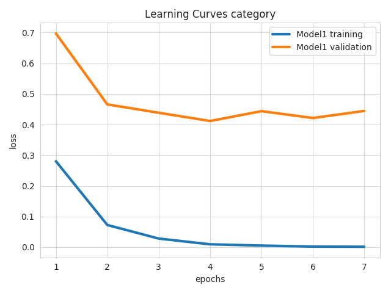

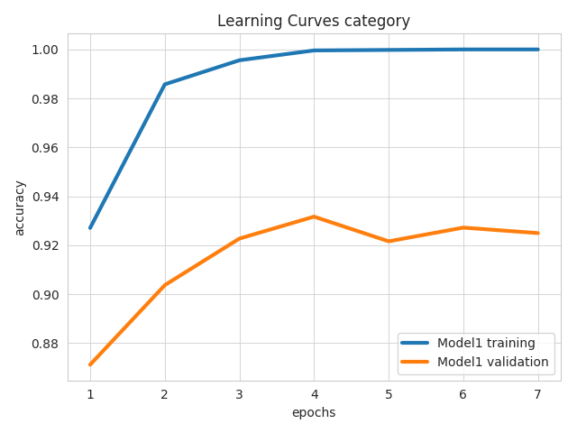


Confusion Matrix
----------------

### confusion_matrix

This visualization uses the `top_n_classes`, `normalize`, `ground_truth_metadata`, `test_statistics` and `model_names` parameters.
For each model (in the aligned lists of `test_statistics` and `model_names`) it produces a heatmap of the confusion matrix in the predictions for each field that has a confusion matrix in `test_statistics`.
The value of `top_n_classes` limits the heatmap to the `n` most frequent classes.

Example command:
```
ludwig visualize --visualization confusion_matrix --top_n_classes 2 --test_statistics results\titanic_Model1_0\test_statistics.json --ground_truth_metadata results\titanic_Model1_0\model\train_set_metadata.json
```

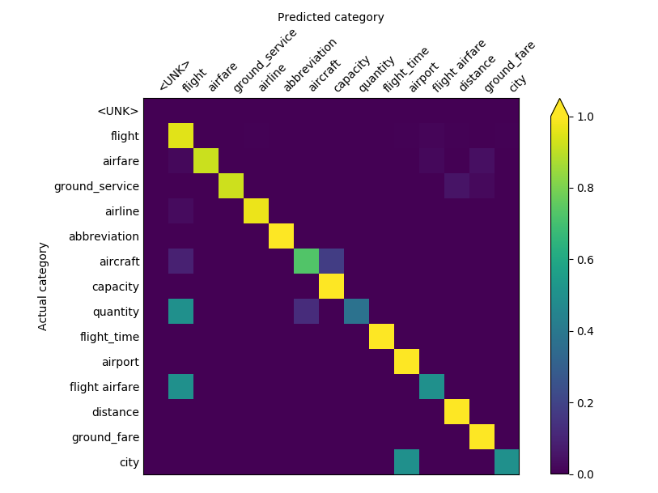

The second plot produced, is a barplot showing the entropy of each class, ranked from most entropic to least entropic.

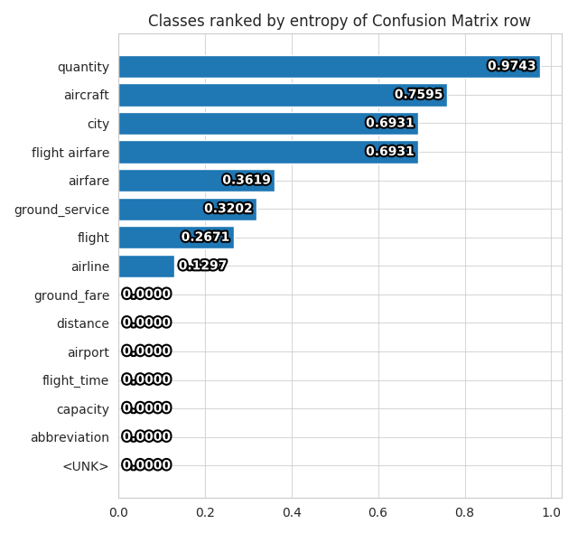


Compare Performance
-------------------

### compare_performance

This visualization uses the `field`, `test_statistics` and `model_names` parameters.
For each model (in the aligned lists of `test_statistics` and `model_names`) it produces bars in a bar plot, one for each overall metric available in the `test_statistics` file for the specified `field`.

Example command:
```
ludwig visualize --visualization compare_performance --model_names Model1 Model2 --test_statistics results\titanic_Model1_0\test_statistics.json results\titanic_Model2_0\test_statistics.json --field Survived
```

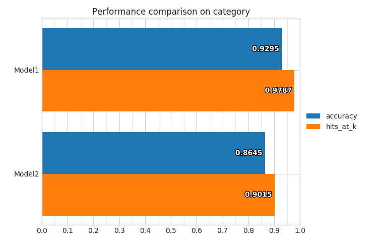


### compare_classifiers_performance_from_prob

This visualization uses the `ground_truth`, `field`, `probabilities` and `model_names` parameters.
`field` needs to be a category.
For each model (in the aligned lists of `probabilities` and `model_names`) it produces bars in a bar plot, one for each overall metric computed on the fly from the probabilities of predictions for the specified `field`.

Example command:
```
ludwig visualize --visualization compare_classifiers_performance_from_prob --model_names Model1 Model2 --ground_truth train.hdf5 --field Survived --probabilities results\titanic_Model1_0\Survived_probabilities.csv results\titanic_Model2_0\Survived_probabilities.csv
```

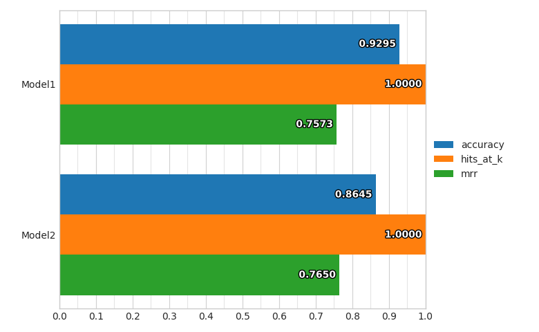


### compare_classifiers_performance_from_pred

This visualization uses the `ground_truth`, `ground_truth_metadata`, `field`, `predictions` and `model_names` parameters.
`field` needs to be a category.
For each model (in the aligned lists of `predictions` and `model_names`) it produces bars in a bar plot, one for each overall metric computed on the fly from the predictions for the specified `field`.

Example command:
```
ludwig visualize --visualization compare_classifiers_performance_from_pred --model_names Model1 Model2 --ground_truth train.hdf5 --field Survived --ground_truth_metadata train.json --predictions results\titanic_Model1_0\Survived_predictions.csv results\titanic_Model2_0\Survived_predictions.csv
```

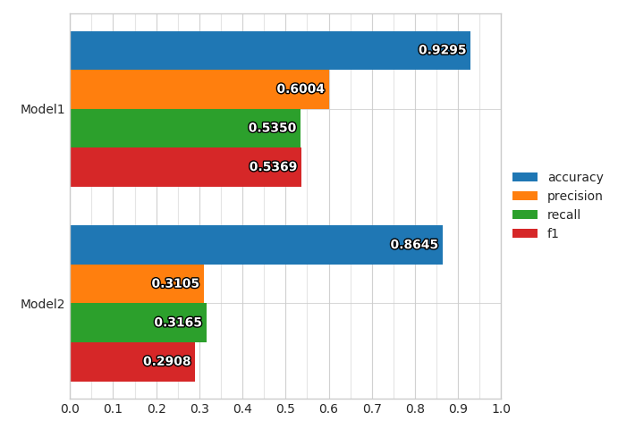


### compare_classifiers_performance_subset

This visualization uses the `top_n_classes`, `subset`, `ground_truth`, `ground_truth_metadata`, `field`, `probabilities` and `model_names` parameters.
`field` needs to be a category.
For each model (in the aligned lists of `predictions` and `model_names`) it produces bars in a bar plot, one for each overall metric computed on the fly from the probabilities predictions for the specified `field`, considering only a subset of the full training set.
The way the subset is obtained is using the `top_n_classes` and `subset` parameters.

If the values of `subset` is `ground_truth`, then only datapoints where the ground truth class is within the top `n` most frequent ones will be considered as test set, and the percentage of datapoints that have been kept from the original set will be displayed.

Example command:
```
ludwig visualize --visualization compare_classifiers_performance_subset --model_names Model1 Model2 --top_n_classes 2 --subset ground_truth --ground_truth train.hdf5 --field Survived --ground_truth_metadata train.json --probabilities results\titanic_Model1_0\Survived_probabilities.csv results\titanic_Model2_0\Survived_probabilities.csv
```


If the values of `subset` is `predictions`, then only datapoints where the the model predicts a class that is within the top `n` most frequent ones will be considered as test set, and the percentage of datapoints that have been kept from the original set will be displayed for each model.


### compare_classifiers_performance_changing_k

This visualization uses the `top_k`, `ground_truth`, `field`, `probabilities` and `model_names` parameters.
`field` needs to be a category.
For each model (in the aligned lists of `probabilities` and `model_names`) it produces a line plot that shows the Hits@K measure (that counts a prediction as correct if the model produces it among the first `k`) while changing `k` from 1 to `top_k` for the specified `field`.

Example command:
```
ludwig visualize --visualization compare_classifiers_performance_changing_k --model_names Model1 Model2 --top_k 5 --ground_truth train.hdf5 --field Survived --probabilities results\titanic_Model1_0\Survived_probabilities.csv results\titanic_Model2_0\Survived_probabilities.csv
```

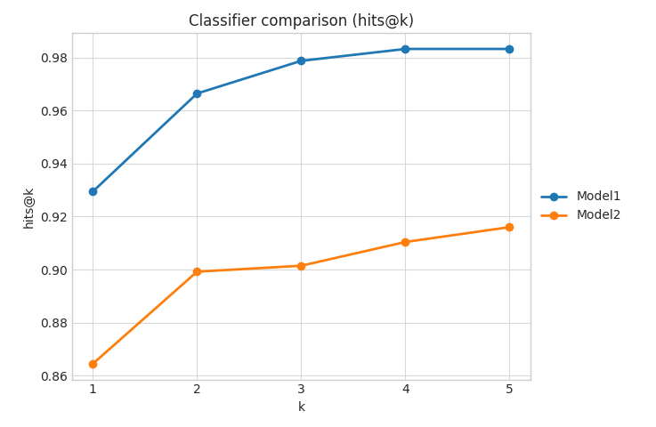


### compare_classifiers_multiclass_multimetric

This visualization uses the `top_n_classes`, `ground_truth_metadata`, `field`, `test_statistics` and `model_names` parameters.
`field` needs to be a category.
For each model (in the aligned lists of `test_statistics` and `model_names`) it produces four plots that show the precision, recall and F1 of the model on several classes for the specified `field`.

The first one show the measures on the `n` most frequent classes.

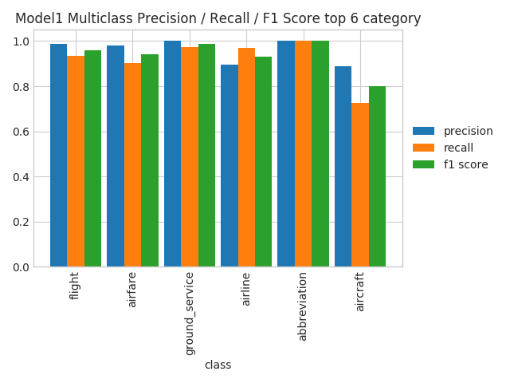

The second one shows the measures on the `n` classes where the model performs the best.


The third one shows the measures on the `n` classes where the model performs the worst.

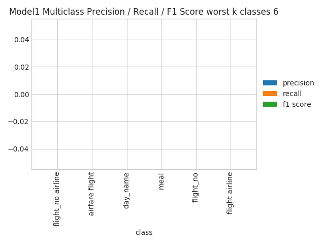

The fourth one shows the measures on all the classes, sorted by their frequency. This could become unreadable in case the number of classes is really high.


Compare Classifier Predictions
------------------------------

### compare_classifiers_predictions

This visualization uses the `ground_truth`, `field`, `predictions` and `model_names` parameters.
`field` needs to be a category and there must be two and only two models (in the aligned lists of `predictions` and `model_names`).
This visualization produces a pie chart comparing the predictions of the two models for the specified `field`.

Example command:
```
ludwig visualize --visualization compare_classifiers_predictions --model_names Model1 Model2 --ground_truth train.hdf5 --field Survived --predictions results\titanic_Model1_0\Survived_predictions.csv results\titanic_Model2_0\Survived_predictions.csv
```
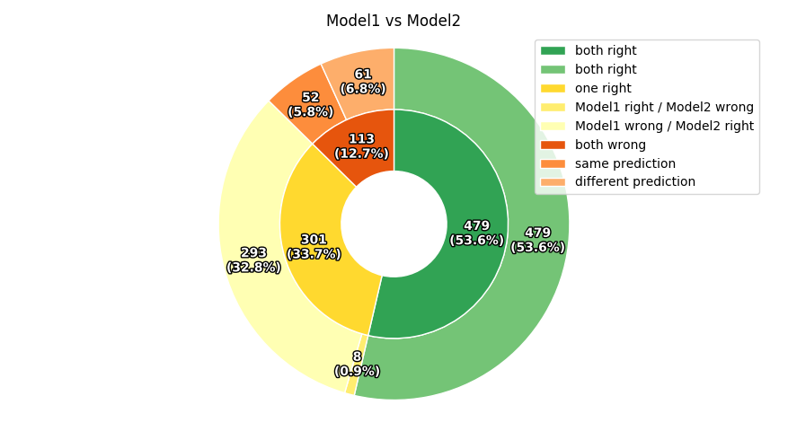


### compare_classifiers_predictions_distribution

This visualization uses the `ground_truth`, `field`, `predictions` and `model_names` parameters.
`field` needs to be a category.
This visualization produces a radar plot comparing the distributions of predictions of the models for the first 10 classes of the specified `field`.

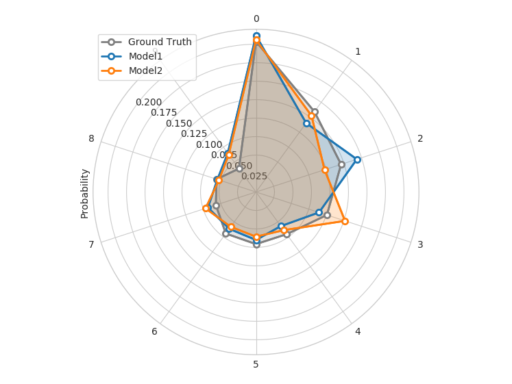


Confidence_Thresholding
--------------------

### confidence_thresholding

This visualization uses the `ground_truth`, `field`, `probabilities` and `model_names` parameters.
`field` needs to be a category.
For each model (in the aligned lists of `probabilities` and `model_names`) it produces a pair of lines indicating the accuracy of the model and the data coverage while increasing a threshold (x axis) on the probabilities of predictions for the specified `field`.

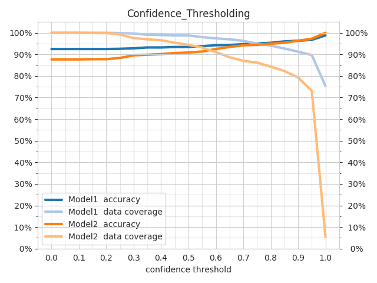


### confidence_thresholding_data_vs_acc

This visualization uses the `ground_truth`, `field`, `probabilities` and `model_names` parameters.
`field` needs to be a category.
For each model (in the aligned lists of `probabilities` and `model_names`) it produces a line indicating the accuracy of the model and the data coverage while increasing a threshold on the probabilities of predictions for the specified `field`.
The difference with `confidence_thresholding` is that it uses two axes instead of three, not visualizing the threshold and having coverage as x axis instead of the threshold.

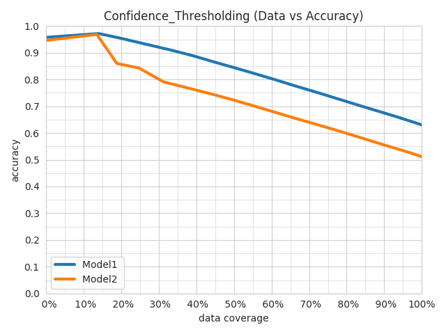


### confidence_thresholding_data_vs_acc_subset

This visualization uses the `top_n_classes`, `subset`, `ground_truth`, `field`, `probabilities` and `model_names` parameters.
`field` needs to be a category.
For each model (in the aligned lists of `probabilities` and `model_names`) it produces a line indicating the accuracy of the model and the data coverage while increasing a threshold on the probabilities of predictions for the specified `field`, considering only a subset of the full training set.
The way the subset is obtained is using the `top_n_classes` and `subset` parameters..
The difference with `confidence_thresholding` is that it uses two axes instead of three, not visualizing the threshold and having coverage as x axis instead of the threshold.

If the values of `subset` is `ground_truth`, then only datapoints where the ground truth class is within the top `n` most frequent ones will be considered as test set, and the percentage of datapoints that have been kept from the original set will be displayed.
If the values of `subset` is `predictions`, then only datapoints where the the model predicts a class that is within the top `n` most frequent ones will be considered as test set, and the percentage of datapoints that have been kept from the original set will be displayed for each model.


### confidence_thresholding_data_vs_acc_subset_per_class

This visualization uses the `top_n_classes`, `subset`, `ground_truth`, `ground_truth_metadata`, `field`, `probabilities` and `model_names` parameters.
`field` needs to be a category.
For each model (in the aligned lists of `probabilities` and `model_names`) it produces a line indicating the accuracy of the model and the data coverage while increasing a threshold on the probabilities of predictions for the specified `field`, considering only a subset of the full training set.
The way the subset is obtained is using the `top_n_classes` and `subset` parameters..
The difference with `confidence_thresholding` is that it uses two axes instead of three, not visualizing the threshold and having coverage as x axis instead of the threshold.

If the values of `subset` is `ground_truth`, then only datapoints where the ground truth class is within the top `n` most frequent ones will be considered as test set, and the percentage of datapoints that have been kept from the original set will be displayed.
If the values of `subset` is `predictions`, then only datapoints where the the model predicts a class that is within the top `n` most frequent ones will be considered as test set, and the percentage of datapoints that have been kept from the original set will be displayed for each model.

The difference with `confidence_thresholding_data_vs_acc_subset` is that it produces one plot per class within the `top_n_classes`.

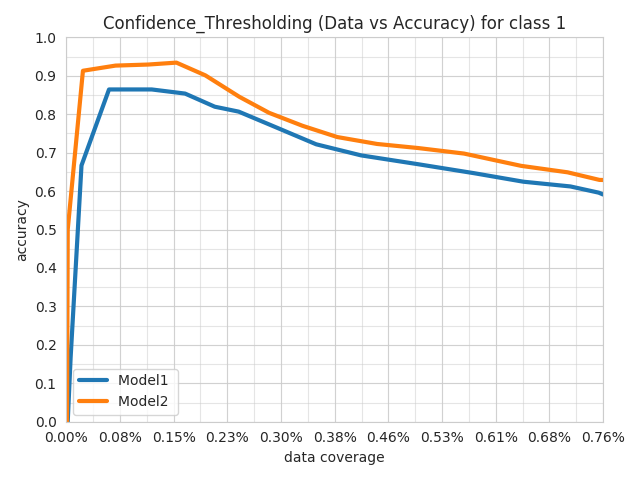

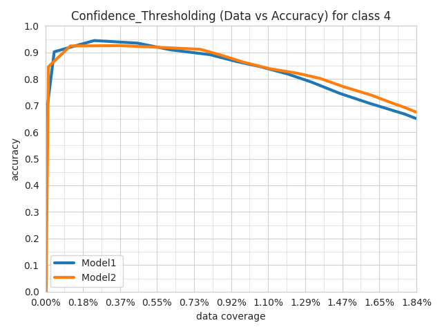


### confidence_thresholding_2thresholds_2d

This visualization uses the `ground_truth`, `threshold_fields`, `probabilities` and `model_names` parameters.
`threshold_fields` need to be exactly two, either category or binary.
`probabilities` need to be exactly two, aligned with `threshold_fields`.
`model_names` has to be exactly one.
Three plots are produced.

The first plot shows several semi transparent lines.
They summarize the 3d surfaces displayed by `confidence_thresholding_2thresholds_3d` that have thresholds on the confidence of the predictions of the two `threshold_fields` as x and y axes and either the data coverage percentage or the accuracy as z axis.
Each line represents a slice of the data coverage surface projected onto the accuracy surface.

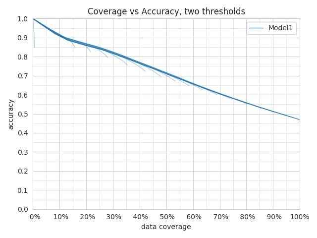

The second plot shows the max of all the lines displayed in the first plot.

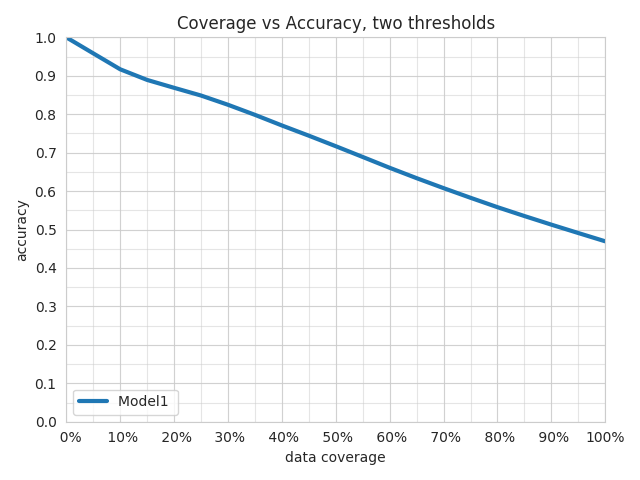

The third plot shows the max line and the values of the thresholds that obtained a specific data coverage vs accuracy pair of values.


### confidence_thresholding_2thresholds_3d

This visualization uses the `ground_truth`, `threshold_fields` and `probabilities` parameters.
`threshold_fields` need to be exactly two, either category or binary.
`probabilities` need to be exactly two, aligned with `threshold_fields`.
The plot shows the 3d surfaces displayed by `confidence_thresholding_2thresholds_3d` that have thresholds on the confidence of the predictions of the two `threshold_fields` as x and y axes and either the data coverage percentage or the accuracy as z axis.

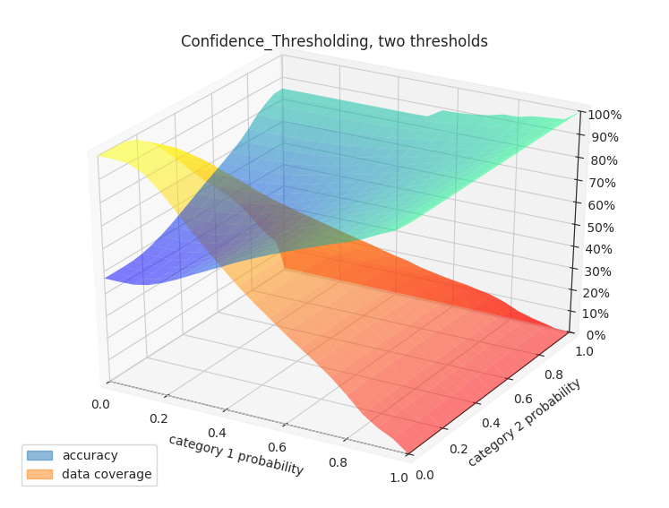


Binary Threshold vs. Metric
---------------------------

### binary_threshold_vs_metric

This visualization uses the `positive_label`, `metrics`, `ground_truth`, `field`, `probabilities` and `model_names` parameters.
`field` can be a category or binary feature.
For each metric specified in `metrics` (options are `f1`, `precision`, `recall`, `accuracy`), this visualization produces a line chart plotting a threshold on the confidence of the model against the metric for the specified `field`.
If `field` is a category feature, `positive_label` indicates which is the class to be considered positive class and all the others will be considered negative.
It needs to be an integer, to figure out the association between classes and integers check the `ground_truth_metadata` JSON file.

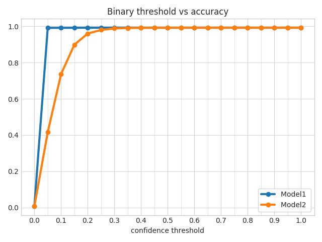


ROC Curves
----------

### roc_curves

This visualization uses the `positive_label`, `ground_truth`, `field`, `probabilities` and `model_names` parameters.
`field` can be a category or binary feature.
This visualization produces a line chart plotting the roc curves for the specified `field`.
If `field` is a category feature, `positive_label` indicates which is the class to be considered positive class and all the others will be considered negative.
It needs to be an integer, to figure out the association between classes and integers check the `ground_truth_metadata` JSON file.


### roc_curves_from_test_statistics

This visualization uses the `output_feature_name`, `test_statistics` and `model_names` parameters.
`output_feature_name` needs to be binary feature.
This visualization produces a line chart plotting the roc curves for the specified `output_feature_name`.


Calibration Plot
----------------

### calibration_1_vs_all

This visualization uses the `top_k`, `ground_truth`, `field`, `probabilities` and `model_names` parameters.
`field` needs to be a category or binary.
For each class or each of the `k` most frequent classes if `top_k` is specified, it produces two plots computed on the fly from the probabilities of predictions for the specified `field`.

The first plot is a calibration curve that shows the calibration of the predictions considering the current class to be the true one and all others to be a false one, drawing one line for each model (in the aligned lists of `probabilities` and `model_names`).


The second plot shows the distributions of the predictions considering the current class to be the true one and all others to be a false one, drawing the distribution for each model (in the aligned lists of `probabilities` and `model_names`).


### calibration_multiclass

This visualization uses the `ground_truth`, `field`, `probabilities` and `model_names` parameters.
`field` needs to be a category.
For each class, produces two plots computed on the fly from the probabilities of predictions for the specified `field`.

The first plot is a calibration curve that shows the calibration of the predictions considering al classes, drawing one line for each model (in the aligned lists of `probabilities` and `model_names`).

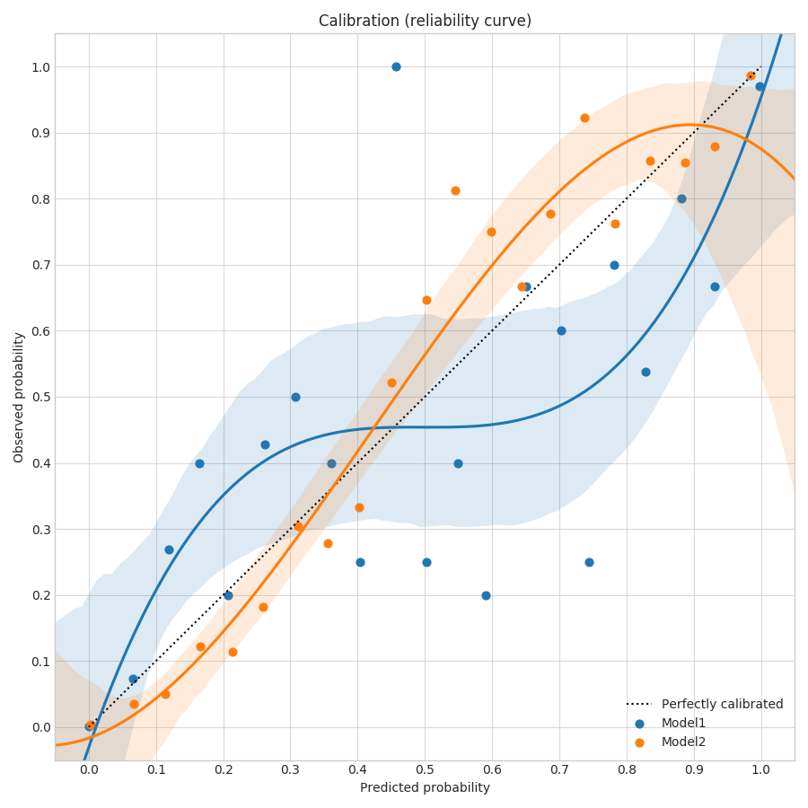

The second plot shows a bar plot of the brier score (that calculates how calibrated are the probabilities of the predictions of a model), drawing one bar for each model (in the aligned lists of `probabilities` and `model_names`).


Class Frequency vs. F1 score
----------------------------

### frequency_vs_f1

This visualization uses the `ground_truth_metadata`, `field`, `test_statistics` and `model_names` parameters.
`field` needs to be a category.
For each model (in the aligned lists of `test_statistics` and `model_names`), produces two plots statistics of predictions for the specified `field`.

The first plot is a line plot with one x axis representing the different classes and two vertical axes colored in orange and blue respectively.
The orange one is the frequency of the class and an orange line is plotted to show the trend.
The blue one is the F1 score for that class and a blue line is plotted to show the trend. 
The classes on the x axis are sorted by f1 score.


The second plot has the same structure of the first one, but the axes are flipped and the classes on the x axis are sorted by frequency.

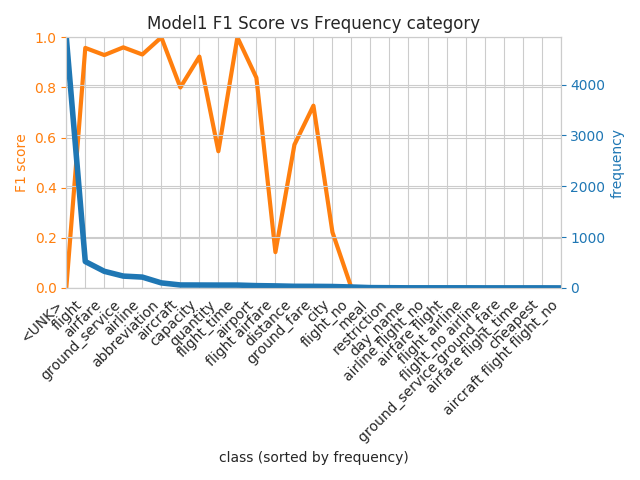
